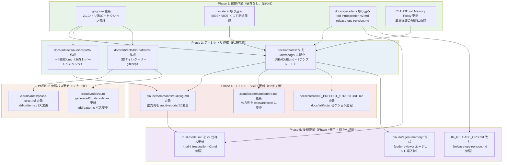

# 設計: 新規ディレクトリ構造・構成変更戦略

**作成日**: 2026-03-13
**ステータス**: Draft
**対象 Phase**: LAM v4.0.1 → v4.4.1 移行 Phase 1（構造変更）

---

## 概要

LAM v4.4.1 は v4.2.0 で導入された `docs/artifacts/` ディレクトリ、`.claude/agent-memory/` ディレクトリ、および ADR の番号体系拡張をはじめとする複数の構造変更を含む。

本文書では 6 つの判断ポイントについて設計を記述し、影式プロジェクトへの取り込み方針を確定する。

影式は `docs/memos/` を広範に使用しており（`middle-draft/`, `v4-update-plan/`, `v4-4-1-update-plan/` 等、影式固有のコンテンツが多数）、単純なリネームや全面移行は適切でない。

---

## 判断1: docs/artifacts/ ディレクトリの導入

### 背景

LAM v4.2.0 で導入された `docs/artifacts/` は「中間成果物・知見蓄積の専用場所」であり、監査レポート、retro 由来の知見、TDD パターン詳細記録を格納する。

影式では現在 `docs/memos/` がこの役割を兼ねており、以下のファイルが散在している:

| ファイル | 種別 | 現在地 |
|---------|------|--------|
| `audit-report-wave3.md` | 監査レポート | `docs/memos/` |
| `audit-report-full-source.md` | 監査レポート | `docs/memos/` |
| `retro-wave-9.md` | Retro 記録 | `docs/memos/` |
| `retro-phase-1.md` | Retro 記録 | `docs/memos/` |
| `tdd-patterns/` | TDD パターン詳細 | `docs/memos/tdd-patterns/`（未作成） |

### 選択肢

| 選択肢 | 概要 | メリット | デメリット |
|--------|------|---------|-----------|
| A. 全面移行 | `docs/memos/` を `docs/artifacts/` に改名 | LAM テンプレートと完全一致 | 影式固有コンテンツ（middle-draft, v4-update-plan 等）が全て対象になり工数大。中間成果物と知見蓄積の区別が消える |
| B. 新規のみ | 既存は `docs/memos/` に残し、新規のみ `docs/artifacts/` に作成 | 最小工数。既存参照を壊さない | 両方のディレクトリが混在し、格納先が直感的でない |
| C. 段階的移行 | 新規は `docs/artifacts/` に作成、新コマンド群が参照する既存ファイルのみ参照先を更新。影式固有コンテンツは `docs/memos/` に据え置き | 影式固有と LAM 共通の役割分担が明確になる。移行コストが分散する | 二つのディレクトリが共存するため初見の説明が必要 |

### 決定: **B. 新規のみ `docs/artifacts/` に作成、既存の `docs/memos/` は維持**

**根拠**:

1. **影式固有コンテンツの保護**: `docs/memos/` には影式プロジェクト固有の大量のコンテンツが存在する（`middle-draft/`〈設計中間草案〉、`v4-update-plan/`〈移行計画〉、`LivingArchitectModel-4.0.1/`〈テンプレート参照コピー〉等）。これらは LAM の `docs/artifacts/` の目的（知見蓄積・監査レポート）と性質が異なる。
2. **ゼロ回帰**: 既存の参照ファイル（`docs/internal/03_QUALITY_STANDARDS.md` が `audit-report-wave3.md` を参照等）を壊さない。
3. **最小工数**: 移行の複雑さを避け、新規作成から `docs/artifacts/` を使い始める。
4. **役割の分離**: `docs/memos/` は「ユーザー入力・影式固有の生メモ・中間草案」、`docs/artifacts/` は「LAM ワークフローが生成する構造化された知見・レポート・パターン記録」として役割が明確に分離される。

**サブディレクトリ別の作成方針**:

| サブディレクトリ | 優先度 | 内容 |
|----------------|--------|------|
| `docs/artifacts/knowledge/` | **高** | README.md + conventions.md / patterns.md / pitfalls.md の 4 ファイル（テンプレート）を新規作成 |
| `docs/artifacts/audit-reports/` | **中** | ディレクトリ作成のみ。既存の `docs/memos/audit-report-*.md` の移動は行わない |
| `docs/artifacts/tdd-patterns/` | **中** | ディレクトリ作成。`.claude/rules/auto-generated/README.md` 等のパス参照を `docs/memos/tdd-patterns/` → `docs/artifacts/tdd-patterns/` に更新 |

**既存 `docs/memos/` の監査レポート・Retro 記録の移動**: 行わない。将来の `/retro` 実行時、`/full-review` 実行時から自然に `docs/artifacts/` に生成される。

**リスク**: 既存の監査レポートが `docs/memos/` に残るため、レポートの所在が分散する。対策として `docs/artifacts/audit-reports/` に `INDEX.md`（`docs/memos/` の過去レポートへのリンク集）を作成し、参照可能にする。

---

## 判断2: .claude/agent-memory/ の導入時期

### 背景

LAM v4.4.1 で code-reviewer Subagent がレビュー中に学んだ知見を永続化する `.claude/agent-memory/code-reviewer/` が導入された。影式には code-reviewer エージェント（`.claude/agents/code-reviewer.md`）は存在するが、agent-memory 機能（実行中にディレクトリへ書き込む仕組み）は未実装。

CLAUDE.md の Memory Policy（現在:「Subagent の役割ノウハウ蓄積のみに使用可」）は三層構造に対応していない。

### knowledge/ との棲み分け

| 仕組み | 蓄積者 | タイミング | 内容 |
|--------|--------|-----------|------|
| `docs/artifacts/knowledge/` | 人間（/retro 経由） | Wave/Phase 完了時 | 意図的に整理された知見・教訓 |
| `.claude/agent-memory/` | Subagent（自動） | 実行中に自発的に | 実行中に学んだパターン・慣例（プロジェクト固有） |
| Auto Memory (`MEMORY.md`) | Claude 本体（自動） | セッション中 | ビルドコマンド、デバッグ知見等（Subagent 役割ノウハウ） |

### 選択肢

| 選択肢 | 概要 |
|--------|------|
| A. 即時導入 | ディレクトリ作成 + CLAUDE.md Memory Policy 更新を同時に実施 |
| B. hooks 移行完了後に導入 | hooks（Phase 2 相当）が完了し、code-reviewer エージェントを導入する際に合わせて作成 |
| C. 延期（必要時に作成） | code-reviewer エージェントを実際に使い始める時点で作成 |

### 決定: **C. ディレクトリ作成は延期、CLAUDE.md の Memory Policy のみ更新**

**根拠**:

1. **実態なき準備は不要**: 影式に code-reviewer エージェントは存在するが、agent-memory への書き込み機能が未実装の状態でディレクトリだけ作っても、書き込まれることはない。YAGNI 原則。
2. **Memory Policy の整合は今すぐ必要**: CLAUDE.md の Memory Policy が旧い（三層構造を説明していない）ため、LAM v4.4.1 の知識モデルとの乖離を解消するために更新する。ディレクトリ作成を待つ理由はない。
3. **自然なタイミング**: `.claude/agents/code-reviewer.md` を導入する際（次の Phase 相当）に、`agent-memory/code-reviewer/` の作成と初期化を行うのが最も自然。

**実施内容**:

- CLAUDE.md の Memory Policy セクションを更新（三層構造を明記、`docs/artifacts/knowledge/` と `.claude/agent-memory/` の使い分けを記載）
- `.claude/agent-memory/` ディレクトリの作成: 延期
- `.gitignore` への追加: 不要（agent-memory はプロジェクト固有知見のため Git 管理対象）

---

## 判断3: ADR 番号衝突の解決

### 背景

影式に既存の ADR が 1 件あり、LAM v4.4.1 に 4 件の新規 ADR がある。双方とも ADR-0001 を使用しており、番号が衝突している。

| 番号 | 影式 | LAM v4.4.1 |
|------|------|------------|
| 0001 | 免疫系アーキテクチャの導入（Accepted） | モデルルーティング戦略（Proposed） |
| 0002 | なし | Stop hook 実装方式（Accepted） |
| 0003 | なし | context7 vs WebFetch（Accepted） |
| 0004 | なし | Bash read コマンド allow-list（Accepted） |

### 選択肢

| 選択肢 | 概要 | メリット | デメリット |
|--------|------|---------|-----------|
| A. LAM ADR を 0002〜0005 に振り直し | 影式 ADR-0001 を維持、LAM ADR を +1 にシフトして取り込み | 影式の既存 ADR を尊重。LAM テンプレートとの差分は番号のみ | LAM テンプレートの ADR 番号と影式の番号が永続的にずれる |
| B. LAM ADR をプレフィックス付き（LAM-0001）| 独立した番号空間を維持 | 由来が明確 | ADR 命名規則が 2 種類になり複雑 |
| C. 影式 ADR を振り直し | 影式 ADR-0001 を 0005 等に変更し、LAM の番号をそのまま使用 | LAM テンプレートと番号一致 | 既存の確定 ADR（Accepted）を変更することになり ADR の「不変性」原則に反する |

### 決定: **A. LAM ADR を 0002〜0005 として取り込み（影式の既存 ADR を尊重）**

**根拠**:

1. **ADR の不変性原則**: `docs/internal/00_PROJECT_STRUCTURE.md` に「一度確定した ADR は原則変更せず」と明記されている。影式 ADR-0001 は Accepted 状態であり変更すべきでない（選択肢 C を排除）。
2. **影式 ADR の独自性**: ADR-0001（免疫系アーキテクチャ導入）は影式プロジェクト固有の判断記録であり、LAM テンプレートの ADR-0001（モデルルーティング戦略）とは別の決定事項。番号を空けることに意味がある。
3. **シンプルさ**: プレフィックス方式（選択肢 B）は命名規則を複雑にする。+1 シフトの方が説明が容易。
4. **将来の拡張性**: 影式固有の ADR（番号 0001〜、独自の設計判断）と LAM 由来の ADR（番号 0002〜0005、フレームワーク設計判断）が自然に続番で共存できる。

**取り込み後の番号マッピング**:

| 影式 ADR 番号 | タイトル | 由来 |
|-------------|---------|------|
| 0001 | LAM v4.0.0 免疫系アーキテクチャの導入 | 影式固有 |
| 0002 | モデルルーティング戦略 | LAM v4.4.1 ADR-0001 より |
| 0003 | Stop hook 実装方式 | LAM v4.4.1 ADR-0002 より |
| 0004 | context7 vs WebFetch | LAM v4.4.1 ADR-0003 より |
| 0005 | Bash read コマンド allow-list | LAM v4.4.1 ADR-0004 より |

**ファイル命名**:

```
docs/adr/
├── 0001-lam-v4-immune-system-architecture.md  （既存・変更なし）
├── 0002-model-routing-strategy.md             （新規）
├── 0003-stop-hook-implementation.md           （新規）
├── 0004-context7-vs-webfetch.md               （新規）
└── 0005-bash-read-commands-allow-list.md      （新規）
```

各ファイルに「LAM v4.4.1 ADR-000N より移植」の注記を冒頭に追加する。

---

## 判断4: .gitignore の更新

### 背景

LAM v4.4.1 は `.claude/lam-loop-state.json` と `.claude/test-results.xml` の 2 エントリを新規で追加している。影式の `.gitignore` はこれらを含んでいない。

また、影式の `.gitignore` では `.claude/doc-sync-flag`, `.claude/last-test-result`, `.claude/pre-compact-fired` の 3 エントリが Agent セクションに混在している。LAM v4.4.1 ではこれらを「LAM runtime state files」セクションに分離している。

### 現行 `.gitignore` の Agent セクション

```gitignore
# Agent
.agent/
memos/
!docs/memos/
docs/memos/*
!docs/memos/v4-update-plan/
.serena/
data/
SESSION_STATE.md
docs/daily/
.claude/settings.local.json
.claude/commands/release.md
.claude/doc-sync-flag
.claude/last-test-result
.claude/pre-compact-fired
```

### 決定: **2 エントリ追加 + LAM runtime state files セクション整理**

**追加エントリ**:

| エントリ | 理由 |
|---------|------|
| `.claude/lam-loop-state.json` | `lam-stop-hook.py` が実行中に生成するループ状態ファイル。実行時の一時状態であり Git 管理不要 |
| `.claude/test-results.xml` | TDD 内省パイプライン v2 が pytest の JUnit XML 出力を読み取るファイル。ビルド成果物であり Git 管理不要 |

**整理後の `.gitignore`**（Agent セクションから LAM runtime エントリを分離）:

```gitignore
# Agent
.agent/
memos/
!docs/memos/
docs/memos/*
!docs/memos/v4-update-plan/
!docs/memos/v4-4-1-update-plan/
.serena/
data/
SESSION_STATE.md
docs/daily/
.claude/settings.local.json
.claude/commands/release.md

# LAM runtime state files
.claude/lam-loop-state.json
.claude/doc-sync-flag
.claude/pre-compact-fired
.claude/last-test-result
.claude/test-results.xml
```

**影式固有のエントリの扱い**:

| エントリ | 判断 |
|---------|------|
| `!docs/memos/` + `docs/memos/*` + `!docs/memos/v4-update-plan/` | 維持（影式固有コンテンツ管理） |
| `!docs/memos/v4-4-1-update-plan/` | 追加（現在 Git 未追跡の移行計画を追跡対象に追加） |
| `# Reference materials` セクションの `_reference/` | 維持 |
| `# User Config` セクションの `config.toml` | 維持 |

---

## 判断5: docs/specs/ の新規ファイル取り込み

### 背景

LAM v4.4.1 で 3 カテゴリの新規スペック（4 ファイル）が追加された。影式の `docs/specs/lam/` に取り込む候補として評価する。

### 評価

| ファイル | LAM 内容 | 影式への適合 | 判断 |
|---------|---------|------------|------|
| `tdd-introspection-v2.md` | TDD 内省パイプライン v2 仕様（JUnit XML 方式）。信頼度モデルの再設計 | 影式の `.claude/rules/auto-generated/trust-model.md` が v1 のまま。v2 への更新に必要 | **推奨** |
| `release-ops-revision.md` | `docs/internal/04_RELEASE_OPS.md` 改訂仕様（approved） | 影式の SSOT である `04_RELEASE_OPS.md` の改訂根拠として必要 | **推奨** |
| `hooks-python-migration/requirements.md` | bash → Python 移行の要件定義（全 hook 対象） | 影式は既に Python 移行を完了している（`01-design-hooks-windows.md` で設計済み）。影式の設計書がより影式に最適化されている | **不要** |
| `hooks-python-migration/design.md` | bash → Python 移行の設計書 | 同上 | **不要** |
| `hooks-python-migration/tasks.md` | bash → Python 移行のタスク分解（全 32 タスク） | 同上。タスクは影式の移行設計から派生させる | **不要** |

**`hooks-python-migration/` を不要とする詳細理由**:

影式は `docs/memos/v4-update-plan/designs/01-design-hooks-windows.md` で独自の hooks 移行設計を完成させている。LAM の `hooks-python-migration/` は LAM テンプレートの bash 実装を前提とした設計であり、影式の Python 環境固有の設計（Windows パス問題、Git Bash リスク、notify-sound.py との共存）を含まない。参考資料としての価値はあるが、`docs/specs/lam/` の SSOT として取り込む必要はない。

### 取り込み先

```
docs/specs/lam/
├── （既存ファイル群）
├── tdd-introspection-v2.md      （新規取り込み）
└── release-ops-revision.md      （新規取り込み）
```

**取り込み時の注意**:

- `tdd-introspection-v2.md`: 取り込み後、`.claude/rules/auto-generated/trust-model.md` の v1 仕様を v2 に更新する作業が後続タスクとして発生する。本設計文書では設計判断のみ記録し、更新作業はルール変更 Phase に分離する（PM 級承認が必要）。
- `release-ops-revision.md`: 取り込み後、`docs/internal/04_RELEASE_OPS.md` の改訂を別タスクとして実施（PM 級承認が必要）。

---

## 判断6: docs/memos/ → docs/artifacts/ のパス変更影響

### 背景

判断 1 の決定（新規は `docs/artifacts/` に作成、既存 `docs/memos/` は維持）により、TDD パターン詳細記録のパスは `docs/memos/tdd-patterns/` → `docs/artifacts/tdd-patterns/` に変更される。この変更が影響する参照箇所を特定する。

### 影響箇所の全量調査

`docs/memos/tdd-patterns` を参照しているファイル（grep による確認済み）:

| ファイル | 該当行 | 変更内容 | 権限等級 |
|---------|-------|---------|---------|
| `.claude/rules/phase-rules.md` | `- パターン詳細: \`docs/memos/tdd-patterns/\`` | → `docs/artifacts/tdd-patterns/` | PM 級 |
| `.claude/rules/auto-generated/trust-model.md` | `パターン詳細を \`docs/memos/tdd-patterns/\` に書き出し` | → `docs/artifacts/tdd-patterns/` | PM 級 |

上記 2 箇所のみが `tdd-patterns` パスを参照しており、スコープは限定的。

### 監査レポート参照の全量調査

`docs/memos/audit-report` を参照しているファイル:

| ファイル | 該当行 | 変更の要否 |
|---------|-------|----------|
| `docs/internal/03_QUALITY_STANDARDS.md` | `docs/memos/audit-report-wave3.md`, `docs/memos/audit-report-full-source.md` | **変更不要**（既存ファイルは `docs/memos/` に残るため） |
| `.claude/commands/auditing.md` | `成果物: docs/memos/audit-report-<feature>.md` | **更新が必要**（新規作成先を `docs/artifacts/audit-reports/` に変更） |

### コマンド群の出力パス更新

新規作成物の出力先を `docs/artifacts/` に変更するためにコマンドファイルの更新が必要なもの:

| コマンド | 現行出力先 | 変更後出力先 | 権限等級 |
|---------|----------|------------|---------|
| `/auditing` | `docs/memos/audit-report-<feature>.md` | `docs/artifacts/audit-reports/YYYY-MM-DD-<feature>.md` | PM 級 |
| `/retro` | `docs/memos/retro-wave-{N}.md` 等 | `docs/artifacts/retro-wave-{N}.md` 等 | PM 級 |
| `/full-review` | （各イテレーション結果） | `docs/artifacts/audit-reports/YYYY-MM-DD-iter{N}.md` | PM 級 |

**注**: `/retro` は現行コマンド定義で `docs/memos/` を出力先としている。Retro 記録の新規作成先を `docs/artifacts/` に変更することで、LAM v4.4.1 の `retro-v4.4.0.md` 等と同じ配置になる。

### docs/memos/ を参照するその他のファイルの扱い

全体グレップで確認した参照箇所のうち、変更不要なもの:

| ファイル | 参照内容 | 変更不要の理由 |
|---------|---------|-------------|
| `.claude/rules/core-identity.md` | `docs/tasks/` または `docs/memos/` への書き出し | `docs/memos/` は引き続き影式固有コンテンツに使用するため維持 |
| `.claude/rules/upstream-first.md` | 未知の挙動を `docs/memos/` に記録 | 未加工調査メモは `docs/memos/` のままで適切 |
| `.claude/skills/ultimate-think/SKILL.md` | アンカーファイル作成先 `docs/memos/` | 一時的なアンカーは `docs/memos/` のままで適切 |
| `docs/internal/00_PROJECT_STRUCTURE.md` | Raw Ideas / Intermediate Reports の格納先 | `docs/memos/` の役割定義として維持。`docs/artifacts/` の説明を追記 |
| `docs/internal/02_DEVELOPMENT_FLOW.md` | walkthrough 結果の格納先 | 検証中間レポートは `docs/memos/` のままで適切 |
| `docs/internal/05_MCP_INTEGRATION.md` | Heimdall 書き出し先 | 影式固有の MCP 設定であり変更不要 |

### 決定: 変更対象ファイルの一括更新

変更が必要なファイルは以下の 4 件のみ（スコープを最小化）:

1. `.claude/rules/phase-rules.md`: `tdd-patterns` パスのみ更新
2. `.claude/rules/auto-generated/trust-model.md`: `tdd-patterns` パスのみ更新
3. `.claude/commands/auditing.md`: 新規レポート出力先を `docs/artifacts/audit-reports/` に更新
4. `docs/internal/00_PROJECT_STRUCTURE.md`: `docs/artifacts/` セクションの追記

これらはすべて PM 級変更（`.claude/rules/` および `docs/internal/` の変更）であり、移行作業 Phase での PM 承認ゲートで実施する。

---

## 依存関係図と移行順序

以下に構造変更の実施順序と依存関係を示す。上位の作業が完了してから下位の作業に進む。



### 実施順序サマリー

| Phase | 作業 | 権限等級 | 並列可否 |
|-------|------|---------|---------|
| P1 | .gitignore 更新 | SE 級 | 全 P1 作業が並列可 |
| P1 | docs/adr/ 0002〜0005 取り込み | PM 級 | |
| P1 | docs/specs/lam/ 2 ファイル取り込み | PM 級 | |
| P1 | CLAUDE.md Memory Policy 更新 | PM 級 | |
| P2 | docs/artifacts/ ディレクトリ群作成 | SE 級 | P1 完了後、B1〜B3 並列可 |
| P3 | tdd-patterns パス参照更新（rules 2 件） | PM 級 | B3 完了後、C1〜C2 並列可 |
| P4 | コマンド・SSOT 更新（3 件） | PM 級 | P2 完了後、D1〜D3 並列可 |
| P5 | trust-model v2 更新 / RELEASE_OPS 改訂 / agent-memory 作成 | PM 級 | 各々独立 |

---

## リスクと対策

| # | リスク | 影響度 | 発生確率 | 対策 |
|---|--------|--------|---------|------|
| R1 | `docs/memos/` と `docs/artifacts/` の役割が混乱し、格納先の判断が困難になる | 中 | 中 | `docs/internal/00_PROJECT_STRUCTURE.md` に両ディレクトリの使い分けを明記。audit-reports の INDEX.md で過去レポートへの誘導を提供 |
| R2 | ADR 番号シフト（0002〜0005）により LAM テンプレートとの対応表を維持しなければならない | 低 | 低 | 各 ADR ファイルの冒頭に「LAM v4.4.1 ADR-000N より移植」の注記を追加。`00-diff-new-directories.md` に対応表を記録済み |
| R3 | .gitignore の `docs/memos/*` 除外ルールと新しい `docs/artifacts/` の関係が意図せず機能する | 低 | 低 | `docs/artifacts/` は `docs/memos/*` のパターンに含まれない。gitignore のパターンマッチングで問題なし（確認済み） |
| R4 | `tdd-introspection-v2.md` の取り込みが trust-model.md の即時更新を促し PM 級承認が重複する | 低 | 中 | 取り込み（P1）と trust-model 更新（P5）を意図的に分離。P5 は別の承認ゲートとして扱う |
| R5 | code-reviewer エージェントの導入が延期された場合、Memory Policy の更新だけが宙に浮く | 低 | 低 | Memory Policy の更新自体は情報の正確性向上であり、ディレクトリが未作成でも有害でない |

### ロールバック計画

本設計の変更はすべてファイル・ディレクトリの追加が主体であり、既存ファイルの削除・移動を含まない。ロールバックが必要な場合:

1. **P1 (.gitignore)**: 追加した 2 エントリと `v4-4-1-update-plan` 除外ルールを元に戻す（git checkout .gitignore）
2. **P1 (ADR / specs 取り込み)**: 追加ファイルを削除（git rm）
3. **P2 (ディレクトリ作成)**: `docs/artifacts/` を削除（git rm -r）
4. **P3/P4 (パス参照更新)**: git diff で変更箇所を確認し、元のパスに戻す

いずれも `git revert` または `git checkout` で復元可能。既存コンテンツへの破壊的変更がないため、ロールバックリスクは低い。

---

## 設計決定サマリー（ADR 候補）

本設計文書における決定事項のうち、ADR として記録を推奨するもの:

| 決定事項 | 選択 | ADR 候補番号 |
|---------|------|------------|
| docs/artifacts/ 導入方針 | B. 新規のみ、既存 docs/memos/ は維持 | （本文書で代替。ADR 不要） |
| .claude/agent-memory/ 導入時期 | C. 延期（必要時に作成） | （本文書で代替。ADR 不要） |
| ADR 番号衝突の解決 | A. LAM ADR を 0002〜0005 に振り直し | （本文書で代替。ADR 不要） |
| docs/specs/lam/ の取り込み範囲 | tdd-introspection-v2.md と release-ops-revision.md のみ | （本文書で代替。ADR 不要） |

いずれも影式固有の導入判断であり、本設計文書が判断記録として機能する。将来の移行でより重要な設計判断（アーキテクチャ変更等）が生じた場合は ADR として切り出す。
