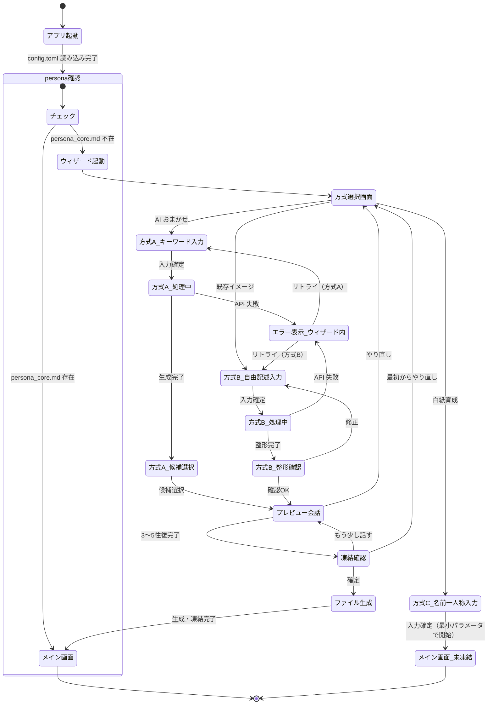
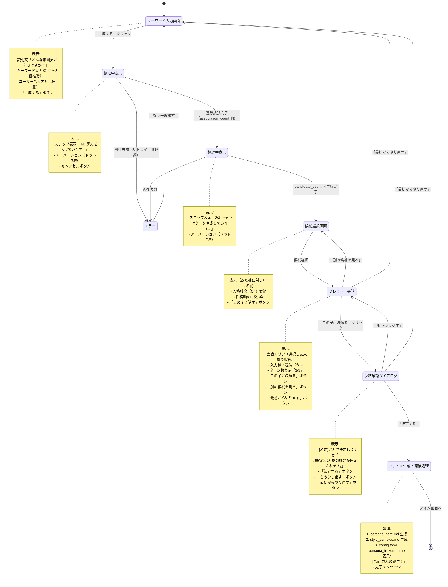
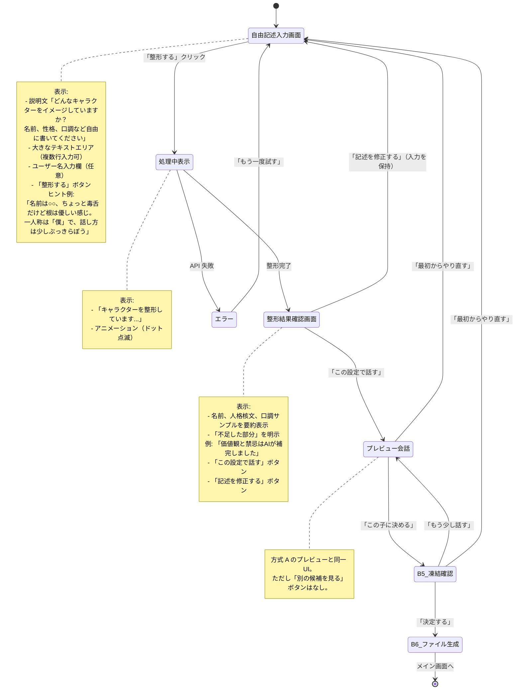
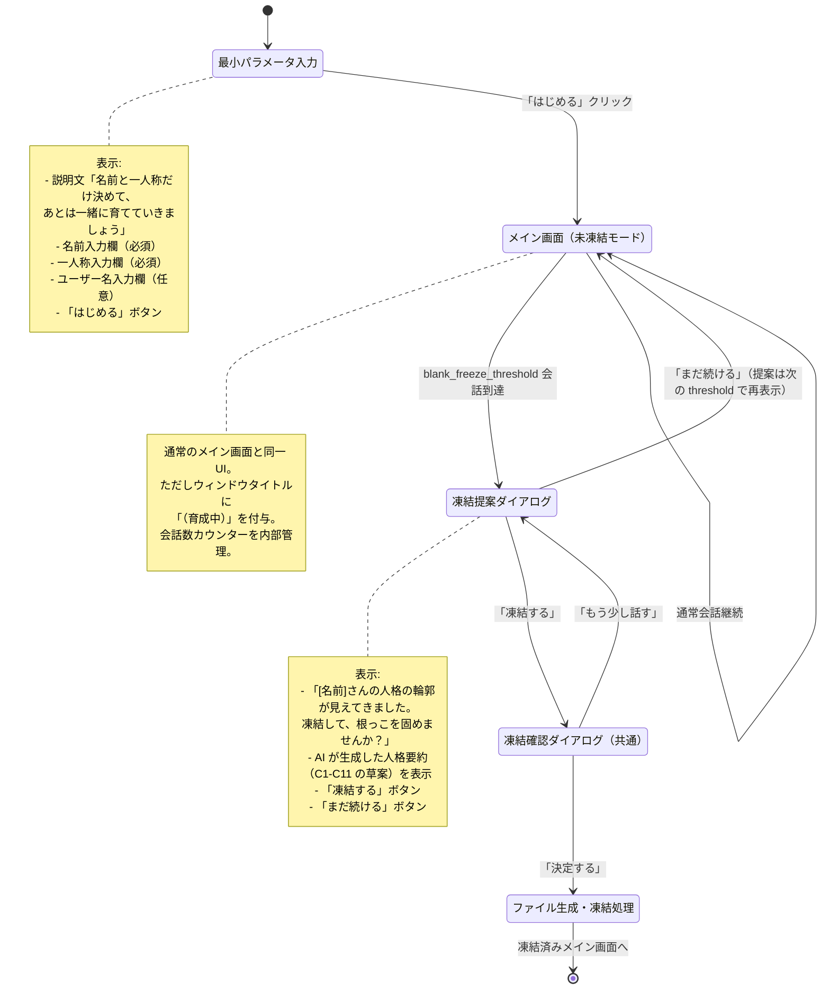

# D-5: ウィザード画面フロー

**決定対象**: requirements.md Section 8 — D-5「ウィザード画面フロー（GUI 遷移図）」
**関連 FR**: FR-5.1, FR-5.2, FR-5.3, FR-5.4, FR-5.5, FR-5.6, FR-5.7, FR-5.8, FR-5.9
**ステータス**: 提案（承認待ち）

---

## 1. コンテキスト

### 1.1 なぜこの決定が必要か

影式の初回起動時（persona_core.md が存在しない場合）、ユーザーは人格生成ウィザードを経てマスコットの人格を確定させる必要がある（FR-4.7, FR-5.1）。

ウィザードは以下の3方式を提供し、それぞれ GUI 遷移が異なる:

- **方式 A（AI おまかせ）**: キーワード → 連想拡張パイプライン → 複数候補 → 選択 → プレビュー → 凍結
- **方式 B（既存イメージ）**: 自由記述 → AI 整形・補完 → 確認 → プレビュー → 凍結
- **方式 C（白紙育成）**: 最小パラメータ → 未凍結で開始 → 20会話後に凍結提案

この遷移を整合的に設計しないと、ユーザーが途中でどの状態にいるかわからなくなる。また、tkinter の overrideredirect（枠なし）ウィンドウという実装制約のなかで、ウィザード UI をどう実現するかも明確にする必要がある。

### 1.2 前提となる設計上の制約

| 制約 | 内容 |
|------|------|
| GUI フレームワーク | tkinter overrideredirect（枠なし透過ウィンドウ） |
| Phase 1 の原則 | テキストのみ（画像なし） |
| NFR-3 | 外部依存最小化。tkinter 標準ウィジェットのみで実現 |
| FR-5.7 | 連想拡張パイプラインは非同期処理（LLM 呼び出しのため） |
| D-12 の前提 | ウィザード用モデルスロットは D-12 で決定済みとして参照 |

---

## 2. 選択肢分析

### 選択肢 A: 単一ウィンドウ内でのフレーム切り替え

既存の枠なしウィンドウ内で、`tkinter.Frame` の表示/非表示を切り替えることで「画面遷移」を模擬する。

- **概要**: ウィンドウは常に1つ。各ウィザードステップを Frame として定義し、`frame.pack()`/`frame.pack_forget()` で切り替える
- **メリット**:
  - ウィンドウが1つなので位置の管理が簡単
  - tkinter の標準機能のみで実現
  - overrideredirect の扱いが1箇所で済む
  - ウィンドウサイズを動的に変更可能（`geometry()` で調整）
- **デメリット**:
  - 複数のフレームを1ファイルに詰め込むと肥大化する
  - ウィンドウサイズが変わると画面が「ガタつく」印象になりうる

### 選択肢 B: 別ウィンドウ（Toplevel）を起動

`tk.Toplevel()` で別ウィンドウを開き、ウィザード完了後に閉じてメインウィンドウに移行する。

- **概要**: メインの `Tk()` インスタンスはバックグラウンドで維持し、ウィザードは `Toplevel` として動作
- **メリット**:
  - ウィザードとメインウィンドウのコードを明確に分離できる
  - ウィンドウサイズを独立して制御できる
- **デメリット**:
  - `Toplevel` にも `overrideredirect(True)` を設定する必要があり、ドラッグ移動の実装が重複する
  - 起動シーケンス（5.5）でウィザードの起動タイミング管理が複雑になる
  - 初回起動時はメインウィンドウが不要なため、「隠れた Tk() が存在する」状態が生まれる

### 選択肢 C: ウィザードモードとメインモードを TkinterMascotView が切り替え

`TkinterMascotView` クラスが `wizard_mode: bool` フラグを持ち、`show_wizard_frame()` / `show_main_frame()` で内部状態を切り替える。

- **概要**: 選択肢 A の発展形。MascotView Protocol を拡張せず、tkinter 実装クラスの内部に限定してウィザードフレームを管理する
- **メリット**:
  - Protocol（6メソッド）を汚染しない
  - 単一ウィンドウの利点を維持しながらコードを分離できる
  - ウィザード終了後、そのままメイン画面に移行できる
- **デメリット**:
  - `TkinterMascotView` の責務が「GUI 表示」と「ウィザード制御」の2つになる（SRP 軽度違反）

---

## 3. Three Agents Perspective

**[Affirmative]**（推進者）:
選択肢 C が最善。MascotView Protocol の6メソッドを変更せずに拡張できるため、Phase 2 での GUI ライブラリ差し替えへの影響がない。ウィンドウが1つなので、ドラッグ移動の実装が1箇所で済む。ウィザード完了時にシームレスにメイン画面へ移行でき、UX の断絶感がない。SRP の軽度違反は、ウィザード処理をウィザードコントローラーに委譲することで将来的に改善できる。

**[Critical]**（批判者）:
選択肢 C の SRP 違反は軽微ではない可能性がある。ウィザードは複数ステップ・複数方式を持つ複雑なフローであり、`TkinterMascotView` がウィザード状態を管理し始めると肥大化する。選択肢 B の方がコード分離が明確であり、テストも書きやすい。また、Phase 2 でウィザードに機能追加（画像プレビューなど）が入った場合、分離された Toplevel の方が影響範囲が小さい。

**[Mediator]**（調停者）:
結論: **選択肢 C の変形**を採用する。具体的には:

1. `TkinterMascotView` はウィザードフレームの「表示切り替え」のみを担当する。ウィザードの状態管理（ステップ、方式、生成結果）は `WizardController` クラスに委譲する
2. `WizardController` は `TkinterMascotView` への参照を持ち、各ステップで適切なフレームを表示させる
3. MascotView Protocol の6メソッドは変更しない
4. ウィンドウは単一の `Tk()` インスタンスのまま。フレームの切り替えで画面遷移を模擬する

この分割により SRP を維持しつつ、単一ウィンドウの利点を活かせる。

---

## 4. 決定

**採用**: 選択肢 C の変形（`TkinterMascotView` + `WizardController` の分割）
**採用ウィンドウ方式**: 単一 `Tk()` ウィンドウ + Frame 切り替え

**理由**:
- MascotView Protocol を汚染しない
- Phase 2 での GUI ライブラリ差し替えへの影響範囲が最小
- 単一ウィンドウにより、ドラッグ移動・overrideredirect 設定が1箇所に集約される
- `WizardController` への責務委譲で SRP を維持

---

## 5. 詳細仕様

### 5.1 全体 GUI 遷移図



### 5.2 方式 A（AI おまかせ）詳細フロー



### 5.3 方式 B（既存イメージ）詳細フロー



### 5.4 方式 C（白紙育成）詳細フロー



### 5.5 ウィザード共通 UI 仕様

#### 5.5.1 ウィンドウサイズ

| 画面 | 推奨サイズ（px） | 理由 |
|------|----------------|------|
| 方式選択画面 | 400 x 360 | 3方式ボタン + 説明文 |
| キーワード/自由記述入力 | 400 x 320 | テキスト入力 + ボタン |
| 処理中表示 | 400 x 200 | 最小限のフィードバック |
| 候補選択画面（方式 A） | 400 x 500 | candidate_count 個の候補リスト |
| 整形確認画面（方式 B） | 400 x 420 | 整形結果 + ボタン |
| プレビュー会話 | 400 x 480 | 会話エリア + 入力欄 + ボタン群 |
| 凍結確認ダイアログ | 400 x 280 | テキスト + 3ボタン |

全画面で `overrideredirect(True)` を適用。ドラッグ移動は全画面で有効。

#### 5.5.2 処理中（ローディング）UX

```
連想拡張パイプライン（FR-5.7）は LLM 呼び出しが含まれるため、
数秒〜十数秒の待機が発生する。この間のフィードバックが必要。
```

- **ドット点滅アニメーション**: `root.after()` で 500ms ごとに `...` → `` → `.` → `..` → `...` を繰り返す
- **ステップ表示**: 方式 A は3段階に分けてフィードバック
  - `ステップ 1/3: キーワードから連想を広げています...`
  - `ステップ 2/3: キャラクターを生成しています...`
  - `ステップ 3/3: 口調のサンプルを生成しています...`
- **キャンセル**: 処理中でもキャンセルボタンを表示する。キャンセル時は方式選択画面に戻る

#### 5.5.3 プレビュー会話の仕様

| 項目 | 仕様 |
|------|------|
| 推奨往復数 | 3〜5往復（FR-5.5）。最低3往復後に「この子に決める」を有効化 |
| 会話履歴 | スクロール可能なテキストエリアに表示（発言者名 + 発言内容） |
| システムプロンプト | 生成した人格（C1-C11, S1-S7 草案）を注入して LLM を呼び出す |
| 使用モデル | `models.conversation`（D-12 で決定。W-1〜W-4 は `models.wizard` を使用） |
| 会話の永続化 | プレビュー会話は observations に保存しない（確定後に破棄） |
| 「この子に決める」の有効化条件 | 3往復以上経過後に有効化 |

#### 5.5.4 方式選択画面のレイアウト

```
┌─────────────────────────────────┐
│  影式 — キャラクター生成         │  ← ウィンドウタイトル相当
│                                  │
│  どのように作りますか？          │
│                                  │
│  ┌────────────────────────────┐ │
│  │  AI おまかせ               │ │
│  │  キーワードを入れるだけで   │ │
│  │  AIが個性豊かな子を作ります │ │
│  └────────────────────────────┘ │
│                                  │
│  ┌────────────────────────────┐ │
│  │  既存イメージ              │ │
│  │  好みのキャラを自由に記述  │ │
│  │  AIが整形・補完します      │ │
│  └────────────────────────────┘ │
│                                  │
│  ┌────────────────────────────┐ │
│  │  白紙育成                  │ │
│  │  名前と一人称だけ決めて    │ │
│  │  一緒に育てましょう        │ │
│  └────────────────────────────┘ │
└─────────────────────────────────┘
```

各方式はクリック可能なボタン（背景色付き）として表示。選択後はそのまま入力画面へ遷移。

### 5.6 WizardController 責務定義

`WizardController` クラスが管理する状態:

| 状態変数 | 型 | 説明 |
|---------|-----|------|
| `wizard_mode` | `str` | `'A'` / `'B'` / `'C'` |
| `current_step` | `int` | 現在のステップ番号 |
| `user_input` | `str` | ユーザーの入力テキスト |
| `user_name` | `str` | ユーザー名（任意） |
| `association_results` | `list[str]` | 連想拡張結果 |
| `candidates` | `list[dict]` | 生成された人格候補（方式 A） |
| `selected_candidate` | `dict` | 選択された人格候補 |
| `preview_turns` | `int` | プレビュー会話の往復数 |
| `persona_draft` | `dict` | 生成中の人格パラメータ（C1-C11） |
| `style_draft` | `dict` | 生成中のスタイルサンプル（S1-S7） |

`WizardController` が担う処理:
1. ステップ遷移のロジック（入力検証、ステップ番号管理）
2. LLM 呼び出し（連想拡張、候補生成、整形補完、プレビュー会話）の非同期管理
3. 処理中状態の通知（`TkinterMascotView` への表示指示）
4. persona_core.md / style_samples.md の生成・保存
5. config.toml の `persona_frozen = true` への更新

### 5.7 方式 C の凍結提案トリガー

```
会話数カウント対象: AgentCore が observations に書き込んだ
マスコット側の発言数（speaker = 'mascot'）
```

- `blank_freeze_threshold`（デフォルト 20）回到達時、次の AgentCore 応答後に凍結提案を挿入
- 提案を「まだ続ける」で却下した場合、次の `blank_freeze_threshold` 回後に再提案
  - 2回目以降の提案間隔は同じ `blank_freeze_threshold` 値を使用
- 凍結提案時の人格要約は、その時点の observations から LLM が生成する（C1-C11 草案として提示）

### 5.8 エラー時の UI フォールバック

| エラー種別 | 表示 | 復旧アクション |
|-----------|------|-------------|
| API 呼び出し失敗（リトライ上限） | 処理中画面に「接続に失敗しました。もう一度試しますか？」 | 「再試行」or「入力画面へ戻る」ボタン |
| ANTHROPIC_API_KEY 未設定 | 方式選択前のチェックで検出 → 専用エラー画面 | 設定方法の案内文を表示してアプリ終了 |
| 生成結果が空 | 候補生成で空の結果が返った場合 | 「もう一度生成する」ボタン |

---

## 6. 影響範囲

| 影響先 | 内容 |
|--------|------|
| `TkinterMascotView` | ウィザードフレーム群の定義、フレーム切り替えメソッドの追加 |
| `WizardController`（新規） | ウィザード全ステップのロジック管理、LLM 呼び出し、ファイル生成 |
| `AgentCore` | プレビュー会話時に一時的に WizardController からの呼び出しを受ける設計が必要 |
| `config.toml` | `persona_frozen` フラグの書き換え（方式 A, B 凍結時 / 方式 C 提案承認時） |
| `persona_core.md`, `style_samples.md` | ウィザード完了時に新規生成 |
| D-12（ウィザードモデル） | プレビュー会話で使用するモデルスロットの参照先として依存 |
| D-6（エラーメッセージ） | ウィザード内エラーのメッセージ文面を参照 |
