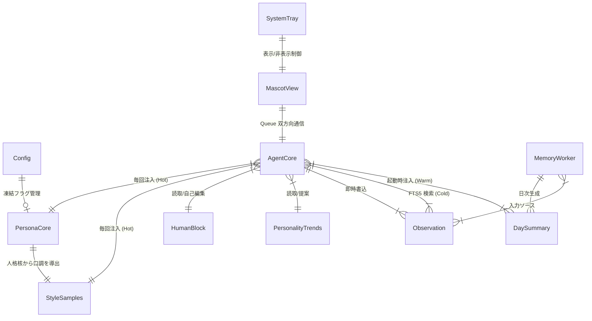

# Phase 1 MVP 要件定義書

**機能名**: phase-1-mvp
**文書種別**: Requirements（要件定義）
**根拠**: `docs/memos/middle-draft/04-unified-design.md`（承認済み統合設計案）
**作成日**: 2026-03-03
**状態**: 承認済み（Rev.3）

---

## 1. 概要

影式 Phase 1（MVP）は、**「人格を持ち、記憶を引き継ぐ Windows 常駐テキストデスクトップマスコット」** の基盤を構築する。

テキスト対話のみで人格を感じられること、セッションをまたいで記憶が連続すること、安全にシャットダウンできることが最低条件となる。

---

## 2. スコープ

### 2.1 Phase 1 に含むもの

| # | 機能領域 | 概要 |
|---|---------|------|
| 1 | GUI + 常駐 | tkinter 枠なしウィンドウ + pystray システムトレイ |
| 2 | 設定管理 | config.toml による一元管理 |
| 3 | LLM 接続 | Anthropic API（公式 SDK） |
| 4 | 人格パラメータ | C1-C11（凍結核）、S1-S7（凍結殻）の読み込み・注入 |
| 5 | 人格生成ウィザード | 3方式 + プレビュー会話 + 凍結 + ゆらぎパイプライン |
| 6 | 記憶システム | SQLite + FTS5 + 3層ロード（Hot/Warm/Cold） |
| 7 | 日次サマリー | memory_worker による日記生成 + シャットダウン2層防御 |
| 8 | 人格維持 | 簡易自己問答 + 15メッセージごとの整合性チェック |
| 9 | ユーザー情報管理 | human_block.md の AI 自己編集 |
| 10 | 傾向記録 | personality_trends.md への承認制提案 |

### 2.2 Phase 1 に含まないもの（Phase 2 以降）

- 欲求システム（DesireWorker）、自律発言（つぶやき）
- セマンティック検索（sqlite-vec + e5-small）、忘却曲線
- AgenticSearch パイプライン、curiosity_targets の運用（スキーマ予約のみ）
- PNGTuber 的ボディ表現（透過 PNG 差し替え）
- Theory of Mind（トーン分析）
- 記憶閲覧 GUI、承認制 UI
- 可変層（L1-L6）の本格運用

---

## 3. ユーザーストーリー

| ID | ストーリー | 優先度 |
|----|-----------|--------|
| US-1 | Windows PC ユーザーとして、人格を持つデスクトップマスコットと日常的にテキスト対話したい。**なぜなら**、自分のことを覚えてくれる対話相手が作業環境を豊かにするから | Must |
| US-2 | ユーザーとして、好みに合ったキャラクターを簡単に作成し、プレビューで確認してから確定したい。**なぜなら**、対話を始めてから人格が合わないと分かるのは時間の無駄だから | Must |
| US-3 | ユーザーとして、過去の会話内容を踏まえた応答を得たい（「昨日の話の続き」ができる）。**なぜなら**、毎回リセットされる会話では関係を築けないから | Must |
| US-4 | ユーザーとして、マスコットをシステムトレイに格納して作業の邪魔にならないようにしたい。**なぜなら**、常駐アプリが画面を占有すると作業効率が落ちるから | Must |
| US-5 | ユーザーとして、アプリの終了・異常終了でも会話記録が失われないことを確信したい。**なぜなら**、蓄積された記憶はキャラクターとの関係の証であり、取り返しがつかないから | Must |
| US-6 | ユーザーとして、マスコットのウィンドウをクリック（突っつき）して軽い反応を得たい。**なぜなら**、テキスト入力以外の気軽なインタラクションが「そばにいる」実感を生むから | Should |
| US-7 | ユーザーとして、人格の「根っこ」が変わらないことを信頼したい。**なぜなら**、人格が安定しないと愛着を持てず長期利用の動機が失われるから | Must |

### 3.1 ユーザーストーリー → 機能要件 トレーサビリティ

| US | 対応 FR |
|----|---------|
| US-1 | FR-2.1〜2.4, FR-6.1〜6.7 |
| US-2 | FR-5.1〜5.9 |
| US-3 | FR-3.1〜3.12 |
| US-4 | FR-2.7〜2.9 |
| US-5 | FR-3.3, FR-3.8〜3.10, FR-7.3, FR-7.5 |
| US-6 | FR-2.5 |
| US-7 | FR-4.1〜4.8, FR-6.3〜6.5 |

---

## 4. データモデル

### 4.1 エンティティ一覧

| エンティティ | 格納先 | 変更主体 | Phase 1 必須 |
|------------|--------|---------|-------------|
| PersonaCore | `persona_core.md` | ウィザード生成 → 凍結 | 必須 |
| StyleSamples | `style_samples.md` | ウィザード生成 → 凍結 | 必須 |
| HumanBlock | `human_block.md` | AI 自己編集 | 必須 |
| PersonalityTrends | `personality_trends.md` | AI 提案 → ユーザー承認 | 必須（初期は空） |
| Config | `config.toml` | ユーザー手動 | 必須 |
| Observation | SQLite `observations` | AI 自動（即時書込） | 必須 |
| DaySummary | SQLite `day_summary` | AI 自動（memory_worker） | 必須 |
| SessionContext | in-memory | AgentCore | 必須（メモリ上のみ） |
| CuriosityTarget | SQLite `curiosity_targets` | — | スキーマ予約のみ |

### 4.2 SQLite スキーマ (memory.db)

```sql
-- 会話断片（即時書込）
CREATE TABLE observations (
    id          INTEGER PRIMARY KEY AUTOINCREMENT,
    content     TEXT NOT NULL,          -- 発言テキスト
    speaker     TEXT NOT NULL,          -- 'user' | 'mascot'
    created_at  REAL NOT NULL,          -- Unix timestamp
    session_id  TEXT,                   -- セッション識別子
    embedding   BLOB                   -- Phase 2 用予約（NULL 運用）
);

-- FTS5 全文検索インデックス（外部コンテンツテーブル方式）
CREATE VIRTUAL TABLE observations_fts USING fts5(
    content,
    content='observations',
    content_rowid='id',
    tokenize='trigram'
);

-- 日次要約（memory_worker が生成）
CREATE TABLE day_summary (
    id          INTEGER PRIMARY KEY AUTOINCREMENT,
    date        TEXT NOT NULL UNIQUE,   -- 'YYYY-MM-DD'
    summary     TEXT NOT NULL,          -- 5-8文の日記形式
    created_at  REAL NOT NULL
);

-- Phase 2 用予約（Phase 1 ではテーブル作成のみ、運用しない）
CREATE TABLE curiosity_targets (
    id              INTEGER PRIMARY KEY AUTOINCREMENT,
    topic           TEXT NOT NULL,
    status          TEXT DEFAULT 'pending',
    priority        INTEGER DEFAULT 5,
    parent_id       INTEGER REFERENCES curiosity_targets(id),
    created_at      REAL NOT NULL,
    result_summary  TEXT
);

CREATE INDEX idx_curiosity_status ON curiosity_targets (status, priority);
```

### 4.3 ファイル形式定義

#### 4.3.1 persona_core.md

**形式決定**: All Markdown（YAML/TOML フロントマターは不採用）

理由:
- 追加パーサー依存なし（pyyaml 等が不要）
- ユーザーが手動編集しやすい
- 他の人格ファイル（human_block.md 等）と形式が統一される
- メタデータは Markdown テーブルとして先頭に配置（regex で十分に解析可能）

> **注**: `07-character-design.md` Section 4.4 の TOML 形式サンプルは概念図示用。正式フォーマットは本定義の Markdown テーブル形式とする。

```markdown
# [キャラクター名]

## メタデータ

| 項目 | 値 |
|------|---|
| 生成日時 | 2026-03-15T14:32:07+09:00 |
| 生成モデル | claude-haiku-4-5-20251001 |
| 生成方式 | ai_generate / user_defined / blank_growth |
| 連想キーワード | 朝型, 笑い上戸, 負けず嫌い |
| 凍結状態 | frozen / unfrozen |

## C1: 名前

[名前テキスト]

## C2: 一人称

[一人称テキスト]

## C3: 二人称（ユーザーの呼び方）

[呼び方テキスト]

## C4: 人格核文

[50-150文字の人格記述]

## C5: 性格軸

- **好奇心**: [20-50文字の自然言語記述]
- **社交性**: [20-50文字]
- **繊細さ**: [20-50文字]
- **几帳面さ**: [20-50文字]
- **思いやり**: [20-50文字]

## C6: 口調パターン

[50-200文字]

## C7: 口癖

- [口癖1]
- [口癖2]
- [口癖3]

## C8: 年齢感

[10-30文字]

## C9: 価値観

[50-150文字]

## C10: 禁忌

- [禁忌1]
- [禁忌2]

## C11: 知識の自己認識

[30-80文字]
```

**推奨合計**: 400-800文字（Hot Memory 100行以内の指針と整合）

#### 4.3.2 style_samples.md

```markdown
# [キャラクター名] - 口調参照例

## S1: 日常会話

1. （雑談中）→「[発話例]」
2. （質問されて）→「[発話例]」
3. （相槌）→「[発話例]」

## S2: 喜び

1. （褒められて）→「[発話例]」
2. （小さな喜び）→「[発話例]」

## S3: 怒り・不快

1. （嫌なことを言われて）→「[発話例]」
2. （理不尽に対して）→「[発話例]」

## S4: 悲しみ・寂しさ

1. （寂しい時）→「[発話例]」
2. （悲しい話を聞いて）→「[発話例]」

## S5: 困惑・不知

1. （知らないことを聞かれて）→「[発話例]」
2. （困った時）→「[発話例]」

## S6: ユーモア

1. （冗談を言う）→「[発話例]」
2. （ツッコミ）→「[発話例]」

## S7: 沈黙破り

1. （長い沈黙の後）→「[発話例]」
2. （何気ないつぶやき）→「[発話例]」
```

各シナリオの推奨例数: S1: 3-5例、S2-S7: 各 2-3例（合計 17-25例目安）。
**推奨合計**: 800-1500文字

#### 4.3.3 human_block.md

```markdown
# ユーザー情報

## 基本情報

（AI が会話中に検出した情報を追記）

## 好み・興味

## 習慣・パターン

## 更新履歴

- [YYYY-MM-DD] [変更内容]
```

**自己編集ガードレール**:
- 明示された情報のみ記録（推測禁止）
- 既存情報の削除禁止（上書きのみ）
- 一時情報はフィルタ（枝刈り）
- 矛盾時は最新日付が勝つ（鮮度優先）

#### 4.3.4 personality_trends.md

```markdown
# 傾向メモ

## 関係性の変化

（AI が提案 → ユーザー承認後に追記）

## 感情の傾向

## 新しい口癖候補（supplementary_styles）

## 提案履歴

- [YYYY-MM-DD] [提案内容] → 承認/却下
```

**書き込みルール**: プログラム的書き込みは禁止。AI は対話内で提案のみ行い、ユーザーの「承認」応答後に追記する。

#### 4.3.5 config.toml

```toml
[general]
persona_frozen = false          # 人格凍結フラグ
data_dir = "./data"             # データディレクトリ

[models]
conversation = "claude-haiku-4-5-20251001"
memory_worker = "claude-haiku-4-5-20251001"
utility = "claude-haiku-4-5-20251001"
wizard = "claude-haiku-4-5-20251001"         # D-12: 人格生成ウィザード用

[wizard]
association_count = 5           # 連想拡張の数
temperature = 0.9               # ウィザード時 LLM temperature
candidate_count = 3             # 方式 A の候補数
blank_freeze_threshold = 20     # 方式 C の凍結提案までの会話数

[conversation]
temperature = 0.7               # 通常対話時 LLM temperature
max_tokens = 1024               # D-15: 通常会話の応答最大トークン数

[gui]
window_width = 400
window_height = 300
opacity = 0.95                  # ウィンドウ不透明度 (0.0-1.0)
topmost = true                  # 最前面固定
font_size = 14
font_family = ""                # 空文字 = システムデフォルト

[memory]
warm_days = 5                   # Warm Memory に含む日数
cold_top_k = 5                  # Cold Memory 検索上位件数
consistency_interval = 15       # 整合性チェック間隔（メッセージ数）

[api]
max_retries = 3                 # API リトライ回数
retry_backoff_base = 2.0        # 指数バックオフの底
timeout = 30                    # タイムアウト（秒）

[tray]
minimize_to_tray = true         # 閉じる → トレイ最小化

[logging]
level = "INFO"                  # D-2: コンソール出力レベル
file_level = "DEBUG"            # D-2: ファイル出力レベル
max_bytes = 5242880             # D-2: ログファイル最大サイズ（5MB）
backup_count = 3                # D-2: ログファイル世代数
```

### 4.4 エンティティ関係図



---

## 5. インターフェース定義

### 5.1 MascotView Protocol

| メソッド | シグネチャ | Phase 1 実装 | 役割 |
|---------|----------|-------------|------|
| `show` | `() -> None` | 必須 | ウィンドウ表示 |
| `hide` | `() -> None` | 必須 | ウィンドウ非表示 |
| `display_text` | `(text: str) -> None` | 必須 | セリフ更新 |
| `set_body_state` | `(state: str) -> None` | no-op | ボディ状態設定（Phase 2） |
| `schedule` | `(delay_ms: int, callback: Callable) -> None` | 必須 | GUI スレッドでの遅延実行 |
| `on_click` | `(handler: Callable[[int, int], None]) -> None` | 必須 | クリックイベント登録 |

`schedule()` は `root.after()` に対応し、バックグラウンドスレッドから GUI への安全なコールバックを実現する。

### 5.2 GUI レイアウト（Phase 1）

```
┌─────────────────────────────────┐
│  [キャラクター名]                │  ← 枠なし透過ウィンドウ
│                                  │     ドラッグ移動可能
│  「こんにちは」                   │  ← テキスト表示エリア
│                                  │
│  [入力欄_______________] [送信]  │  ← テキスト入力
│                                  │
│  ██████████████████████████████  │  ← ウィンドウ枠 = ボディ代わり
└─────────────────────────────────┘
         ↑ クリックで「突っつかれた」反応
```

### 5.3 システムトレイメニュー

| メニュー項目 | 動作 |
|-------------|------|
| 表示 | `MascotView.show()` |
| 終了 | シャットダウンシーケンス → プロセス終了 |

### 5.4 スレッド間通信

```
メインスレッド (tkinter)          バックグラウンドスレッド (asyncio)
         │                                    │
         │── user_input ──→ queue.Queue ──→   │
         │                                    ├── AgentCore (ReAct)
         │←── response ──── queue.Queue ──── │
         │                                    ├── MemoryWorker
         │  root.after() で定期ポーリング      │
         │                                    │
```

### 5.5 起動シーケンス

```
1. config.toml 読み込み (FR-1.1, FR-1.2, FR-1.3)
2. ANTHROPIC_API_KEY 存在確認 (FR-1.6)
3. data_dir 初期化、SQLite DB 作成 (FR-1.4)
4. persona_core.md 存在チェック
   ├─ 存在しない → ウィザード起動 (FR-4.7, FR-5)
   └─ 存在する → 読み込み (FR-4.1)
5. 凍結状態チェック: 手動編集検出 (FR-4.4)
6. Hot Memory ロード: persona_core + style_samples + human_block + personality_trends (FR-3.5)
7. 日次サマリー欠損チェック → 補完生成 (FR-3.10)
8. Warm Memory ロード: 直近 warm_days 日分の day_summary (FR-3.6)
9. プロンプト構築: Hot/Warm Memory を XML タグでラップ (FR-3.11)
10. SessionContext 初期化 (FR-3.12)
11. GUI ウィンドウ表示 + トレイアイコン登録 (FR-2.1, FR-2.7)
12. バックグラウンドスレッド起動: AgentCore + MemoryWorker
```

---

## 6. 機能要件

### FR-1: アプリケーション基盤

| ID | 要件 | 優先度 | 受入条件 |
|----|------|--------|---------|
| FR-1.1 | config.toml を読み込み、全設定値をアプリケーションに反映する | Must | config.toml の各セクション値が対応する設定オブジェクトの属性に格納され、`AppConfig.models.conversation` 等で取得した値が TOML ファイルの記述と一致する |
| FR-1.2 | config.toml が存在しない場合、デフォルト値で config.toml を生成する | Must | 初回起動時にデフォルト config.toml が作成される |
| FR-1.3 | config.toml の値が不正な場合、デフォルト値にフォールバックし警告を表示する | Must | 不正な値に対してフォールバックが動作し、ログに警告が記録される |
| FR-1.4 | 起動時にデータディレクトリ（data_dir）を初期化する | Must | ディレクトリと SQLite DB が自動作成される |
| FR-1.5 | Python logging モジュールによるログ出力を行う | Should | INFO 以上のログがコンソールとファイルに出力される |
| FR-1.6 | 起動時に `ANTHROPIC_API_KEY` 環境変数の存在を確認する | Must | 未設定時に設定方法を案内するメッセージを表示してアプリを終了する |

### FR-2: GUI システム

| ID | 要件 | 優先度 | 受入条件 |
|----|------|--------|---------|
| FR-2.1 | 枠なし透過ウィンドウ（overrideredirect）で表示する | Must | タイトルバーなしのウィンドウが表示される |
| FR-2.2 | ウィンドウをドラッグで任意位置に移動できる | Must | マウスドラッグでウィンドウが追従する |
| FR-2.3 | テキスト入力欄と送信ボタンを備える | Must | テキスト入力後に送信ボタン押下で、バックグラウンドスレッド側の入力キューにテキストが enqueue される |
| FR-2.4 | マスコットのセリフをテキストで表示する | Must | display_text() でセリフが更新される |
| FR-2.5 | ウィンドウクリックで「突っつかれた」イベントを AgentCore に通知する | Should | クリックイベント発火後、入力キューにクリックイベントが enqueue され、5秒以内に `display_text()` が空でない文字列で呼ばれる |
| FR-2.6 | MascotView Protocol の6メソッドを TkinterMascotView として実装する | Must | Protocol に準拠した実装が存在する |
| FR-2.7 | pystray でシステムトレイアイコンを表示する | Must | トレイアイコンが表示される |
| FR-2.8 | 閉じるボタンでトレイに最小化する（minimize_to_tray 有効時） | Must | ×ボタンでウィンドウが非表示になりトレイに格納される |
| FR-2.9 | トレイメニューから「表示」「終了」を選択できる | Must | 「表示」選択で `MascotView.show()` が呼ばれウィンドウが可視化される。「終了」選択でシャットダウンシーケンスが開始される |
| FR-2.10 | 最前面固定（topmost）を config.toml で制御できる | Should | topmost=true/false が反映される |

### FR-3: 記憶システム

| ID | 要件 | 優先度 | 受入条件 |
|----|------|--------|---------|
| FR-3.1 | SQLite DB（memory.db）を初期化し、observations, day_summary, curiosity_targets テーブルを作成する | Must | 起動時にテーブルが存在する |
| FR-3.2 | FTS5 仮想テーブル（observations_fts）を作成し、observations と同期する | Must | observations への新規書き込み後、FTS5 インデックスが最新状態になっている（同期方式は D-4 で決定） |
| FR-3.3 | ユーザー発言とマスコット応答を observations に即時書込する | Must | 各発言が即座に DB に永続化される |
| FR-3.4 | FTS5 でキーワード検索し、上位 cold_top_k 件を返す | Must | 検索クエリに関連する observations が返される |
| FR-3.5 | 起動時に persona_core.md + human_block.md + style_samples.md + personality_trends.md を Hot Memory として読み込む | Must | システムプロンプトに4ファイルの内容が注入される |
| FR-3.6 | 起動時に直近 warm_days 日分の day_summary を Warm Memory として読み込む | Must | 直近の日次サマリーがコンテキストに含まれる |
| FR-3.7 | 会話中に必要に応じて Cold Memory（FTS5 検索）を取得する | Must | AgentCore の ReAct ループ内で FTS5 検索が実行され、取得結果が LLM に渡すプロンプトに XML タグ付きで挿入される |
| FR-3.8 | シャットダウン時に未処理 observations から日次サマリーを生成する（atexit フック） | Must | 正常終了時に当日分の day_summary が生成される |
| FR-3.9 | プロセス終了シグナルでも日次サマリー生成を実行する | Must | Windows 環境では `SetConsoleCtrlHandler` による CTRL_CLOSE_EVENT / CTRL_SHUTDOWN_EVENT を捕捉し、サマリー生成を試行する（実装方式は D-11 で決定） |
| FR-3.10 | 起動時に day_summary の欠損日を検出し、observations から遡って補完する | Must | 異常終了後の再起動でサマリーが補完される |
| FR-3.11 | メモリ内容を XML タグでラップしてプロンプトに注入する | Must | プロンプトインジェクション対策が適用される |
| FR-3.12 | セッション中の会話ターンを SessionContext（in-memory バッファ）として保持する | Must | セッション開始から現在までの会話がコンテキストウィンドウに含まれる。次回起動時には引き継がない |

### FR-4: 人格システム

| ID | 要件 | 優先度 | 受入条件 |
|----|------|--------|---------|
| FR-4.1 | persona_core.md（C1-C11）を読み込み、システムプロンプトに注入する | Must | 全パラメータが正しく読み込まれる |
| FR-4.2 | style_samples.md（S1-S7）を読み込み、システムプロンプトに注入する | Must | 口調参照例がコンテキストに含まれる |
| FR-4.3 | persona_frozen=true の場合、persona_core.md と style_samples.md へのプログラム的書き込みを禁止する | Must | 凍結後に書き込みを試みるとエラーになる |
| FR-4.4 | persona_core.md の手動編集を検出し、「再凍結しますか？」と確認する | Should | **起動時に**ファイルハッシュを前回凍結時と比較し、変更があればユーザーに確認メッセージを表示する |
| FR-4.5 | human_block.md を読み込み、会話中に検出したユーザー属性情報を自己編集する | Must | 明示的に述べられた情報のみが記録される。更新は応答生成と非同期で、会話ターン完了後に行われる |
| FR-4.6 | personality_trends.md を読み込み、AI は変更提案のみ行う（直接書き込み禁止） | Must | AI の提案がテキストで表示され、ユーザー承認後に追記される |
| FR-4.7 | persona_core.md が存在しない場合、ウィザードを起動する | Must | 初回起動時にウィザード画面に遷移する |
| FR-4.8 | persona_core.md の読み込み失敗時: (a-1) ファイル不在 → ウィザード起動へ遷移（FR-4.7 に従う）、(a-2) ファイル読取不能 → 起動中断+エラー表示、(b) メタデータセクションのパース失敗 → デフォルト値でフォールバック+警告ログ、(c) 必須フィールド（C1:名前, C4:人格核文）の欠損 → 起動中断+エラー表示 | Must | 各ケースで定義された動作が実行される |

### FR-5: 人格生成ウィザード

| ID | 要件 | 優先度 | 受入条件 |
|----|------|--------|---------|
| FR-5.1 | 3方式（AI おまかせ / 既存イメージ / 白紙育成）の選択画面を表示する | Must | 3つの選択肢が提示される |
| FR-5.2 | **方式 A（AI おまかせ）**: キーワード入力 → 連想拡張 → candidate_count 個の候補生成 → 選択 | Must | キーワードから複数の異なる人格候補が生成される |
| FR-5.3 | **方式 B（既存イメージ）**: 自由記述 → AI が整形・不足補完 → 確認 | Must | ユーザー記述が C1-C11 形式に整形される |
| FR-5.4 | **方式 C（白紙育成）**: 名前 + 一人称のみ入力 → 未凍結で開始 | Should | 最小パラメータで対話可能な状態になる |
| FR-5.5 | 生成された人格でプレビュー会話（3-5往復）を行う | Must | ユーザーが人格の雰囲気を確認できる |
| FR-5.6 | プレビュー後、ユーザーが「確定」で persona_core.md と style_samples.md を生成・凍結する | Must | ファイルが生成され persona_frozen=true になる |
| FR-5.7 | 連想拡張パイプライン: ユーザー入力 → LLM 意味拡張 → association_count 個の連想 → パラメータ統合 | Must | パイプラインが association_count 個の連想を LLM から取得し、パラメータ統合ステップに渡すことが確認できる |
| FR-5.8 | 生成メタデータ（日時・連想結果等）を persona_core.md のメタデータセクションに記録する | Should | 生成過程が記録として残る |
| FR-5.9 | 方式 C の凍結: `wizard.blank_freeze_threshold`（デフォルト 20）会話後に AI が全体像を提案 → ユーザー承認で凍結 | Should | 設定された会話数到達後に提案が表示され、承認フローが動作する |

### FR-6: 対話エンジン（AgentCore）

| ID | 要件 | 優先度 | 受入条件 |
|----|------|--------|---------|
| FR-6.1 | ReAct ベースの対話ループ: ユーザー入力 → Thought → Action → Observation → 応答生成 | Must | ユーザー入力に対し、(1) FTS5 による記憶検索結果がプロンプトに含まれ、(2) 応答テキストが `display_text()` で表示され、(3) 入力・応答の両方が observations に書き込まれる |
| FR-6.2 | コンテキスト注入の優先順位: ユーザー入力 > セッションメモリ(Warm) > 検索結果(Cold) > ペルソナ(Hot) | Must | トークン上限に達した場合のトランケーション順序が Cold → Warm → Hot → ユーザー入力の順（先に削除されるのは Cold）であることがプロンプト構築ロジックで確認できる |
| FR-6.3 | 応答前の簡易自己問答: 「このキャラクターならどう反応する？」をシステムプロンプト内で指示 | Must | 追加 API コールなしで人格一貫性が向上する |
| FR-6.4 | consistency_interval メッセージごとに軽量な整合性チェックを実行する | Should | consistency_interval 間隔でシステムプロンプトに人格一貫性の自己確認指示が含まれることを確認できる |
| FR-6.5 | 括弧書き心情描写は使わず、文体と語彙のみで感情を表現する | Must | システムプロンプトに括弧書き心情描写を使用しない旨の明示的指示が含まれる |
| FR-6.6 | 会話中の human_block 更新判断: 明示的なユーザー属性情報の検出時のみ | Must | 推測による書き込みが発生しない |
| FR-6.7 | Anthropic API（anthropic SDK）経由で LLM を呼び出す | Must | config.toml の models セクションで指定されたモデルが使用される |

### FR-7: エラーハンドリング

| ID | 要件 | 優先度 | 受入条件 |
|----|------|--------|---------|
| FR-7.1 | API 呼び出し失敗時: 最大 max_retries 回、指数バックオフでリトライ | Must | リトライが動作し、全失敗時にエラーメッセージが表示される |
| FR-7.2 | 認証エラー（401/403）時: 「API キーを確認してください」と通知 | Must | ウィンドウ内メッセージ表示またはシステムトレイ通知でユーザーに案内される（通知手段は D-9 で決定） |
| FR-7.3 | SQLite DB ロック時: 最大5回、100ms 間隔でリトライ → 失敗時はメモリバッファに一時保持 | Should | DB ロック時にデータが失われない |
| FR-7.4 | persona_core.md 読み込み失敗時: 起動を中断し明確なエラーメッセージを表示 | Must | 人格なしでの動作が発生しない |
| FR-7.5 | シャットダウン中のサマリー生成失敗時: ログに記録し次回起動で再試行 | Must | サマリー生成失敗がデータ喪失につながらない |

---

## 7. 非機能要件

| ID | カテゴリ | 要件 | 基準 |
|----|---------|------|------|
| NFR-1 | プラットフォーム | Windows 11 で動作する | Windows 11 Pro/Home 22H2+ |
| NFR-2 | 言語 | Python 3.12+ で動作する | 3.12, 3.13 対応 |
| NFR-3 | 依存 | 外部依存を最小化する | tkinter(標準), pystray, anthropic, python-dotenv |
| NFR-4 | メモリ | 常駐時のメモリ使用量を抑える | 目標: < 100MB |
| NFR-5 | 起動時間 | 起動からウィンドウ表示まで | 目標: 10秒以内（サマリー補完除く） |
| NFR-6 | 応答時間 | ユーザー入力から応答表示まで | Haiku: 1-3秒（ネットワーク依存） |
| NFR-7 | コスト | 全 Haiku 構成での月額 API コスト | 目安: $5-15（頻繁対話想定） |
| NFR-8 | セキュリティ | API キーは config.toml に保存しない | 環境変数 `ANTHROPIC_API_KEY` を使用 |
| NFR-9 | データ安全性 | 正常・異常終了で observations を失わない | 即時書込 + 2層防御 |
| NFR-10 | テスト | pytest によるテストカバレッジ | 全 FR の受入条件に対応するテストが存在すること。行カバレッジ目標 80%（実装後に実測で調整） |

---

## 8. 設計フェーズで決定する項目

以下は Design（設計）サブフェーズで決定する。

| # | 項目 | 候補・方針 | 備考 |
|---|------|-----------|------|
| D-1 | src/ ディレクトリ構成 | レイヤード or フラット | モジュール分割方針 |
| D-2 | ログ設計 | Python logging, ログレベル, ローテーション | 詳細仕様 |
| D-3 | プロンプトテンプレート設計 | system/user/assistant の構成 | AgentCore の核心 |
| D-4 | FTS5 同期トリガー実装 | INSERT/UPDATE/DELETE トリガー | DB 実装詳細 |
| D-5 | ウィザード画面フロー | GUI 遷移図 | 画面設計 |
| D-6 | エラーメッセージ一覧 | ユーザー向けメッセージ定義 | UX 設計 |
| D-7 | SQLite VACUUM 実行方式 | 起動時 / 定期 / 手動 | 長期運用の肥大化防止 |
| D-8 | 整合性チェック3類型の具体的検出方針 | プロンプト指示 or ルールベース | FR-6.4 の実装詳細 |
| D-9 | トレイ通知の実現可否 | pystray バルーン通知の Windows 11 対応 | FR-7.2 の通知手段 |
| D-10 | `.env` ファイルによる環境変数設定 | python-dotenv 採用可否 | NFR-8 の UX 改善 |
| D-11 | Windows プロセス終了シグナルの捕捉方式 | `win32api.SetConsoleCtrlHandler` / `atexit` 二重化 / ctypes | FR-3.9 の Windows 対応 |
| D-12 | ウィザードが使用するモデルスロット | `[models].utility` 流用 or `[models].wizard` 新設 | FR-5.7 のモデル指定 |
| D-13 | observations.session_id の生成規則 | UUID v4 / 起動日時ベース | FR-3.12 との連携 |
| D-14 | personality_trends 承認フローのトリガー手段 | LLM 意図検出 / キーワードマッチ / ボタン UI | FR-4.6 の実装詳細 |
| D-15 | `max_tokens` デフォルト値 | config.toml `[conversation]` に追加 | Anthropic API 必須パラメータ |

---

## 9. Three Agents Perspective Check

> **レビュー履歴**:
> - Rev.2: 初版レビュー + requirement-analyst（Sonnet）レビュー（Critical 4 / Warning 7 / Info 5）→ 全件修正
> - Rev.3: quality-auditor（Opus）品質監査（Critical 3 / Warning 8 / Info 5）→ Critical 全件 + Warning 主要件修正

### [Affirmative]（推進者）

- Phase 1 のスコープは明確に定義されており、統合設計案（04）で承認済みの内容に忠実
- データモデルが具体的（SQLite スキーマ、ファイル形式まで定義済み）で、実装に直結する
- MascotView Protocol による GUI 抽象化が Phase 2 への拡張パスを保証している
- ゆらぎパイプラインは Phase 1 でも LLM 連想拡張で一定の唯一性を確保できる
- 3層ロード + FTS5 の記憶システムは Codified Context の 283 セッション実績に裏打ちされている
- 起動シーケンス（5.5）が明示され、各 FR の実行順序が明確
- US → FR トレーサビリティマトリクス（3.1）により、要件の網羅性が視覚的に確認可能

### [Critical]（批判者）

1. **ウィザード3方式のスコープリスク**: 方式 C（白紙育成）の凍結タイミング（20会話）が未検証。3方式すべてを Phase 1 に含めると、ウィザード実装だけで相当な工数になる
2. **整合性チェックのコスト**: FR-6.4 の定期整合性チェックは utility モデルへの追加 API コールを要する可能性がある → **対応済み**: システムプロンプト内指示方式を採用し追加コールなし。3類型の検出ロジック詳細は D-8 で設計フェーズに委譲
3. **persona_core.md の Markdown パース**: メタデータの regex 解析はエッジケース（ユーザーの手動編集で形式が崩れた場合）に脆弱 → **対応済み**: FR-4.8 を3段階（ファイル不在/パース失敗/必須フィールド欠損）に細分化
4. **session_context の欠落**: 初版でセッションバッファの仕様が欠けていた → **対応済み**: FR-3.12 + エンティティ一覧に追加
5. **API キー不在時の起動フロー**: 環境変数未設定で起動した場合の UX 未定義 → **対応済み**: FR-1.6 追加
6. **SIGTERM は Windows で未サポート**: FR-3.9 が UNIX シグナルに依存しており NFR-1（Windows 11）と矛盾 → **対応済み**: Windows ConsoleCtrlHandler に変更、詳細は D-11 に委譲
7. **受入条件の曖昧表現**: FR-1.1, 2.3, 2.5, 2.9, 3.7, 6.1, 6.2 の受入条件が「正しく」「動作する」等のテスト不能表現 → **対応済み**: 全7件を観察可能な基準に書き直し

### [Mediator]（調停者）

1. **ウィザード3方式**: Phase 1 に全3方式を含める（04 承認済み）。ただし実装優先順位を **A → B → C** の順とし、方式 C の凍結タイミングは `wizard.blank_freeze_threshold` で設定可能。方式 C が遅延しても A/B だけで MVP は成立する
2. **整合性チェック**: Phase 1 では conversation モデルのシステムプロンプトに整合性チェック指示を含め、**追加 API コールは発生させない**。3類型の具体的検出方針は D-8 で設計フェーズに委譲
3. **Markdown パース**: ファイル不在→起動中断、メタデータパース失敗→デフォルト値フォールバック+警告、必須フィールド欠損→起動中断の3段階で対応（FR-4.8 に反映済み）
4. **embedding BLOB**: Phase 2 での sqlite-vec との互換性は Phase 2 設計時に検証する。最悪 ALTER TABLE でカラム再定義可能なので、Phase 1 では予約のみで問題ない
5. **ウィンドウ透過**: Phase 1 はテキストマスコット（ヘリ = ボディ）のため、透過のアーティファクトは限定的。背景色を固定色にすることで回避可能
6. **受入条件の改善**: Rev.2 で 3件、Rev.3 で追加 7件の受入条件を観察可能な基準に修正済み
7. **設計委譲事項の拡充**: D-7〜D-10（Rev.2）+ D-11〜D-15（Rev.3）を追加し、設計フェーズで決定すべき事項を明確化
8. **Windows シグナル対応**: FR-3.9 を OS 非依存の記述に変更し、Windows 固有の実装方式は D-11 に委譲。atexit（FR-3.8）+ ConsoleCtrlHandler（FR-3.9）の2層防御を維持

---

## 10. Definition of Ready チェックリスト

- [x] **Doc Exists**: `docs/specs/phase1-mvp/requirements.md` が存在する
- [x] **Unambiguous**: A（Core Value）〜 D（Constraints）の要素が明記され、解釈の揺れがない
- [ ] **Atomic**: タスクが 1 PR サイズに分割されている → tasks サブフェーズで実施
- [x] **Testable**: 受入条件がテストコードで表現可能な形式である
- [x] **Perspective Check**: Three Agents による多角的レビューが完了している
