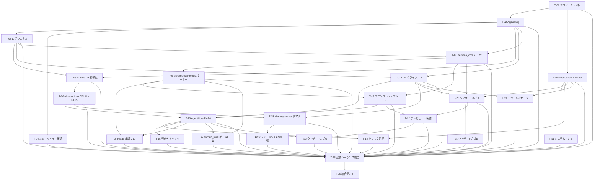

# Phase 1 MVP タスク一覧

**フェーズ**: PLANNING -- tasks サブフェーズ
**根拠**: requirements.md（承認済み Rev.3）+ design-d01〜d15（承認済み）
**作成日**: 2026-03-03

---

## タスク概要

| # | タスク名 | 対応 FR | 依存 | 推定規模 | 優先度 |
|---|---------|---------|------|---------|--------|
| T-01 | プロジェクト骨格 + pyproject.toml + ディレクトリ構成 | FR-1.4 | なし | S | Must |
| T-02 | AppConfig dataclass + config.toml 読み書き | FR-1.1, FR-1.2, FR-1.3 | T-01 | M | Must |
| T-03 | ログシステム（logging_setup） | FR-1.5 | T-02 | S | Should |
| T-04 | .env 読み込み + API キー確認 | FR-1.6 | T-02 | S | Must |
| T-05 | SQLite DB 初期化 + スキーマ定義 + FTS5 トリガー | FR-3.1, FR-3.2 | T-02, T-03 | M | Must |
| T-06 | observations CRUD + FTS5 検索 + session_id 生成 | FR-3.3, FR-3.4, FR-3.12 | T-05 | M | Must |
| T-07 | LLM クライアント（Anthropic SDK ラッパー + リトライ） | FR-6.7, FR-7.1, FR-7.2 | T-02, T-03 | M | Must |
| T-08 | persona_core.md パーサー + 凍結ガード | FR-4.1, FR-4.3, FR-4.4, FR-4.8 | T-02, T-03 | M | Must |
| T-09 | style_samples.md + human_block.md + personality_trends.md パーサー | FR-4.2, FR-4.5, FR-4.6 | T-08 | M | Must |
| T-10 | MascotView Protocol 定義 + TkinterMascotView 基本実装 | FR-2.1, FR-2.2, FR-2.3, FR-2.4, FR-2.6 | T-01 | M | Must |
| T-11 | システムトレイ（pystray）+ 最小化/復帰 | FR-2.7, FR-2.8, FR-2.9, FR-2.10 | T-10 | M | Must |
| T-12 | プロンプトテンプレートエンジン（SystemPrompt + Messages 構築） | FR-3.5, FR-3.6, FR-3.11, FR-6.2, FR-6.3, FR-6.5 | T-08, T-09 | L | Must |
| T-13 | AgentCore ReAct ループ（対話エンジン本体） | FR-6.1, FR-3.7, FR-6.6 | T-06, T-07, T-12 | L | Must |
| T-14 | クリックイベント（突っつき）処理 | FR-2.5 | T-10, T-13 | S | Should |
| T-15 | 整合性チェック（3類型 プロンプト指示 + ルールベース後処理） | FR-6.4 | T-13 | S | Should |
| T-16 | personality_trends 承認フロー（トリガー + 承認判定 + 追記） | FR-4.6 | T-13, T-09 | M | Must |
| T-17 | human_block 自己編集（属性検出 + 非同期更新） | FR-4.5, FR-6.6 | T-13, T-09 | M | Must |
| T-18 | MemoryWorker: 日次サマリー生成 + 欠損補完 | FR-3.8, FR-3.10, FR-7.5 | T-06, T-07 | M | Must |
| T-19 | シャットダウン2層防御（atexit + SetConsoleCtrlHandler） | FR-3.9 | T-18 | M | Must |
| T-20 | ウィザード方式 A（AI おまかせ: 連想拡張 + 候補生成 + 選択） | FR-5.1, FR-5.2, FR-5.7, FR-5.8 | T-07, T-08, T-10 | L | Must |
| T-21 | ウィザード方式 B（既存イメージ: 自由記述 + AI 整形補完） | FR-5.1, FR-5.3 | T-20 | M | Must |
| T-22 | ウィザードプレビュー会話 + 凍結処理 | FR-5.5, FR-5.6 | T-20, T-12 | M | Must |
| T-23 | ウィザード方式 C（白紙育成 + 凍結提案） | FR-5.4, FR-5.9 | T-22, T-13 | M | Should |
| T-24 | エラーメッセージ定義 + エラー表示 UI | FR-7.1〜7.5 | T-10, T-07 | M | Must |
| T-25 | 起動シーケンス統合 + スレッド間通信 + main.py | 全 FR | T-01〜T-24 | L | Must |
| T-26 | 結合テスト + E2E 検証 | 全 FR | T-25 | M | Must |

**タスク総数**: 26

---

## 依存関係グラフ

## 実行順序（推奨）

| フェーズ | タスク | 並列実行可能 | 概要 |
|---------|--------|-------------|------|
| 1 | T-01 | - | プロジェクト骨格 |
| 2 | T-02, T-10 | Yes | 設定 / GUI 基盤 |
| 3 | T-03, T-04, T-07, T-08, T-11 | Yes | ログ / .env / LLM / 人格パーサー / トレイ |
| 4 | T-05, T-09, T-24 | Yes | DB / 補助パーサー / エラー |
| 5 | T-06, T-12, T-20 | Yes | CRUD / プロンプト / ウィザードA |
| 6 | T-13, T-18, T-21, T-22 | Partial | AgentCore / サマリー / ウィザードB / プレビュー凍結 |
| 7 | T-14, T-15, T-16, T-17, T-19, T-23 | Yes | 後処理系 + シャットダウン + ウィザードC |
| 8 | T-25 | - | 起動シーケンス統合 |
| 9 | T-26 | - | 結合テスト |

---

## AoT によるタスク分解

### Atom テーブル

| Atom | 内容 | 依存 | 並列可否 |
|------|------|------|---------|
| T-01 | プロジェクト骨格 | なし | - |
| T-02 | AppConfig | T-01 | 可 (T-10) |
| T-10 | MascotView + tkinter | T-01 | 可 (T-02) |
| T-03 | ログシステム | T-02 | 可 (T-04, T-07, T-08) |
| T-04 | .env + API キー | T-02 | 可 (T-03, T-07, T-08) |
| T-07 | LLM クライアント | T-02, T-03 | 可 (T-08) |
| T-08 | persona_core パーサー | T-02, T-03 | 可 (T-07) |
| T-11 | システムトレイ | T-10 | 可 (T-05, T-09) |
| T-05 | SQLite DB 初期化 | T-02, T-03 | 可 (T-09, T-11, T-24) |
| T-09 | 補助パーサー | T-08 | 可 (T-05, T-24) |
| T-24 | エラーメッセージ | T-10, T-07 | 可 (T-05, T-09) |
| T-06 | observations CRUD | T-05 | 可 (T-12, T-20) |
| T-12 | プロンプトテンプレート | T-08, T-09 | 可 (T-06, T-20) |
| T-20 | ウィザード方式A | T-07, T-08, T-10 | 可 (T-06, T-12) |
| T-13 | AgentCore | T-06, T-07, T-12 | - |
| T-18 | MemoryWorker | T-06, T-07 | 可 (T-21, T-22) |
| T-21 | ウィザード方式B | T-20 | 可 (T-18, T-22) |
| T-22 | プレビュー+凍結 | T-20, T-12 | 可 (T-18, T-21) |
| T-14〜T-17, T-19, T-23 | 後処理系一括 | T-13, T-18, T-22 | 相互並列可 |
| T-25 | 統合 | 全タスク | - |
| T-26 | 結合テスト | T-25 | - |

### インターフェース契約

各タスクの Input/Output/Contract は個別タスク詳細にて定義。

---

## タスク詳細

### T-01: プロジェクト骨格 + pyproject.toml + ディレクトリ構成

**対応 FR**: FR-1.4（data_dir 初期化の前提）
**対応設計**: D-1（フィーチャーベース構成）
**依存**: なし
**推定規模**: S (Small: ~100-150行)
**概要**: D-1 で決定したフィーチャーベースのディレクトリ構成と、pyproject.toml、基本的な `__init__.py` 群、conftest.py を作成する。

**スコープ**:
- [ ] `src/kage_shiki/` 以下に core/, agent/, memory/, persona/, gui/, tray/ ディレクトリと `__init__.py` を作成
- [ ] `tests/` 以下に test_core/, test_agent/, test_memory/, test_persona/, test_gui/, test_tray/ ディレクトリと `__init__.py` を作成
- [ ] `pyproject.toml` の作成（依存: anthropic, pystray, python-dotenv, pytest）
- [ ] `.gitignore` に `data/`, `.env`, `__pycache__/` 等を追加
- [ ] `.env.example` テンプレートファイルの作成（D-10 Section 5.5）
- [ ] `src/kage_shiki/__init__.py` にバージョン定義

**テスト方針**:
- [ ] `pytest --collect-only` でテストディレクトリが正しく認識されること
- [ ] `from kage_shiki import __version__` が成功すること

**成果物**:
- `src/kage_shiki/**/__init__.py`（7ファイル）
- `tests/**/__init__.py`（7ファイル）
- `pyproject.toml`
- `.env.example`
- `tests/conftest.py`

**インターフェース契約**:
| 種別 | 定義 |
|------|------|
| Input | なし |
| Output | import 可能な kage_shiki パッケージ |
| Contract | D-1 のディレクトリ構成に完全一致すること |

---

### T-02: AppConfig dataclass + config.toml 読み書き

**対応 FR**: FR-1.1, FR-1.2, FR-1.3
**対応設計**: D-2 (logging セクション), D-12 (wizard モデルスロット), D-15 (max_tokens)
**依存**: T-01
**推定規模**: M (Medium: ~250-350行)
**概要**: config.toml の全セクションを dataclass で型付けし、読み込み/デフォルト生成/不正値フォールバックを実装する。

**スコープ**:
- [ ] `core/config.py`: AppConfig, GeneralConfig, ModelsConfig, WizardConfig, ConversationConfig, GuiConfig, MemoryConfig, ApiConfig, TrayConfig, LoggingConfig dataclass 定義
- [ ] TOML 読み込み関数（tomllib 使用）
- [ ] config.toml 不在時のデフォルト生成関数
- [ ] 各キーのバリデーション + 不正値フォールバック（WARNING ログ付き）
- [ ] `get_max_tokens(purpose: str) -> int` メソッド（D-15 用途別デフォルト値）
- [ ] ModelsConfig に `wizard` フィールド追加（D-12）
- [ ] デフォルト config.toml テンプレート（コメント付き）

**テスト方針**:
- [ ] 正常な config.toml を読み込み、全フィールドが正しく格納されることを確認
- [ ] config.toml が存在しない場合にデフォルトファイルが生成されること
- [ ] 不正な値（型違い、範囲外）に対してデフォルト値でフォールバックすること
- [ ] `get_max_tokens("conversation")` が config.toml の値を返すこと
- [ ] `get_max_tokens("wizard_generate")` が 2048 を返すこと

**成果物**:
- `src/kage_shiki/core/config.py`
- `tests/test_core/test_config.py`

**インターフェース契約**:
| 種別 | 定義 |
|------|------|
| Input | config.toml ファイルパス（存在しなくてもよい） |
| Output | AppConfig インスタンス |
| Contract | 全フィールドが型安全に取得可能。不正値はフォールバックされ WARNING ログ出力 |

---

### T-03: ログシステム（logging_setup）

**対応 FR**: FR-1.5
**対応設計**: D-2（コンソール/ファイル分離 + RotatingFileHandler）
**依存**: T-02
**推定規模**: S (Small: ~100-150行)
**概要**: D-2 で決定したログ設計を実装する。コンソールは INFO、ファイルは DEBUG、RotatingFileHandler で 5MB x 4世代。

**スコープ**:
- [ ] `core/logging_setup.py`: `setup_logging(config, log_dir)` 関数
- [ ] ConsoleHandler（StreamHandler to stderr）: INFO 以上、`[HH:MM:SS] LEVEL name message` フォーマット
- [ ] FileHandler（RotatingFileHandler）: DEBUG 以上、`YYYY-MM-DD HH:MM:SS,mmm LEVEL name message` フォーマット
- [ ] maxBytes=5MB, backupCount=3, encoding="utf-8", delay=True
- [ ] anthropic ライブラリのロガーを WARNING 以上に設定
- [ ] D-2 Section 5.5 のプライバシーポリシー: LLM レスポンス本文・ユーザー入力テキストはログ禁止のドキュメントコメント

**テスト方針**:
- [ ] `setup_logging()` 呼び出し後、ロガーにハンドラーが2つ登録されていること
- [ ] INFO メッセージがコンソールハンドラーとファイルハンドラーの両方に出力されること
- [ ] DEBUG メッセージがファイルハンドラーにのみ出力されること
- [ ] RotatingFileHandler の maxBytes, backupCount が設定どおりであること

**成果物**:
- `src/kage_shiki/core/logging_setup.py`
- `tests/test_core/test_logging_setup.py`

**インターフェース契約**:
| 種別 | 定義 |
|------|------|
| Input | AppConfig + log_dir: Path |
| Output | ルートロガーが設定済み |
| Contract | 全モジュールが `logging.getLogger(__name__)` で自動的に kage_shiki.xxx.yyy 名のロガーを取得可能 |

---

### T-04: .env 読み込み + API キー確認

**対応 FR**: FR-1.6
**対応設計**: D-10（python-dotenv 採用）
**依存**: T-02
**推定規模**: S (Small: ~80-120行)
**概要**: python-dotenv で .env を読み込み、ANTHROPIC_API_KEY の存在を確認する。未設定時は EM-001 メッセージを表示して終了。

**スコープ**:
- [ ] `main.py` の先頭で `load_dotenv(override=False)` を呼び出す処理
- [ ] ANTHROPIC_API_KEY 存在チェック関数
- [ ] .env ファイルが存在するか否かに応じた段階的エラーメッセージ（D-10 Section 5.4）
- [ ] 未設定時はアプリ終了（sys.exit(1)）

**テスト方針**:
- [ ] 環境変数に ANTHROPIC_API_KEY が設定されている場合に確認が成功すること
- [ ] 環境変数が未設定の場合に SystemExit が発生すること
- [ ] .env ファイルから API キーが読み込まれること（monkeypatch で検証）

**成果物**:
- `src/kage_shiki/core/config.py`（API キー確認関数を追加）
- `tests/test_core/test_config.py`（API キー関連テスト追加）

**インターフェース契約**:
| 種別 | 定義 |
|------|------|
| Input | 環境変数 / .env ファイル |
| Output | ANTHROPIC_API_KEY 文字列 or SystemExit |
| Contract | os.environ に既に設定されていれば .env は上書きしない |

---

### T-05: SQLite DB 初期化 + スキーマ定義 + FTS5 トリガー

**対応 FR**: FR-3.1, FR-3.2
**対応設計**: D-4（INSERT トリガー方式）, D-7（WAL モード、VACUUM なし）
**依存**: T-02, T-03
**推定規模**: M (Medium: ~200-300行)
**概要**: memory.db の初期化を行う。observations, observations_fts, day_summary, curiosity_targets テーブルを作成し、FTS5 INSERT トリガーを設定する。

**スコープ**:
- [ ] `memory/db.py`: DB 接続管理クラス（コンテキストマネージャ対応）
- [ ] `PRAGMA journal_mode = WAL` + `PRAGMA cache_size = -2000` の設定
- [ ] observations テーブル作成（id, content, speaker, created_at, session_id, embedding）
- [ ] observations_fts 仮想テーブル作成（FTS5 外部コンテンツテーブル方式）
- [ ] FTS5 INSERT トリガー作成（D-4 Section 5.1）
- [ ] day_summary テーブル作成
- [ ] curiosity_targets テーブル + インデックス作成（Phase 2 用予約）
- [ ] 全テーブルは `IF NOT EXISTS` で冪等に作成

**テスト方針**:
- [ ] 初期化後に全テーブルが存在すること（`sqlite_master` で確認）
- [ ] FTS5 トリガーが存在すること
- [ ] observations に INSERT 後、observations_fts で検索可能であること
- [ ] `journal_mode` が WAL であること
- [ ] DB ファイルが指定パスに作成されること

**成果物**:
- `src/kage_shiki/memory/db.py`
- `tests/test_memory/test_db.py`

**インターフェース契約**:
| 種別 | 定義 |
|------|------|
| Input | DB ファイルパス |
| Output | 初期化済み sqlite3.Connection |
| Contract | テーブル・トリガーが全て存在し、WAL モードが有効 |

---

### T-06: observations CRUD + FTS5 検索 + session_id 生成

**対応 FR**: FR-3.3, FR-3.4, FR-3.12
**対応設計**: D-4（FTS5 検索クエリ）, D-13（ハイブリッド session_id）
**依存**: T-05
**推定規模**: M (Medium: ~250-350行)
**概要**: observations テーブルへの即時書込、FTS5 検索（Cold Memory 取得）、session_id の生成ロジックを実装する。

**スコープ**:
- [ ] `memory/db.py` に追加: `save_observation(conn, content, speaker, created_at, session_id)` 関数
- [ ] `memory/db.py` に追加: `search_observations_fts(conn, query, top_k)` 関数（BM25 スコアリング）
- [ ] `memory/db.py` に追加: `get_day_observations(conn, date)` 関数（日次サマリー生成用）
- [ ] `memory/db.py` に追加: `get_missing_summary_dates(conn)` 関数（欠損日検出）
- [ ] `memory/db.py` に追加: `save_day_summary(conn, date, summary)` 関数
- [ ] `agent/agent_core.py` に配置: `generate_session_id()` 関数（YYYYMMDD_HHMM_xxxxxxxx 形式, D-13）
- [ ] `SessionContext` クラスの定義（session_id + turns バッファ）
- [ ] DB ロック時のリトライ処理（最大5回、100ms 間隔、FR-7.3 / EM-008）

**テスト方針**:
- [ ] `save_observation()` で INSERT 後に SELECT で取得できること
- [ ] INSERT 後に FTS5 検索で当該レコードが見つかること
- [ ] BM25 スコアリングで関連度順に並ぶこと
- [ ] `generate_session_id()` が `YYYYMMDD_HHMM_xxxxxxxx` 形式であること
- [ ] 2回呼び出しで異なる値が返ること
- [ ] DB ロック時のリトライが動作すること（mock で検証）

**成果物**:
- `src/kage_shiki/memory/db.py`（追加分）
- `src/kage_shiki/agent/agent_core.py`（session_id + SessionContext のみ）
- `tests/test_memory/test_db.py`（追加分）
- `tests/test_agent/test_agent_core.py`（session_id テスト）

**インターフェース契約**:
| 種別 | 定義 |
|------|------|
| Input | observations: (content, speaker, session_id) / FTS5: (query, top_k) |
| Output | observations: rowid / FTS5: list[dict] |
| Contract | INSERT はトリガーにより FTS5 に自動同期。検索結果は BM25 降順 |

---

### T-07: LLM クライアント（Anthropic SDK ラッパー + リトライ）

**対応 FR**: FR-6.7, FR-7.1, FR-7.2
**対応設計**: D-15（用途別 max_tokens）
**依存**: T-02, T-03
**推定規模**: M (Medium: ~200-300行)
**概要**: Anthropic SDK の Messages API ラッパーを実装する。リトライ（指数バックオフ）、認証エラー検出、用途別 max_tokens を含む。

**スコープ**:
- [ ] `agent/llm_client.py`: `LLMClient` クラス
- [ ] `send_message(system, messages, model, max_tokens, temperature)` メソッド
- [ ] `send_message_for_purpose(system, messages, purpose)` ヘルパー（purpose から model/max_tokens/temperature を自動解決）
- [ ] 指数バックオフリトライ（max_retries 回、retry_backoff_base）
- [ ] 認証エラー（401/403）の検出と例外分類（AuthenticationError を独立例外に）
- [ ] タイムアウト処理（config.api.timeout）
- [ ] D-2 ログポリシー準拠: レスポンス本文はログに出さず、トークン数・処理時間のみ記録
- [ ] D-15: 用途別 max_tokens の定数テーブル参照

**テスト方針**:
- [ ] 正常時に Anthropic API のレスポンスが返ること（mock）
- [ ] リトライ回数が max_retries に達した場合に例外が発生すること
- [ ] 401/403 エラーで AuthenticationError が発生すること
- [ ] purpose="conversation" で max_tokens=1024, temperature=0.7 が使われること
- [ ] purpose="wizard_generate" で max_tokens=2048, temperature=0.9 が使われること
- [ ] 指数バックオフの待機時間が正しいこと（mock で検証）

**成果物**:
- `src/kage_shiki/agent/llm_client.py`
- `tests/test_agent/test_llm_client.py`

**インターフェース契約**:
| 種別 | 定義 |
|------|------|
| Input | system: str, messages: list[dict], purpose: str |
| Output | LLM レスポンス（content text） |
| Contract | リトライ上限超過で例外。認証エラーは専用例外。ログに本文を含めない |

---

### T-08: persona_core.md パーサー + 凍結ガード

**対応 FR**: FR-4.1, FR-4.3, FR-4.4, FR-4.8
**対応設計**: requirements.md Section 4.3.1（Markdown テーブル形式）
**依存**: T-02, T-03
**推定規模**: M (Medium: ~250-350行)
**概要**: persona_core.md を Markdown からパースして C1-C11 + メタデータを取得する。凍結ガード、手動編集検出、エラーハンドリング（3段階）を含む。

**スコープ**:
- [ ] `persona/persona_system.py`: `PersonaSystem` クラス
- [ ] `load_persona_core(path) -> PersonaCore` メソッド（C1-C11 + メタデータ）
- [ ] Markdown セクション解析: `## C1: 名前` 〜 `## C11: 知識の自己認識` を抽出
- [ ] メタデータテーブル解析: `## メタデータ` セクションの `| 項目 | 値 |` テーブルをパース
- [ ] FR-4.8 の3段階エラー処理:
  - (a-1) ファイル不在 → ウィザード起動フラグを返す
  - (a-2) ファイル読取不能 → 起動中断エラー
  - (b) メタデータパース失敗 → デフォルトフォールバック + WARNING
  - (c) 必須フィールド（C1, C4）欠損 → 起動中断エラー
- [ ] 凍結ガード: `persona_frozen=true` 時に書き込みメソッドを拒否
- [ ] 手動編集検出: ファイルハッシュを保存し、起動時に比較（FR-4.4）
- [ ] `save_persona_core(path, persona_core)` メソッド（ウィザードからの生成時用）

**テスト方針**:
- [ ] 正常な persona_core.md を読み込み、全 C1-C11 フィールドが取得できること
- [ ] メタデータテーブルが正しくパースされること
- [ ] ファイル不在時にウィザード起動フラグが返ること
- [ ] C1（名前）欠損時に例外が発生すること
- [ ] C4（人格核文）欠損時に例外が発生すること
- [ ] メタデータパース失敗時にフォールバックが動作すること
- [ ] 凍結状態で書き込みが拒否されること
- [ ] ハッシュ変更時に手動編集が検出されること

**成果物**:
- `src/kage_shiki/persona/persona_system.py`
- `tests/test_persona/test_persona_system.py`

**インターフェース契約**:
| 種別 | 定義 |
|------|------|
| Input | persona_core.md ファイルパス |
| Output | PersonaCore dataclass or 例外 |
| Contract | C1, C4 が必須。凍結時は write 系メソッドが例外。メタデータ不良はフォールバック |

---

### T-09: style_samples.md + human_block.md + personality_trends.md パーサー

**対応 FR**: FR-4.2, FR-4.5, FR-4.6
**対応設計**: requirements.md Section 4.3.2〜4.3.4
**依存**: T-08
**推定規模**: M (Medium: ~200-300行)
**概要**: Hot Memory の残り3ファイルの読み込み/書き込みを実装する。human_block は自己編集用の更新メソッド、personality_trends は承認後の追記メソッドを含む。

**スコープ**:
- [ ] `persona/persona_system.py` に追加: `load_style_samples(path) -> str` メソッド（全文を文字列として返す）
- [ ] `persona/persona_system.py` に追加: `load_human_block(path) -> str` メソッド
- [ ] `persona/persona_system.py` に追加: `update_human_block(path, section, content)` メソッド（セクション単位の追記/更新）
- [ ] `persona/persona_system.py` に追加: `load_personality_trends(path) -> str` メソッド
- [ ] `persona/persona_system.py` に追加: `append_personality_trends(path, section, entry)` メソッド（承認後の追記）
- [ ] `persona/persona_system.py` に追加: `is_trends_empty(content) -> bool`（D-3 Section 5.4 の省略判定）
- [ ] 初回起動時に human_block.md / personality_trends.md のテンプレートファイルを生成する機能
- [ ] style_samples.md の凍結ガード（persona_frozen=true 時は書き込み禁止）

**テスト方針**:
- [ ] style_samples.md の全文読み込みが成功すること
- [ ] human_block.md の読み込み・セクション更新が正しく動作すること
- [ ] personality_trends.md の読み込み・セクション追記が正しく動作すること
- [ ] テンプレートファイルの自動生成が動作すること
- [ ] 空の personality_trends が正しく判定されること
- [ ] 凍結状態で style_samples への書き込みが拒否されること

**成果物**:
- `src/kage_shiki/persona/persona_system.py`（追加分）
- `tests/test_persona/test_persona_system.py`（追加分）

**インターフェース契約**:
| 種別 | 定義 |
|------|------|
| Input | 各 .md ファイルパス |
| Output | ファイル内容（str）/ 更新成否（bool） |
| Contract | human_block の更新は既存情報の削除不可。trends の追記はセクション末尾に挿入 |

---

### T-10: MascotView Protocol 定義 + TkinterMascotView 基本実装

**対応 FR**: FR-2.1, FR-2.2, FR-2.3, FR-2.4, FR-2.6
**対応設計**: D-1（gui/ ディレクトリ）, D-5（単一ウィンドウ + Frame 切り替え）
**依存**: T-01
**推定規模**: M (Medium: ~300-400行)
**概要**: MascotView Protocol（6メソッド）の typing.Protocol 定義と、tkinter による実装クラスを作成する。枠なしウィンドウ、ドラッグ移動、テキスト入力/送信/表示を含む。

**スコープ**:
- [ ] `gui/mascot_view.py`: `MascotView` Protocol 定義（show, hide, display_text, set_body_state, schedule, on_click）
- [ ] `gui/tkinter_view.py`: `TkinterMascotView` クラス
- [ ] overrideredirect(True) による枠なしウィンドウ
- [ ] マウスドラッグによるウィンドウ移動
- [ ] テキスト表示エリア（Label or Text ウィジェット）
- [ ] テキスト入力欄 + 送信ボタン
- [ ] Enter キーでの送信対応
- [ ] `display_text(text)` によるセリフ更新
- [ ] `schedule(delay_ms, callback)` → `root.after()` ラッパー
- [ ] `on_click(handler)` → ウィンドウ本体へのバインド
- [ ] `set_body_state(state)` → Phase 1 は no-op
- [ ] config.toml の gui セクション（window_width, window_height, opacity, topmost, font_size, font_family）の反映
- [ ] queue.Queue による入力テキストの送信（バックグラウンドスレッドへの通信経路）

**テスト方針**:
- [ ] `TkinterMascotView` が `MascotView` Protocol に準拠すること（Protocol チェック）
- [ ] `display_text()` で内部テキスト変数が更新されること
- [ ] `schedule()` が `root.after()` を呼び出すこと（mock）
- [ ] `on_click()` でハンドラーが登録されること
- [ ] 送信ボタン押下で Queue にテキストが enqueue されること

**成果物**:
- `src/kage_shiki/gui/mascot_view.py`
- `src/kage_shiki/gui/tkinter_view.py`
- `tests/test_gui/test_mascot_view.py`

**インターフェース契約**:
| 種別 | 定義 |
|------|------|
| Input | AppConfig（GUI 設定値）, queue.Queue（入力テキスト送信先） |
| Output | tkinter ウィンドウ表示 |
| Contract | Protocol の6メソッドを全て実装。queue 経由でバックグラウンドスレッドと通信 |

---

### T-11: システムトレイ（pystray）+ 最小化/復帰

**対応 FR**: FR-2.7, FR-2.8, FR-2.9, FR-2.10
**対応設計**: D-9（pystray 通知 + 遅延通知フォールバック）
**依存**: T-10
**推定規模**: M (Medium: ~150-250行)
**概要**: pystray によるシステムトレイアイコン、メニュー（表示/終了）、閉じるボタンでのトレイ最小化を実装する。

**スコープ**:
- [ ] `tray/system_tray.py`: `SystemTray` クラス
- [ ] pystray.Icon の初期化（アイコン画像は簡易な PIL Image で生成）
- [ ] メニュー項目: 「表示」→ MascotView.show(), 「終了」→ シャットダウンシーケンス開始
- [ ] ウィンドウの×ボタン（WM_DELETE_WINDOW）をインターセプト → minimize_to_tray=true の場合は hide()
- [ ] topmost 設定の反映（config.toml `[gui].topmost`）
- [ ] D-9: `pystray.Icon.notify()` による通知機能（try/except でガード）
- [ ] D-9: `error_notification_pending` フラグによる遅延通知機構
- [ ] `show()` 時の遅延通知チェック処理

**テスト方針**:
- [ ] SystemTray がメニュー項目を持つこと
- [ ] 「表示」メニュー選択時に MascotView.show() が呼ばれること（mock）
- [ ] 「終了」メニュー選択時にシャットダウンコールバックが呼ばれること（mock）
- [ ] pystray.Icon.notify() の呼び出しが例外でクラッシュしないこと
- [ ] 遅延通知フラグが正しく管理されること

**成果物**:
- `src/kage_shiki/tray/system_tray.py`
- `tests/test_tray/test_system_tray.py`

**インターフェース契約**:
| 種別 | 定義 |
|------|------|
| Input | MascotView インスタンス, シャットダウンコールバック |
| Output | システムトレイアイコン表示 |
| Contract | メニューは「表示」「終了」の2項目。notify() 失敗時は遅延通知にフォールバック |

---

### T-12: プロンプトテンプレートエンジン（SystemPrompt + Messages 構築）

**対応 FR**: FR-3.5, FR-3.6, FR-3.11, FR-6.2, FR-6.3, FR-6.5
**対応設計**: D-3（全体構造 + XML タグ + トランケーション戦略）
**依存**: T-08, T-09
**推定規模**: L (Large: ~400-500行)
**概要**: D-3 で決定したプロンプトテンプレート構造を実装する。SystemPrompt の組み立て（S1-S7 ブロック）、Messages 配列の構築、Cold Memory 注入、トランケーション戦略を含む。

**スコープ**:
- [ ] `agent/agent_core.py` に追加: `PromptBuilder` クラス
- [ ] SystemPrompt 構築: 行動規範ブロック（固定テキスト）
- [ ] SystemPrompt 構築: `<persona>` タグで persona_core.md を展開
- [ ] SystemPrompt 構築: `<style_samples>` タグで style_samples.md を展開
- [ ] SystemPrompt 構築: `<user_info>` タグで human_block.md を展開
- [ ] SystemPrompt 構築: `<personality_trends>` タグ（空なら省略）
- [ ] SystemPrompt 構築: `<recent_memories>` タグで day_summary を展開（空なら省略）
- [ ] SystemPrompt 構築: 応答規範ブロック（FR-6.3 自己問答指示、FR-6.5 括弧書き禁止）
- [ ] Messages 配列構築: セッション開始メッセージ + 会話履歴 + 最新入力
- [ ] Cold Memory 注入: `<retrieved_memories>` タグを最新 user メッセージの先頭に結合
- [ ] トランケーション戦略: Cold → Warm → セッション履歴 → Hot → ユーザー入力 の順で段階的削減
- [ ] `consistency_check_active` フラグによる整合性チェック指示の条件挿入（D-8 の指示文面）

**テスト方針**:
- [ ] SystemPrompt に `<persona>` タグが含まれること
- [ ] personality_trends が空の場合に `<personality_trends>` タグが省略されること
- [ ] day_summary がない場合に `<recent_memories>` タグが省略されること
- [ ] Cold Memory が空でない場合に `<retrieved_memories>` タグが最新 user メッセージに結合されること
- [ ] consistency_check_active=True の場合に整合性チェック指示が含まれること
- [ ] consistency_check_active=False の場合に整合性チェック指示が含まれないこと
- [ ] 応答規範ブロックに括弧書き禁止指示が含まれること

**成果物**:
- `src/kage_shiki/agent/agent_core.py`（PromptBuilder 部分）
- `tests/test_agent/test_agent_core.py`（PromptBuilder テスト）

**インターフェース契約**:
| 種別 | 定義 |
|------|------|
| Input | PersonaCore, style_samples, human_block, personality_trends, day_summaries, session_turns, cold_memories, consistency_check_active |
| Output | system: str, messages: list[dict] |
| Contract | D-3 の XML タグ構造に完全準拠。トランケーション順序は Cold > Warm > Session > Hot > Input |

---

### T-13: AgentCore ReAct ループ（対話エンジン本体）

**対応 FR**: FR-6.1, FR-3.7, FR-6.6
**対応設計**: D-3（ReAct フロー）, D-8（整合性チェック後処理）
**依存**: T-06, T-07, T-12
**推定規模**: L (Large: ~400-500行)
**概要**: ReAct ループ本体を実装する。ユーザー入力受信 → FTS5 検索 → プロンプト構築 → LLM 呼び出し → 応答表示 → 後処理（observations 書込、human_block 判断、trends 判断）。

**スコープ**:
- [ ] `agent/agent_core.py` に追加: `AgentCore` クラス
- [ ] ReAct ループ: 入力キュー監視 → Thought（FTS5 検索判断）→ Action（FTS5 検索実行）→ Observation（Cold Memory 注入）→ 応答生成 → 後処理
- [ ] FTS5 検索クエリの抽出ロジック（ユーザー入力から検索キーワードを抽出）
- [ ] message_count のインクリメントと consistency_check_active の計算
- [ ] 応答後の observations 即時書込（ユーザー入力 + マスコット応答の両方）
- [ ] human_block 更新判断のプレースホルダー（T-17 で実装）
- [ ] personality_trends 提案判断のプレースホルダー（T-16 で実装）
- [ ] D-8: ルールベース後処理（3類型パターンマッチング → WARNING ログ記録）
- [ ] セッション開始メッセージの生成（最初の LLM 呼び出しで挨拶を生成）
- [ ] asyncio イベントループとの統合（バックグラウンドスレッドで実行）
- [ ] queue.Queue 経由での MascotView との通信（入力受信 + 応答送信）

**テスト方針**:
- [ ] ユーザー入力に対して LLM 応答が生成されること（LLM mock）
- [ ] 入力と応答の両方が observations に書き込まれること
- [ ] FTS5 検索結果がプロンプトに注入されること（DB mock）
- [ ] message_count が正しくインクリメントされること
- [ ] consistency_interval 間隔で consistency_check_active が True になること
- [ ] ルールベース後処理でパターンマッチ時に WARNING ログが記録されること
- [ ] セッション開始メッセージが messages 配列の先頭に配置されること

**成果物**:
- `src/kage_shiki/agent/agent_core.py`（AgentCore 部分）
- `tests/test_agent/test_agent_core.py`（AgentCore テスト）

**インターフェース契約**:
| 種別 | 定義 |
|------|------|
| Input | queue.Queue（ユーザー入力）, AppConfig, DB Connection, PersonaSystem |
| Output | queue.Queue（LLM 応答テキスト） |
| Contract | 入力受信ごとに observations に即時書込。FTS5 検索は必要時のみ実行 |

---

### T-14: クリックイベント（突っつき）処理

**対応 FR**: FR-2.5
**対応設計**: D-3 Section 5.11
**依存**: T-10, T-13
**推定規模**: S (Small: ~50-80行)
**概要**: ウィンドウクリックで「突っつかれた」イベントを AgentCore に通知し、キャラクターらしい反応を返す。

**スコープ**:
- [ ] TkinterMascotView の on_click ハンドラーから AgentCore の入力キューに `[クリックイベント] ユーザーがウィンドウをクリックして突っつきました` テキストを enqueue
- [ ] AgentCore 側でクリックイベントを通常のユーザー入力として処理
- [ ] max_tokens は "poke" 用の 256 を使用（D-15）

**テスト方針**:
- [ ] クリックイベント発火後、入力キューにクリックテキストが enqueue されること
- [ ] AgentCore がクリックテキストに対して応答を生成すること（LLM mock）
- [ ] 応答が display_text() で表示されること

**成果物**:
- `src/kage_shiki/gui/tkinter_view.py`（on_click ハンドラー追加）
- `src/kage_shiki/agent/agent_core.py`（クリックイベント識別ロジック追加）
- `tests/test_gui/test_mascot_view.py`（クリックイベントテスト追加）

**インターフェース契約**:
| 種別 | 定義 |
|------|------|
| Input | ウィンドウクリック座標 (x, y) |
| Output | display_text() が空でない文字列で呼ばれる |
| Contract | 5秒以内に応答が表示されること（FR-2.5 受入条件） |

---

### T-15: 整合性チェック（3類型 プロンプト指示 + ルールベース後処理）

**対応 FR**: FR-6.4
**対応設計**: D-8（構造化自己問答 + ルールベース後処理）
**依存**: T-13
**推定規模**: S (Small: ~100-150行)
**概要**: D-8 で定義した整合性チェックの3類型パターンと、ルールベース後処理のパターンマッチングを実装する。

**スコープ**:
- [ ] `agent/agent_core.py` に追加: `CHARACTER_HALLUCINATION_PATTERNS`, `ACTION_AMBIGUITY_PATTERNS`, `KNOWLEDGE_DEGRADATION_PATTERNS` 定数
- [ ] `agent/agent_core.py` に追加: `check_consistency_rules(response_text) -> list[ConsistencyHit]` 関数
- [ ] ヒット時の WARNING ログ記録（D-8 Section 5.5 のフォーマット）
- [ ] `consistency_hit` カウンタのセッション累計管理
- [ ] consistency_interval=0 の場合の無効化処理

**テスト方針**:
- [ ] 「私はAIです」を含む応答でタイプ1ヒットが検出されること
- [ ] 「了解しました」を含む応答でタイプ2ヒットが検出されること
- [ ] 「答えられません」を含む応答でタイプ3ヒットが検出されること
- [ ] 正常な応答でヒットが検出されないこと
- [ ] consistency_interval=0 でチェックが無効化されること

**成果物**:
- `src/kage_shiki/agent/agent_core.py`（整合性チェック部分）
- `tests/test_agent/test_agent_core.py`（整合性チェックテスト）

**インターフェース契約**:
| 種別 | 定義 |
|------|------|
| Input | LLM 応答テキスト |
| Output | ConsistencyHit のリスト（空ならヒットなし） |
| Contract | 追加 API コールなし。ルールベースはログ記録のみ（再生成なし） |

---

### T-16: personality_trends 承認フロー（トリガー + 承認判定 + 追記）

**対応 FR**: FR-4.6
**対応設計**: D-14（ルールベーストリガー + 通常対話内提案 + キーワード承認判定）
**依存**: T-13, T-09
**推定規模**: M (Medium: ~300-400行)
**概要**: D-14 で定義した personality_trends への提案フロー全体を実装する。3つのトリガー条件、プロンプト追加指示、承認/却下パターンマッチ、ファイル追記。

**スコープ**:
- [ ] トリガー T1: 関係性の変化（day_summary のキーワード集計）
- [ ] トリガー T2: 感情の傾向変化（感情キーワードリストマッチング）
- [ ] トリガー T3: 口癖候補（observations の高頻度フレーズ抽出）
- [ ] トリガー評価タイミング: セッション開始時に1回
- [ ] 提案用プロンプト追加指示の動的挿入（`---personality_trends_proposal---` フォーマット）
- [ ] `APPROVAL_PATTERNS` + `APPROVAL_NEGATIVE_MODIFIERS` による承認判定
- [ ] `REJECTION_PATTERNS` による却下判定
- [ ] 判定不明時の保留タイムアウト（3ターン）
- [ ] 承認時の personality_trends.md への追記処理
- [ ] 提案履歴セクションへの記録（承認/却下/保留）
- [ ] 同一セッション内の提案件数制限（最大2件）

**テスト方針**:
- [ ] T1 トリガー: 同一テーマが3日以上の day_summary に登場する場合に発火すること
- [ ] T2 トリガー: ポジティブキーワードが warm_days/2 日以上に登場する場合に発火すること
- [ ] 「承認」「はい」「OK」で承認判定されること
- [ ] 「承認できない」で却下判定されること
- [ ] 承認後に personality_trends.md の対象セクションに追記されること
- [ ] 提案履歴が記録されること

**成果物**:
- `src/kage_shiki/agent/agent_core.py`（トリガー + 承認フロー部分）
- `tests/test_agent/test_agent_core.py`（承認フローテスト）

**インターフェース契約**:
| 種別 | 定義 |
|------|------|
| Input | day_summaries, observations, personality_trends.md 内容 |
| Output | 提案テキスト（プロンプト追加指示）/ 追記処理の成否 |
| Contract | 追加 API コールなし。提案は通常応答内に統合。承認はキーワードマッチ |

---

### T-17: human_block 自己編集（属性検出 + 非同期更新）

**対応 FR**: FR-4.5, FR-6.6
**対応設計**: requirements.md Section 4.3.3（ガードレール）
**依存**: T-13, T-09
**推定規模**: M (Medium: ~200-300行)
**概要**: 会話中にユーザーの属性情報（名前、好み、習慣等）を検出し、human_block.md を自己編集する。推測禁止、削除禁止、一時情報フィルタのガードレールを含む。

**スコープ**:
- [ ] `agent/agent_core.py` に追加: human_block 更新判断ロジック
- [ ] LLM 応答の後処理で「ユーザー属性情報が明示された」かを判断
- [ ] 判断基準: LLM にシステムプロンプトで「明示的に述べられた情報のみ抽出」を指示し、応答内に更新マーカーを埋め込む方式
- [ ] 更新マーカーのパース（`---human_block_update---` / `---update_end---`）
- [ ] human_block.md の対象セクションへの追記（PersonaSystem.update_human_block 呼び出し）
- [ ] ガードレール:
  - 推測による書き込み禁止
  - 既存情報の削除禁止（上書きのみ）
  - 一時情報のフィルタ
  - 矛盾時は最新日付が優先

**テスト方針**:
- [ ] 「私の名前は田中です」を含む会話で名前が human_block に記録されること
- [ ] 推測的な情報（「きっとプログラマーだろう」）が記録されないこと
- [ ] 既存情報が削除されないこと（追記/更新のみ）
- [ ] 更新履歴セクションに日付付きで記録されること

**成果物**:
- `src/kage_shiki/agent/agent_core.py`（human_block 更新ロジック）
- `tests/test_agent/test_agent_core.py`（human_block 更新テスト）

**インターフェース契約**:
| 種別 | 定義 |
|------|------|
| Input | LLM 応答テキスト（更新マーカー含む可能性） |
| Output | human_block.md への追記（非同期） |
| Contract | 明示された情報のみ記録。削除禁止。応答生成とは非同期で実行 |

---

### T-18: MemoryWorker: 日次サマリー生成 + 欠損補完

**対応 FR**: FR-3.8, FR-3.10, FR-7.5
**依存**: T-06, T-07
**推定規模**: M (Medium: ~250-350行)
**概要**: 当日の observations から5-8文の日記形式の日次サマリーを LLM で生成し、day_summary テーブルに保存する。起動時の欠損日補完ロジックを含む。

**スコープ**:
- [ ] `memory/memory_worker.py`: `MemoryWorker` クラス
- [ ] `generate_daily_summary(conn, llm_client, date) -> str` メソッド
  - 指定日の observations を取得
  - LLM（memory_worker モデル、max_tokens=800）で5-8文の日記形式を生成
  - day_summary テーブルに INSERT
- [ ] `generate_daily_summary_sync(conn, llm_client, date)` メソッド（シャットダウン用の同期版）
- [ ] `check_and_fill_missing_summaries(conn, llm_client)` メソッド（起動時の欠損補完）
  - observations から日付一覧を取得
  - day_summary に存在しない日を検出
  - 欠損日ごとにサマリーを生成
- [ ] サマリー生成用のプロンプトテンプレート
- [ ] サマリー生成失敗時のログ記録（FR-7.5: EM-009）

**テスト方針**:
- [ ] observations が存在する日に対してサマリーが生成されること（LLM mock）
- [ ] 生成されたサマリーが day_summary テーブルに保存されること
- [ ] 欠損日検出ロジックが正しく動作すること
- [ ] observations がない日にはサマリーが生成されないこと
- [ ] サマリー生成失敗時にログに記録されること

**成果物**:
- `src/kage_shiki/memory/memory_worker.py`
- `tests/test_memory/test_memory_worker.py`

**インターフェース契約**:
| 種別 | 定義 |
|------|------|
| Input | DB Connection, LLMClient, 対象日（date） |
| Output | day_summary テーブルへの INSERT |
| Contract | 同一日のサマリーは UNIQUE 制約で重複防止。失敗時はログ記録のみ |

---

### T-19: シャットダウン2層防御（atexit + SetConsoleCtrlHandler）

**対応 FR**: FR-3.9
**対応設計**: D-11（ctypes + atexit の二重化）
**依存**: T-18
**推定規模**: M (Medium: ~150-250行)
**概要**: D-11 で決定した2層防御を実装する。atexit フック（Layer 1）と ctypes SetConsoleCtrlHandler（Layer 2）の両方で日次サマリー生成を試行する。

**スコープ**:
- [ ] シャットダウンハンドラーモジュール（main.py または専用モジュール）
- [ ] ctypes による _HandlerRoutine 型定義
- [ ] `_ctrl_handler` コールバック（CTRL_CLOSE_EVENT, CTRL_LOGOFF_EVENT, CTRL_SHUTDOWN_EVENT を捕捉）
- [ ] `_handler_ref` のモジュールレベル参照保持（GC 対策）
- [ ] `register_windows_ctrl_handler(shutdown_callback) -> bool` 関数
- [ ] `make_atexit_handler(shutdown_callback)` 関数
- [ ] `_shutdown_done = threading.Event()` による2重実行防止
- [ ] 登録失敗時の WARNING ログ（コンソールなし環境対応）
- [ ] スレッドセーフ注意事項のドキュメントコメント

**テスト方針**:
- [ ] `_shutdown_done` フラグにより shutdown_callback が1回のみ実行されること
- [ ] atexit ハンドラーと SetConsoleCtrlHandler ハンドラーを両方呼んだとき、callback が1回のみ実行されること
- [ ] SetConsoleCtrlHandler 登録失敗時にアプリが続行すること（mock）
- [ ] shutdown_callback 内で例外が発生してもクラッシュしないこと

**成果物**:
- `src/kage_shiki/core/shutdown_handler.py`
- `tests/test_core/test_shutdown_handler.py`

**インターフェース契約**:
| 種別 | 定義 |
|------|------|
| Input | shutdown_callback（引数なし・戻り値なしの同期関数） |
| Output | Windows コントロールイベント時に callback 実行 |
| Contract | 2重実行防止。登録失敗時はアプリ続行（Layer 1 がバックアップ） |

---

### T-20: ウィザード方式 A（AI おまかせ: 連想拡張 + 候補生成 + 選択）

**対応 FR**: FR-5.1, FR-5.2, FR-5.7, FR-5.8
**対応設計**: D-5（方式 A フロー）, D-12（wizard モデルスロット）
**依存**: T-07, T-08, T-10
**推定規模**: L (Large: ~400-500行)
**概要**: ウィザードの方式選択画面と方式 A（AI おまかせ）の全フローを実装する。WizardController + 各ステップのフレーム + LLM パイプライン。

**スコープ**:
- [ ] `persona/wizard.py`: `WizardController` クラス
- [ ] 方式選択画面の GUI フレーム（3方式ボタン + 説明文）
- [ ] 方式 A のステップ:
  - A1: キーワード入力画面（キーワード1-3個 + ユーザー名任意）
  - A2: 連想拡張処理中（ステップ 1/3 表示 + ドット点滅アニメーション）
  - A3: 候補生成処理中（ステップ 2/3 表示）
  - A4: 候補選択画面（candidate_count 個の候補リスト: 名前 + C4 要約 + 性格軸3点）
- [ ] 連想拡張パイプライン（FR-5.7）: ユーザー入力 → LLM 意味拡張 → association_count 個の連想
- [ ] 候補生成パイプライン: 連想結果 → LLM で C1-C11 を候補ごとに生成
- [ ] スタイルサンプル生成: 選択された候補の C1-C11 → LLM で S1-S7 を生成
- [ ] 処理中のキャンセルボタン（方式選択画面に戻る）
- [ ] エラー時のフォールバック（D-5 Section 5.8: EM-010）
- [ ] 生成メタデータの記録（日時、連想結果、生成方式: FR-5.8）
- [ ] TkinterMascotView のウィザードモード切り替え（Frame 表示/非表示）
- [ ] `models.wizard` + `wizard.temperature` の使用（D-12）

**テスト方針**:
- [ ] 連想拡張パイプラインが association_count 個の連想を返すこと（LLM mock）
- [ ] 候補生成が candidate_count 個の候補を返すこと
- [ ] 各候補が C1-C11 の全フィールドを持つこと
- [ ] スタイルサンプル生成が S1-S7 を返すこと
- [ ] 生成メタデータ（日時、連想結果）が保持されること
- [ ] WizardController の状態遷移が正しいこと

**成果物**:
- `src/kage_shiki/persona/wizard.py`
- `src/kage_shiki/gui/tkinter_view.py`（ウィザードフレーム追加）
- `tests/test_persona/test_wizard.py`

**インターフェース契約**:
| 種別 | 定義 |
|------|------|
| Input | ユーザーキーワード, AppConfig, LLMClient |
| Output | PersonaCore 草案 + StyleSamples 草案 |
| Contract | wizard モデル + temperature=0.9 を使用。candidate_count 個の候補を生成 |

---

### T-21: ウィザード方式 B（既存イメージ: 自由記述 + AI 整形補完）

**対応 FR**: FR-5.1, FR-5.3
**対応設計**: D-5（方式 B フロー）
**依存**: T-20
**推定規模**: M (Medium: ~200-300行)
**概要**: ウィザード方式 B（既存イメージ）のフローを実装する。自由記述入力 → AI 整形・補完 → 確認 → プレビューへ。

**スコープ**:
- [ ] `persona/wizard.py` に追加: 方式 B のロジック
- [ ] B1: 自由記述入力画面（大きなテキストエリア + ユーザー名任意 + ヒント例表示）
- [ ] B2: 整形処理中表示
- [ ] B3: 整形確認画面（名前、人格核文、口調サンプルの要約表示 + AI 補完部分の明示）
- [ ] LLM による整形・補完パイプライン: ユーザー記述 → C1-C11 + S1-S7 形式に整形
- [ ] 「記述を修正する」ボタン（入力を保持して B1 に戻る）
- [ ] `models.wizard` + `wizard.temperature` の使用

**テスト方針**:
- [ ] 自由記述テキストが C1-C11 形式に整形されること（LLM mock）
- [ ] 不足した部分が AI 補完されること
- [ ] 入力保持した状態で修正画面に戻れること
- [ ] 整形結果が PersonaCore 構造に変換できること

**成果物**:
- `src/kage_shiki/persona/wizard.py`（方式 B 追加分）
- `src/kage_shiki/gui/tkinter_view.py`（方式 B フレーム追加）
- `tests/test_persona/test_wizard.py`（方式 B テスト追加）

**インターフェース契約**:
| 種別 | 定義 |
|------|------|
| Input | ユーザー自由記述テキスト |
| Output | PersonaCore 草案 + StyleSamples 草案 |
| Contract | ユーザー記述の意図を尊重し、不足分のみ AI 補完 |

---

### T-22: ウィザードプレビュー会話 + 凍結処理

**対応 FR**: FR-5.5, FR-5.6
**対応設計**: D-5（プレビュー会話仕様 + 凍結確認）, D-12（プレビューは conversation モデル）
**依存**: T-20, T-12
**推定規模**: M (Medium: ~250-350行)
**概要**: 生成された人格でプレビュー会話（3-5往復）を行い、ユーザーが「確定」で persona_core.md と style_samples.md を生成・凍結する。

**スコープ**:
- [ ] プレビュー会話フレーム: 会話エリア + 入力欄 + 送信ボタン + ターン数表示
- [ ] プレビュー会話のシステムプロンプト構築（生成した C1-C11, S1-S7 草案を注入）
- [ ] `models.conversation` + `conversation.temperature` の使用（D-12: 本番体験と一致）
- [ ] 3往復以上で「この子に決める」ボタンを有効化
- [ ] 「別の候補を見る」ボタン（方式 A のみ）
- [ ] 「最初からやり直す」ボタン（方式選択画面に戻る）
- [ ] 凍結確認ダイアログ:
  - 「決定する」→ ファイル生成 + 凍結
  - 「もう少し話す」→ プレビュー続行
  - 「最初からやり直す」→ 方式選択画面
- [ ] persona_core.md の生成・保存（PersonaSystem.save_persona_core 呼び出し）
- [ ] style_samples.md の生成・保存
- [ ] config.toml の `persona_frozen = true` への更新
- [ ] プレビュー会話は observations に保存しない

**テスト方針**:
- [ ] プレビュー会話が草案の人格で応答すること（LLM mock）
- [ ] 3往復未満では「この子に決める」が無効であること
- [ ] 凍結処理で persona_core.md と style_samples.md が生成されること
- [ ] config.toml の persona_frozen が true になること
- [ ] プレビュー会話が observations に保存されないこと

**成果物**:
- `src/kage_shiki/persona/wizard.py`（プレビュー + 凍結部分）
- `src/kage_shiki/gui/tkinter_view.py`（プレビューフレーム + 凍結確認ダイアログ）
- `tests/test_persona/test_wizard.py`（プレビュー + 凍結テスト）

**インターフェース契約**:
| 種別 | 定義 |
|------|------|
| Input | PersonaCore 草案, StyleSamples 草案, LLMClient |
| Output | 凍結済み persona_core.md + style_samples.md |
| Contract | プレビューは conversation モデルを使用。observations に保存しない。凍結後は persona_frozen=true |

---

### T-23: ウィザード方式 C（白紙育成 + 凍結提案）

**対応 FR**: FR-5.4, FR-5.9
**対応設計**: D-5（方式 C フロー）
**依存**: T-22, T-13
**推定規模**: M (Medium: ~200-300行)
**概要**: 方式 C（白紙育成）の実装。名前 + 一人称のみで未凍結開始し、blank_freeze_threshold 会話後に凍結提案。

**スコープ**:
- [ ] C1: 最小パラメータ入力画面（名前必須 + 一人称必須 + ユーザー名任意）
- [ ] 最小 persona_core.md の生成（C1:名前, C2:一人称のみ。他は空/デフォルト）
- [ ] 最小 style_samples.md の生成（空テンプレート）
- [ ] `persona_frozen = false` で開始
- [ ] メイン画面への遷移（ウィンドウタイトルに「（育成中）」付与）
- [ ] 会話数カウント: speaker='mascot' の observations 数をカウント
- [ ] blank_freeze_threshold 到達時の凍結提案:
  - AI が observations から C1-C11 草案を LLM で生成（wizard モデル使用）
  - 凍結提案ダイアログの表示
  - 「凍結する」→ 凍結確認 → ファイル更新 + persona_frozen=true
  - 「まだ続ける」→ 次の threshold で再提案
- [ ] 「まだ続ける」後の再提案間隔は同じ threshold 値を使用

**テスト方針**:
- [ ] 名前と一人称のみで最小 persona_core.md が生成されること
- [ ] 未凍結状態で通常対話が可能であること
- [ ] blank_freeze_threshold 到達時に凍結提案が発生すること（カウント mock）
- [ ] 「まだ続ける」後の再提案が正しいタイミングで発生すること
- [ ] 凍結承認後に persona_core.md が更新され persona_frozen=true になること

**成果物**:
- `src/kage_shiki/persona/wizard.py`（方式 C 追加分）
- `src/kage_shiki/gui/tkinter_view.py`（方式 C フレーム + 凍結提案ダイアログ）
- `tests/test_persona/test_wizard.py`（方式 C テスト追加）

**インターフェース契約**:
| 種別 | 定義 |
|------|------|
| Input | 名前, 一人称, (ユーザー名) |
| Output | 未凍結 persona_core.md → 凍結提案 → 凍結済み persona_core.md |
| Contract | blank_freeze_threshold は config.toml で設定可能。凍結は必ずユーザー承認が必要 |

---

### T-24: エラーメッセージ定義 + エラー表示 UI

**対応 FR**: FR-7.1〜7.5
**対応設計**: D-6（エラーメッセージ一覧 + テンプレート変数化）
**依存**: T-10, T-07
**推定規模**: M (Medium: ~200-300行)
**概要**: D-6 で定義した全エラーメッセージ（EM-001〜EM-011）を定数として実装し、エラー表示 UI（専用画面、警告バー、ウィンドウ内テキスト）を作成する。

**スコープ**:
- [ ] エラーメッセージ定数定義（EM-001〜EM-011 の全テキスト）
- [ ] `str.format_map(defaultdict(str, **kwargs))` によるテンプレート変数解決
- [ ] 専用エラー画面フレーム（Critical エラー用: EM-001, EM-003, EM-004, EM-007）
- [ ] 警告バーフレーム（Warning エラー用: EM-002, EM-005）
- [ ] キャラクター口調テンプレート（EM-006, EM-007 ウィンドウ表示版）
- [ ] 各エラーのログ出力フォーマット

**テスト方針**:
- [ ] 全 EM-XXX メッセージがテンプレート変数なしでもフォーマット可能であること
- [ ] テンプレート変数が提供された場合に正しく埋め込まれること
- [ ] 未定義キーが空文字にフォールバックすること

**成果物**:
- `src/kage_shiki/core/errors.py`（エラーメッセージ定義）
- `src/kage_shiki/gui/tkinter_view.py`（エラー表示 UI 追加）
- `tests/test_core/test_errors.py`

**インターフェース契約**:
| 種別 | 定義 |
|------|------|
| Input | エラーID (EM-XXX) + テンプレート変数（dict） |
| Output | フォーマット済みメッセージ文字列 |
| Contract | 未定義変数は空文字にフォールバック。Critical はシステムメッセージ、Warning/Info はキャラクター口調可 |

---

### T-25: 起動シーケンス統合 + スレッド間通信 + main.py

**対応 FR**: 全 FR（起動シーケンス: requirements.md Section 5.5）
**依存**: T-01〜T-24 の全タスク
**推定規模**: L (Large: ~400-500行)
**概要**: 全コンポーネントを統合し、requirements.md Section 5.5 の起動シーケンスを main.py に実装する。メインスレッド（tkinter）とバックグラウンドスレッド（asyncio: AgentCore + MemoryWorker）のスレッド間通信を構築する。

**スコープ**:
- [ ] `main.py`: エントリポイント
- [ ] 起動シーケンスの実装:
  0. .env ファイル読み込み（load_dotenv）
  1. config.toml 読み込み
  2. ANTHROPIC_API_KEY 存在確認
  3. data_dir 初期化（ディレクトリ作成）
  4. logging_setup 呼び出し
  5. SQLite DB 初期化
  6. persona_core.md 存在チェック → 不在ならウィザード起動
  7. 凍結状態チェック: 手動編集検出
  8. Hot Memory ロード
  9. 日次サマリー欠損チェック → 補完生成
  10. Warm Memory ロード
  11. プロンプト構築
  12. SessionContext 初期化
  13. GUI ウィンドウ表示 + トレイアイコン登録
  14. バックグラウンドスレッド起動: AgentCore + MemoryWorker
  15. atexit + SetConsoleCtrlHandler 登録
- [ ] スレッド間通信:
  - メインスレッド → バックグラウンド: queue.Queue（ユーザー入力）
  - バックグラウンド → メインスレッド: queue.Queue（LLM 応答）
  - root.after() による定期ポーリング
- [ ] threading.Thread でバックグラウンドスレッド起動（daemon=True）
- [ ] asyncio イベントループのバックグラウンドスレッド内での実行
- [ ] 正常終了シーケンス（pystray「終了」→ サマリー生成 → プロセス終了）

**テスト方針**:
- [ ] 起動シーケンスの各ステップが正しい順序で実行されること（統合テスト）
- [ ] config.toml 不在時にデフォルトが生成されること
- [ ] persona_core.md 不在時にウィザードモードで起動すること
- [ ] バックグラウンドスレッドが起動すること
- [ ] queue 経由のメッセージ送受信が動作すること

**成果物**:
- `src/kage_shiki/main.py`
- `tests/test_integration/test_startup.py`

**インターフェース契約**:
| 種別 | 定義 |
|------|------|
| Input | なし（コマンドラインからの起動） |
| Output | GUI ウィンドウ表示 + バックグラウンド処理の開始 |
| Contract | 起動シーケンスは requirements.md Section 5.5 の順序に完全準拠 |

---

### T-26: 結合テスト + E2E 検証

**対応 FR**: 全 FR（受入条件の網羅的検証）
**依存**: T-25
**推定規模**: M (Medium: ~300-400行)
**概要**: 全タスクの統合状態で、requirements.md の各 FR の受入条件をテストする。

**スコープ**:
- [ ] 起動〜対話〜終了の基本フローテスト（LLM mock）
- [ ] ウィザードフロー（方式 A）の E2E テスト
- [ ] 記憶システムの統合テスト（即時書込 → FTS5 検索 → 応答に反映）
- [ ] シャットダウン時のサマリー生成テスト
- [ ] 起動時の欠損補完テスト
- [ ] config.toml の各設定値が実際に反映されることの確認
- [ ] エラーハンドリングの統合テスト:
  - API キー未設定時の動作
  - persona_core.md 不在時の動作
  - API 呼び出し失敗時のリトライ動作
- [ ] NFR-10: テストカバレッジの計測（目標 80%）

**テスト方針**:
- [ ] pytest + pytest-cov でカバレッジ計測
- [ ] LLM 呼び出しは全て mock（実 API は使わない）
- [ ] GUI テストは tkinter の内部状態を直接検査（画面操作はしない）
- [ ] SQLite は :memory: DB またはテンポラリファイルを使用

**成果物**:
- `tests/test_integration/test_e2e.py`
- `tests/test_integration/test_startup.py`（T-25 から引き継ぎ + 拡張）
- `tests/conftest.py`（共通フィクスチャの拡充）

**インターフェース契約**:
| 種別 | 定義 |
|------|------|
| Input | 全モジュールの統合状態 |
| Output | テスト結果レポート + カバレッジレポート |
| Contract | 全 FR の受入条件に対応するテストが存在すること |

---

## DoR 最終チェック

### 全タスク共通
- [x] 対応する仕様書（requirements.md + design-d01〜d15）が存在し承認済み
- [x] 受け入れ条件がテスト可能（各タスクにテスト方針を明記）
- [x] 1 PR で完結するサイズ（全タスク S/M/L 以下、XL なし）

### タスク個別
| タスク | 仕様リンク | テスト可能 | PRサイズ | 優先度 |
|--------|-----------|-----------|---------|--------|
| T-01 | D-1 | Yes | S | Must |
| T-02 | FR-1.1〜1.3, D-2, D-12, D-15 | Yes | M | Must |
| T-03 | FR-1.5, D-2 | Yes | S | Should |
| T-04 | FR-1.6, D-10 | Yes | S | Must |
| T-05 | FR-3.1, FR-3.2, D-4, D-7 | Yes | M | Must |
| T-06 | FR-3.3, FR-3.4, FR-3.12, D-4, D-13 | Yes | M | Must |
| T-07 | FR-6.7, FR-7.1, FR-7.2, D-15 | Yes | M | Must |
| T-08 | FR-4.1, FR-4.3, FR-4.4, FR-4.8 | Yes | M | Must |
| T-09 | FR-4.2, FR-4.5, FR-4.6 | Yes | M | Must |
| T-10 | FR-2.1〜2.4, FR-2.6, D-5 | Yes | M | Must |
| T-11 | FR-2.7〜2.10, D-9 | Yes | M | Must |
| T-12 | FR-3.5, FR-3.6, FR-3.11, FR-6.2, FR-6.3, FR-6.5, D-3 | Yes | L | Must |
| T-13 | FR-6.1, FR-3.7, FR-6.6, D-3, D-8 | Yes | L | Must |
| T-14 | FR-2.5, D-3 | Yes | S | Should |
| T-15 | FR-6.4, D-8 | Yes | S | Should |
| T-16 | FR-4.6, D-14 | Yes | M | Must |
| T-17 | FR-4.5, FR-6.6 | Yes | M | Must |
| T-18 | FR-3.8, FR-3.10, FR-7.5 | Yes | M | Must |
| T-19 | FR-3.9, D-11 | Yes | M | Must |
| T-20 | FR-5.1, FR-5.2, FR-5.7, FR-5.8, D-5, D-12 | Yes | L | Must |
| T-21 | FR-5.1, FR-5.3, D-5 | Yes | M | Must |
| T-22 | FR-5.5, FR-5.6, D-5, D-12 | Yes | M | Must |
| T-23 | FR-5.4, FR-5.9, D-5 | Yes | M | Should |
| T-24 | FR-7.1〜7.5, D-6 | Yes | M | Must |
| T-25 | 全 FR | Yes | L | Must |
| T-26 | 全 FR, NFR-10 | Yes | M | Must |
