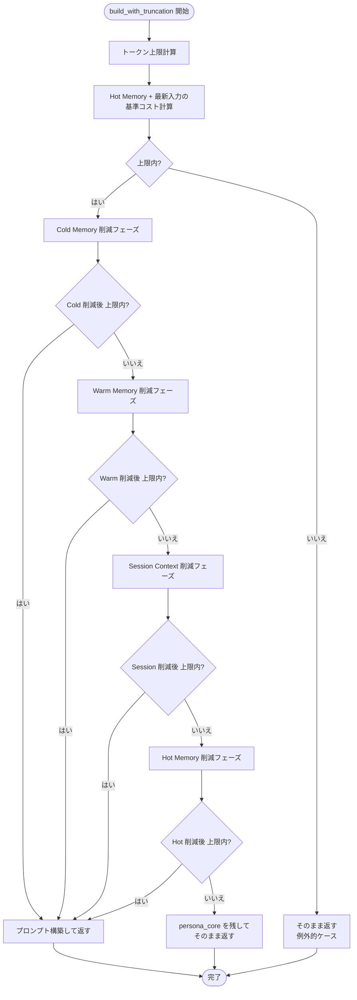

# D-18: トランケートアルゴリズム設計

**決定対象**: requirements.md Section 9 D-18「トランケート単位」
**関連 FR**: FR-8.7
**前提設計**: D-3（プロンプトテンプレート設計）Section 5.8 のトランケーション戦略を実装レベルで確定する
**ステータス**: 承認済み
**作成日**: 2026-03-06

---

## 1. コンテキスト

Phase 1 では `PromptBuilder.build_system_prompt()` と `build_messages()` はトランケートなしで全コンテキストを連結していた。
D-3 Section 5.8.2 の「トランケーション戦略」は受入条件（FR-6.2）として記載されたが、実装は Phase 2a に据え置かれた。

`PromptBuilder` への追加として、コンテキストウィンドウ超過時に以下の優先順位でコンテキストを削減するロジックを設計する。

**削除優先順位**（先に削除されるものから）:

| 優先度 | レイヤー | 対応する PromptBuilder フィールド / 引数 |
|--------|---------|---------------------------------------|
| 1（最初） | Cold Memory | `build_messages()` の `cold_memories` 引数 |
| 2 | Warm Memory | `PromptBuilder.day_summaries` フィールド |
| 3 | Session Context | `build_messages()` の `turns` 引数 |
| 4（最後） | Hot Memory | `persona_core`, `style_samples`, `human_block`, `personality_trends` |

Hot Memory の中でも削減優先順位がある（requirements.md 4.3 の補足として D-3 Section 5.8.2 に記載）:
`personality_trends` → `human_block` → `style_samples` の順。`persona_core` は絶対に削除しない。

---

## 2. 選択肢分析：トランケート単位の決定（D-18 の主要な意思決定）

### 選択肢 A: トークン数で精密計算

Anthropic SDK が提供するトークンカウント API（`client.messages.count_tokens()`）を使用して正確なトークン数を計算する。

**メリット**:
- 正確。日本語の文字数/トークン数乖離（1文字 ≒ 1.5〜2トークン）を正確に扱える

**デメリット**:
- API 呼び出しが必要（コスト + レイテンシが発生）
- Phase 2a の依存追加なし（NFR-3）という制約と整合しない
- LLMProtocol が `count_tokens()` を抽象化しないと LocalLLM 時に破綻する

### 選択肢 B: 文字数で近似（`len(text)` 換算）

`len(text)` で文字数をカウントし、トークン換算係数（1文字 ≈ 1.5トークン）を乗じて近似する。

**メリット**:
- 追加依存ゼロ（NFR-3 に合致）
- 高速・オフライン
- requirements.md D-18 で「Phase 2a では文字数で近似」と明示されている

**デメリット**:
- 精度は低い（日本語 1文字 ≈ 1〜2トークン、英語 1文字 ≈ 0.25〜0.5トークン）
- 計算が過少評価（実際より少ないトークン数と見積もる）になる可能性があるため、安全マージンが必要

### 選択肢 C: ヒューリスティック近似（文字数 ÷ 係数）

選択肢 B の変形。日本語テキストの場合は 1文字 = 1.5トークンと仮定し、安全マージンとして上限の 80% を実運用しきい値とする。

**メリット**:
- 選択肢 B より実際のトークン数に近い
- 安全マージンにより Over-truncation より Under-truncation を防ぐ

**デメリット**:
- 英数字混在テキストでは過大評価になる（その場合はより多くのコンテキストが削除される）

---

## 3. Three Agents Perspective

**[Affirmative]**

選択肢 B（文字数近似）を基本とし、選択肢 C のヒューリスティックを組み合わせる。
`len(text)` による文字数換算は最もシンプルであり、Phase 4 での精密化への置き換えが容易。
要件文書（D-18）に「文字数で近似し、Phase 4 で精密化」と明記されているため、これに従う。

**[Critical]**

日本語は 1文字 ≒ 1.5〜2トークンであり、文字数換算では実際のトークン数を過少評価する危険がある。
例：5000文字のシステムプロンプトが実際は 7500〜10000トークンになる場合、換算値が低く計算されると
「上限内」と判断されて実際には超過するという問題が起きる。
安全マージン（80%しきい値）は「削りすぎ」と「削らなさすぎ」のトレードオフを合理的に解決するが、
しきい値の根拠が経験則のみで実証がない。

**[Mediator]**

選択肢 B（`len(text)` 換算）を採用し、以下の設計で安全性を確保する：
1. **換算係数**: 1文字 = 2トークン（過大評価側に倒す。実際は日本語で 1.5 だが、英語混在を考慮して 2.0）
2. **実運用しきい値**: モデル入力上限の 80%（例：200K トークンのモデルなら 160K 文字相当を上限と見なす）
3. **コンテキストウィンドウ上限**: config.toml に `context_window` を追加せず、Phase 2a では定数としてコードに定義する
4. **Phase 4 での精密化**: Anthropic SDK の `count_tokens()` API または tiktoken 相当ライブラリへの置き換えを予定として記録

---

## 4. 決定

**採用**: 選択肢 B ベース（文字数 × 2.0 でトークン数近似）+ 80% しきい値の安全マージン

**理由**:
- requirements.md D-18 の「文字数で近似し Phase 4 で精密化」という明示的な指示に従う
- 追加依存ゼロ（NFR-3 維持）
- 換算係数 2.0（日本語向けに過大評価側に倒す）により Under-truncation を防ぐ

---

## 5. 詳細仕様

### 5.1 コンテキストウィンドウ定数

コンテキストウィンドウ上限はモデル別に定義する。Phase 2a では Haiku のみ定義し、他のモデルはフォールバック値を使用する。

```python
# agent/truncation.py に追加する定数（新規ファイル）

# モデル別コンテキストウィンドウ（トークン数）
_CONTEXT_WINDOWS: dict[str, int] = {
    "claude-haiku-4-5-20251001": 200_000,
    "claude-haiku-4-5": 200_000,
    "claude-sonnet-4-5": 200_000,
    "claude-opus-4-5": 200_000,
}
_DEFAULT_CONTEXT_WINDOW = 200_000  # 未知モデルのフォールバック

# 安全マージン（実運用しきい値 = コンテキストウィンドウの 80%）
_CONTEXT_WINDOW_SAFETY_RATIO = 0.80

# 文字数→トークン数換算係数（過大評価側に倒す）
_CHARS_TO_TOKENS_RATIO = 2.0

def get_effective_token_limit(model: str, max_tokens_for_output: int) -> int:
    """入力に使用可能なトークン数の実運用上限を返す.

    コンテキストウィンドウ × 安全マージン - 出力用 max_tokens

    Args:
        model: モデル ID。
        max_tokens_for_output: 出力に割り当てる max_tokens。

    Returns:
        入力トークン数の実運用上限。
    """
    window = _CONTEXT_WINDOWS.get(model, _DEFAULT_CONTEXT_WINDOW)
    effective_window = int(window * _CONTEXT_WINDOW_SAFETY_RATIO)
    return max(0, effective_window - max_tokens_for_output)

def estimate_tokens(text: str) -> int:
    """テキストのトークン数を文字数から近似する.

    換算係数 2.0 を使用（日本語テキストを過大評価側に倒す）。
    Phase 4 で Anthropic count_tokens() API に置き換え予定。

    Args:
        text: トークン数を推定するテキスト。

    Returns:
        推定トークン数（過大評価側）。
    """
    return int(len(text) * _CHARS_TO_TOKENS_RATIO)
```

### 5.2 トランケートロジックの配置

Phase 1 の `PromptBuilder` は `build_system_prompt()` と `build_messages()` の2メソッドで構成される。
トランケートロジックは `PromptBuilder` に `build_with_truncation()` メソッドとして追加する。

> **Note (Phase 2a 構造リファクタリング)**: `PromptBuilder` は `agent/agent_core.py` から
> `agent/prompt_builder.py` に分離された。`agent_core.py` からは後方互換のため re-export している。

```
PromptBuilder（agent/prompt_builder.py に分離）
├── build_system_prompt()  ← 変更なし
├── build_messages()       ← 変更なし
└── build_with_truncation()  ← Phase 2a で追加（新規メソッド）
```

`AgentCore.process_turn()` で `build_with_truncation()` を使用するように変更する。

### 5.3 `build_with_truncation()` のアルゴリズム

```
build_with_truncation(
    session_start_message,
    turns,
    latest_input,
    cold_memories,
    model,
    max_tokens_for_output,
    consistency_check_active,
) -> tuple[str, list[dict]]
```

**戻り値**: `(system_prompt, messages)` のタプル

**アルゴリズム（フェーズ分け）**:

```
Phase 0: トークン上限の計算
    token_limit = get_effective_token_limit(model, max_tokens_for_output)

Phase 1: Hot Memory + 最新入力（削除不可）の基準コストを計算
    base_system = build_system_prompt(consistency_check_active)
              ただし personality_trends, day_summaries は除外したバージョン
    base_messages = [セッション開始メッセージ, 最新ユーザー入力のみ]
    base_cost = estimate_tokens(base_system) + estimate_tokens(str(base_messages))

    if base_cost > token_limit:
        # Hot Memory すら収まらない（実質到達しない）
        → そのまま返す（truncation 不可能な場合の保護）

Phase 2: Cold Memory の削減（優先度 1）
    cold_list = cold_memories のコピー
    while len(cold_list) > 0 and 見積もりが超過:
        cold_list = cold_list[:-1]  # 末尾（最古）から1件削減

Phase 3: Warm Memory の削減（優先度 2）
    warm_list = day_summaries のコピー
    while len(warm_list) > 0 and 見積もりが超過:
        warm_list = warm_list[:-1]  # 末尾（最古）から1件削減

Phase 4: Session Context の削減（優先度 3）
    turn_list = turns のコピー
    while len(turn_list) > 2 and 見積もりが超過:
        turn_list = turn_list[2:]  # 先頭（最古のターンペア）から削除

Phase 5: Hot Memory の削減（優先度 4 — 極限時のみ）
    if 見積もりが依然超過:
        personality_trends = "" に設定
    if 見積もりが依然超過:
        human_block = "" に設定
    if 見積もりが依然超過:
        style_samples = 削減（先頭 500 文字のみ残す）
    # persona_core は絶対に削除しない

Phase 6: 最終的なプロンプト構築
    system = build_system_prompt(consistency_check_active) ← 削減後の値で再構築
    messages = build_messages(session_start_message, turn_list, latest_input, cold_list)
    return (system, messages)
```

### 5.4 フロー図



### 5.5 `AgentCore.process_turn()` への統合

Phase 1 の `process_turn()` では以下のように呼ばれていた:

```python
# Phase 1
system_prompt = self._prompt_builder.build_system_prompt(
    consistency_check_active=consistency_check_active,
)
messages = self._prompt_builder.build_messages(
    session_start_message=self.session_start_message,
    turns=self.session_context.turns,
    latest_input=user_input,
    cold_memories=cold_memories,
)
```

Phase 2a では:

```python
# Phase 2a
system_prompt, messages = self._prompt_builder.build_with_truncation(
    session_start_message=self.session_start_message,
    turns=self.session_context.turns,
    latest_input=user_input,
    cold_memories=cold_memories,
    model=get_model(self._config, purpose),
    max_tokens_for_output=get_max_tokens(self._config, purpose),
    consistency_check_active=consistency_check_active,
)
```

`build_system_prompt()` と `build_messages()` は Phase 1 の単体テスト用に引き続き提供する（変更なし）。

### 5.6 Hot Memory の削除不可保証

`persona_core` フィールドはトランケートのいかなるフェーズでも削除・短縮しない。

保証の実装方法：
- Phase 5（Hot Memory 削減）では `personality_trends` → `human_block` → `style_samples` の順でのみ削減する
- `persona_core` に触れるコードパスを Phase 5 のロジックに含めない
- テストで「`persona_core` が空でも最終プロンプトに含まれること」を検証する（テスト観点 6.2 参照）

### 5.7 PromptBuilder への状態変化の禁止

`build_with_truncation()` は `PromptBuilder` の `day_summaries` 等のフィールドを直接変更してはならない。
削減は引数として渡されたリストのコピーに対して行い、`PromptBuilder` インスタンスの状態は不変のまま保つ。

理由: 同一セッション内で `build_with_truncation()` が複数回呼ばれる場合でも、各呼び出しが独立して
「その時点の全コンテキストからトランケートする」という動作を保証するため。

---

## 6. テスト観点

### 6.1 正常系テスト

| テストケース | 検証内容 | 前提 |
|------------|---------|------|
| 上限設定なし（デフォルト）の場合、Phase 1 と同一の出力になる | 回帰テスト | - |
| 上限を低く設定した場合、Cold Memory が削減される | FR-8.7 受入条件（1） | `token_limit` を小さく設定 |
| 上限を非常に低く設定した場合、Warm Memory が削減される | FR-8.7 受入条件（1） | `token_limit` をさらに小さく |
| `persona_core` は上限超過時でも最終プロンプトに含まれる | FR-8.7 受入条件（2） | `token_limit` を極小設定 |

### 6.2 Hot Memory 削除不可テスト（FR-8.7 受入条件 (2) の直接対応）

```python
# テスト設計（実装はしない）

def test_persona_core_never_truncated():
    """persona_core は上限超過時でも保持される."""
    builder = PromptBuilder(
        persona_core="[長い人格定義]",
        style_samples="[スタイルサンプル]",
        human_block="[ユーザー情報]",
        personality_trends="[傾向メモ]",
        day_summaries=[{"date": "...", "summary": "..."}] * 5,
    )
    # token_limit を非常に小さく設定（persona_core すら入らない想定）
    system_prompt, messages = builder.build_with_truncation(
        session_start_message="挨拶",
        turns=[{"role": "user", "content": "..."}, {"role": "assistant", "content": "..."}] * 10,
        latest_input="最新の入力",
        cold_memories=[{"content": "..."} for _ in range(5)],
        model="claude-haiku-4-5-20251001",
        max_tokens_for_output=1024,
        consistency_check_active=False,
        _override_token_limit=10,  # テスト用オーバーライド
    )
    assert "[長い人格定義]" in system_prompt
```

### 6.3 削除順序テスト（FR-8.7 受入条件 (1) の直接対応）

Cold Memory が最初に削減されることを確認する。

| テストステップ | 検証内容 |
|------------|---------|
| 上限 = Cold Memory を含むと超過する値 | Cold が削減され、Warm・Session は維持される |
| 上限 = Cold ゼロでも Warm を含むと超過する値 | Warm が削減され、Session は維持される |
| 上限 = Cold・Warm ゼロでも Session を含むと超過する値 | Session 古いターンが削減される |

### 6.4 境界値テスト

| テストケース | 期待動作 |
|------------|---------|
| `cold_memories=None` | 削減フェーズをスキップし、次フェーズへ |
| `day_summaries=[]` | Warm 削減フェーズをスキップ |
| `turns=[]` | Session 削減フェーズをスキップ |
| `token_limit` が十分大きい | 削減なし（全コンテキストを保持） |

---

## 7. 影響範囲

| 影響先 | 内容 | 変更規模 |
|--------|------|---------|
| `src/kage_shiki/agent/prompt_builder.py` | `PromptBuilder` を `agent_core.py` から分離。`build_with_truncation()` 追加 | 中 |
| `src/kage_shiki/agent/agent_core.py` | `PromptBuilder` を re-export、`process_turn()` で `build_with_truncation()` 呼び出し | 小 |
| `src/kage_shiki/agent/truncation.py` | `get_effective_token_limit()`、`estimate_tokens()` 定数・関数の追加（新規ファイル） | 小 |
| `tests/test_agent/test_agent_core.py` | トランケートテスト追加（FR-8.7 対応） | 中（追加のみ） |
| Phase 1 の既存テスト | `build_system_prompt()`・`build_messages()` を使う既存テストは変更なし | なし |

---

## 8. Phase 4 への引き継ぎ

以下の改善は Phase 4 で実施する（specs に「Phase 4 検討」として記録）。

| 項目 | Phase 4 での改善案 |
|------|-----------------|
| トークン数精密化 | Anthropic SDK の `client.messages.count_tokens()` API を使用 |
| 換算係数の動的調整 | 実際のトークン数をログに記録し、換算係数を実績ベースで調整 |
| コンテキストウィンドウの設定外部化 | config.toml に `[models].context_window` を追加 |
