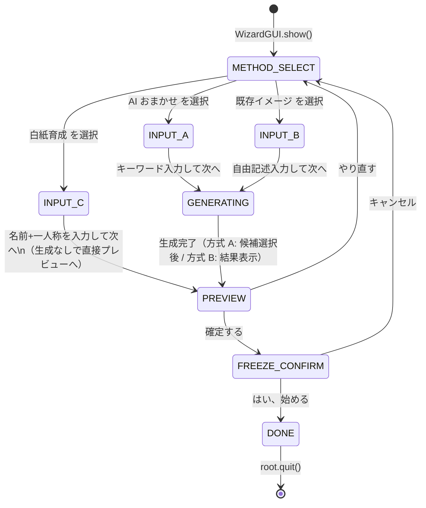
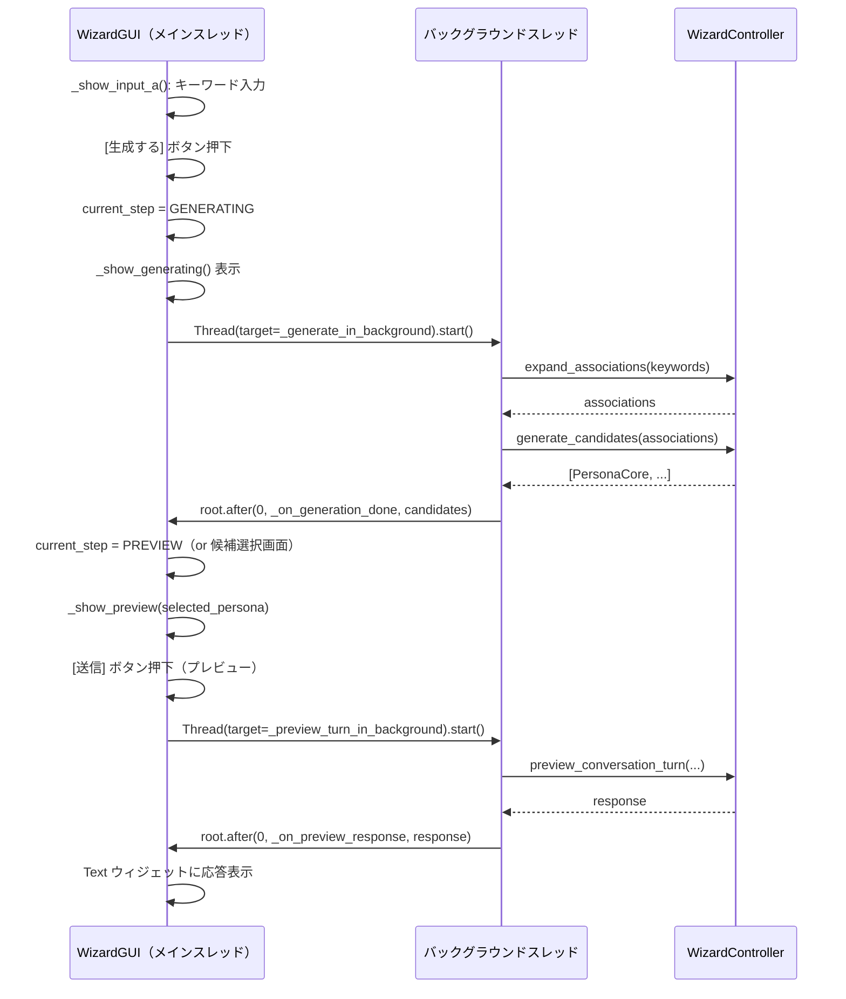

# D-19: ウィザード GUI 設計

**決定対象**: requirements.md Section 9 D-19「ウィザード GUI のウィンドウ管理方式」
**関連 FR**: FR-8.8, FR-8.9, FR-8.10
**制約**: C-1（GUI ライブラリは tkinter）、C-4（既存 wizard.py のビジネスロジックを再利用）
**前提**: D-17（LLMProtocol）確定後に実装着手
**ステータス**: 承認済み
**作成日**: 2026-03-06

---

## 1. コンテキスト

Phase 1 では `main.py` の `_run_wizard()` が以下の最小実装だった:

```python
def _run_wizard(...) -> None:
    llm_client = LLMClient(config)
    wizard = WizardController(llm_client, config)  # noqa: F841
    root = tk.Tk()
    input_queue_w: queue.Queue[str] = queue.Queue()
    mascot_view = TkinterMascotView(root, input_queue_w, config.gui)  # noqa: F841
    # TODO(T-25): ウィザード GUI フレームとの接続
    root.mainloop()
```

Phase 2a では、この TODO を解消し、以下の3画面を tkinter ウィンドウとして実装する:

1. 方式選択画面（FR-8.8）: AI おまかせ / 既存イメージ / 白紙育成
2. プレビュー会話 UI（FR-8.9）: キャラクター名・セリフ表示・入力欄・確定/やり直し
3. 凍結確認ダイアログ（FR-8.10）: 確認後に `persona_core.md` を生成

---

## 2. Three Agents Perspective：ウィンドウ管理方式

### AoT Decomposition

| Atom | 判断内容 | 依存 |
|------|----------|------|
| A1 | ウィンドウ管理方式（同一ルート vs 別 Toplevel） | なし |
| A2 | 状態管理（WizardState の設計） | A1 |
| A3 | WizardController との接続方式 | A1 |
| A4 | MascotView Protocol との関係 | A1, A3 |
| A5 | main.py への統合方法 | A1〜A4 |

---

### Atom A1: ウィンドウ管理方式

**選択肢の比較**:

| 観点 | 同一ルート内 Frame 遷移 | 別 Toplevel |
|------|---------------------|------------|
| 実装シンプルさ | Frame を差し替えるだけ | Toplevel の生成・破棄が必要 |
| tkinter ライフサイクル | root が1つ（管理が簡単） | 複数 Toplevel の競合リスク |
| 通常対話との関係 | ウィザード完了後 root を再利用できる | ウィザード用 Toplevel を閉じて root を開く |
| テスト容易性 | Frame の状態変数で画面確認可能 | Toplevel の winfo_exists() が必要 |
| overrideredirect との整合 | ウィザード中も枠なし = ユーザーが移動しにくい | Toplevel には overrideredirect を適用しない → 通常ウィンドウとして表示可 |

**[Affirmative]**

別 Toplevel 方式を推奨する。理由:
- ウィザードは「設定ダイアログ」であり、枠なし透過ウィンドウ（overrideredirect）は適切でない
- ユーザーが操作中にウィンドウを移動・リサイズできることは UX として重要
- Toplevel をウィザード専用に設計することで通常対話の root への影響を最小化できる

**[Critical]**

別 Toplevel 方式のリスク：
1. ウィザード完了後に Toplevel を閉じて通常対話の root を表示する遷移が複雑になる
2. Phase 1 の `TkinterMascotView` が root を前提に設計されており、Toplevel への適用には変更が必要
3. `tkinter.Toplevel` は `tk.Tk` の子ウィンドウとして生成されるため、root が存在しないと生成できない

**[Mediator]**

**結論**: 同一ルート内 Frame 遷移方式を採用する。

理由:
- C-4（既存 `wizard.py` のビジネスロジックを再利用）という制約の下で、GUI の変更は最小にすべき
- 同一 root で Frame を切り替える方式は、既存の `_run_wizard()` の `root.mainloop()` 構造をそのまま活用できる
- `overrideredirect` の問題は、ウィザード画面専用の Frame に通常の Frame ボーダーを模したスタイルを適用することで軽減する
- 凍結確認ダイアログのみ `tk.messagebox.askyesno()` を使用する（tkinter 標準のモーダルダイアログ）

---

### Atom A2: WizardState の設計

ウィザードの画面遷移状態を Enum で管理する。

```python
from enum import Enum, auto

class WizardStep(Enum):
    """ウィザードの現在の画面ステップ."""
    METHOD_SELECT = auto()    # 方式選択画面
    INPUT_A = auto()          # 方式 A: キーワード入力画面
    INPUT_B = auto()          # 方式 B: 自由記述入力画面
    INPUT_C = auto()          # 方式 C: 名前+一人称入力画面
    GENERATING = auto()       # 生成中（ローディング状態）
    PREVIEW = auto()          # プレビュー会話画面
    FREEZE_CONFIRM = auto()   # 凍結確認（ダイアログ）
    DONE = auto()             # 完了（通常対話へ遷移）
```

`WizardStep` は `WizardGUI` クラスが保持するインスタンス変数として管理する。
テストでは `wizard_gui.current_step` を参照することで画面遷移状態を確認できる（FR-8.8 受入条件 (3) に対応）。

---

### Atom A3: WizardController との接続方式

**選択肢**:
- **コールバック方式**: `WizardGUI` が `WizardController` のメソッドを直接呼び出す
- **キュー方式**: `WizardGUI` がキューにリクエストを入れ、バックグラウンドスレッドが処理する

**[Mediator]**

ウィザードは GUI スレッド（メインスレッド）上で LLM API を呼び出す必要がある。
Phase 1 の通常対話はバックグラウンドスレッドで LLM を呼び出しているが、ウィザードは
「生成 → 表示 → ユーザー選択」のシーケンシャルな処理が多い。

**結論**: バックグラウンドスレッド + キュー方式を採用する。

理由:
- GUI スレッドをブロックすると「生成中」表示ができない（UX 問題）
- `threading.Thread` でウィザードの LLM 呼び出しを非同期化し、`after()` でコールバックを受け取る
- `WizardController` のメソッドは同期的であるため、`threading.Thread(target=wizard.expand_associations)` の形で呼び出せる

---

### Atom A4: MascotView Protocol との関係

**[Mediator]**

`MascotView Protocol` は拡張しない。理由:
- ウィザード GUI は `MascotView` とは別の責務（設定フロー）を持つ
- Phase 1 の `MascotView` は「通常対話中の表示・入力インターフェース」として設計されており、ウィザードフローに必要な「複数ボタン・候補選択・プレビュー会話」を含まない
- `WizardGUI` という独立したクラスとして実装する（`TkinterMascotView` の外側に配置）

`WizardGUI` は `TkinterMascotView` と同じ `root` を使用するが、`MascotView Protocol` を実装しない。

---

### Atom A5: main.py への統合

現行の `_run_wizard()` を全面的に書き換える。

**ウィザード完了後の遷移方法**:

ウィザード完了後は `root.mainloop()` を終了させず、ウィザード Frame を破棄して通常対話 Frame に切り替える。
ただし Phase 2a では「ウィザード完了後にプロセスを終了し、次回起動で通常モードになる」という Phase 1 の設計方針をそのまま踏襲する。

**理由**: ウィザード完了後に `AgentCore` の完全な初期化（Hot Memory ロード・セッション生成等 Step 4〜12）を再実行することは複雑であり、Phase 2a のスコープを超える。

```python
# main.py の _run_wizard() の変更イメージ（コードではない）

def _run_wizard(config, api_key, data_dir, db, persona_system) -> None:
    llm_client = LLMClient(config)
    wizard_ctrl = WizardController(llm_client, config)
    root = tk.Tk()
    wizard_gui = WizardGUI(root, wizard_ctrl, persona_system, data_dir, config)
    wizard_gui.show()
    root.mainloop()
    # mainloop 終了後 → ウィザード完了または中断
    # 次回起動で通常モードに入る
```

---

### AoT Synthesis

**統合結論**:
- 同一ルート内 Frame 遷移方式（overrideredirect(True) は維持したまま、ウィザード Frame にボーダー風スタイルを適用して操作性を確保する）
- `WizardStep` Enum による状態管理
- バックグラウンドスレッド + `root.after()` コールバックで LLM 処理の非同期化
- `WizardGUI` クラスを独立して実装（`MascotView Protocol` は拡張しない）
- ウィザード完了後はプロセス終了（Phase 2a の範囲）

---

## 3. 決定

**採用**: 同一 root 内での Frame 切り替え方式 + `WizardGUI` クラス新設

**理由**:
- C-4（既存 wizard.py ビジネスロジックの再利用）を最も自然に満たす
- tkinter の `root.mainloop()` を一度だけ呼ぶシンプルな構造を維持
- FR-8.8 受入条件（3）の「テストで画面遷移状態が `WizardState` 等の状態変数で確認できる」に対応

---

## 4. 詳細仕様

### 4.1 WizardGUI クラスの責務と配置

```
src/kage_shiki/gui/wizard_gui.py（新規ファイル）
└── WizardGUI
    ├── __init__(root, wizard_ctrl, persona_system, data_dir, config)
    ├── show()                     ← メインウィジェットを表示
    ├── current_step: WizardStep   ← 状態変数（テストで確認可能）
    ├── _show_method_select()      ← 方式選択画面
    ├── _show_input_a()            ← 方式 A 入力画面
    ├── _show_input_b()            ← 方式 B 入力画面
    ├── _show_input_c()            ← 方式 C 入力画面
    ├── _show_generating()         ← 生成中表示
    ├── _show_preview()            ← プレビュー会話画面
    ├── _show_freeze_confirm()     ← 凍結確認ダイアログ（tkinter.messagebox）
    └── _on_done()                 ← 完了後処理（root.quit()）
```

`WizardStep` Enum は `wizard_gui.py` 内で定義する（または `gui/__init__.py` に配置）。

### 4.2 画面遷移図



### 4.3 各画面のウィジェット構成

#### 方式選択画面（FR-8.8）

```
┌────────────────────────────────────────┐
│  影式 セットアップウィザード              │  ← タイトルラベル
│                                        │
│  まずはキャラクターを作成しましょう。     │  ← 説明ラベル
│                                        │
│  ┌──────────────────────────────────┐   │
│  │  [AI おまかせ]                   │   │  ← Button × 3
│  │  キーワードから AI がキャラを生成    │   │
│  └──────────────────────────────────┘   │
│  ┌──────────────────────────────────┐   │
│  │  [既存イメージ]                   │   │
│  │  あなたのイメージを自由に記述      │   │
│  └──────────────────────────────────┘   │
│  ┌──────────────────────────────────┐   │
│  │  [白紙育成]                       │   │
│  │  名前と一人称だけ決めて育てていく    │   │
│  └──────────────────────────────────┘   │
└────────────────────────────────────────┘
ウィンドウサイズ: 480 × 360
```

**ウィジェット**:
- `tk.Label` × 2（タイトル、説明）
- `tk.Button` × 3（AI おまかせ / 既存イメージ / 白紙育成）

#### 方式 A 入力画面

```
┌────────────────────────────────────────┐
│  AI おまかせ: キーワード入力            │
│                                        │
│  イメージするキーワードを入力:           │
│  [入力欄____________________]          │
│  （カンマ区切りで複数入力可能）          │
│                                        │
│  ユーザー名（任意）:                    │
│  [入力欄____________________]          │
│                                        │
│       [戻る]    [生成する]             │
└────────────────────────────────────────┘
```

#### 方式 B 入力画面

```
┌────────────────────────────────────────┐
│  既存イメージ: 自由記述                  │
│                                        │
│  キャラクターのイメージを自由に記述:     │
│  [テキストエリア（複数行）              ]│
│  [                                    ]│
│  [                                    ]│
│                                        │
│  ユーザー名（任意）:                    │
│  [入力欄____________________]          │
│                                        │
│       [戻る]    [生成する]             │
└────────────────────────────────────────┘
```

#### 方式 C 入力画面

```
┌────────────────────────────────────────┐
│  白紙育成: 基本情報の設定               │
│                                        │
│  キャラクター名:                        │
│  [入力欄____________________]          │
│                                        │
│  一人称:                               │
│  [入力欄____________________]          │
│                                        │
│  ユーザー名（任意）:                    │
│  [入力欄____________________]          │
│                                        │
│       [戻る]    [始める（プレビューへ）] │
└────────────────────────────────────────┘
```

#### 生成中画面（GENERATING）

```
┌────────────────────────────────────────┐
│  キャラクターを生成中...                │
│                                        │
│  ◌ ◉ ◉  （アニメーション省略、静的テキスト）  │
│                                        │
│  しばらくお待ちください。               │
└────────────────────────────────────────┘
```

**実装**: `tk.Label` のテキストを `root.after()` で更新するドットアニメーション（「生成中.」「生成中..」「生成中...」を 500ms ごとに切り替え）。

方式 A では生成後に候補選択 UI を表示する（`tk.Listbox` または `tk.OptionMenu` で候補を選択）。
Phase 2a では `candidate_count` のデフォルト値（3体）を想定する。

#### プレビュー会話画面（FR-8.9）

```
┌────────────────────────────────────────┐
│  [キャラクター名]（プレビュー中）        │  ← name_label
│                                        │
│  ┌──────────────────────────────────┐  │
│  │  （生成されたセリフが表示される）  │  │  ← Text（スクロール付き）
│  │                                  │  │
│  │                                  │  │
│  └──────────────────────────────────┘  │
│                                        │
│  [入力欄____________________] [送信]    │
│                                        │
│    [やり直す]              [確定する]   │
└────────────────────────────────────────┘
ウィンドウサイズ: 480 × 400
```

**ウィジェット**:
- `tk.Label`（キャラクター名）
- `tk.Text` + `tk.Scrollbar`（会話表示エリア、`state="disabled"`）
- `tk.Entry` + `tk.Button`（入力欄 + 送信ボタン）
- `tk.Button` × 2（やり直す / 確定する）

**プレビュー会話のスレッド処理**:
送信ボタン押下 → バックグラウンドスレッドで `WizardController.preview_conversation_turn()` 呼び出し → `root.after()` で Text ウィジェットに結果を表示。

#### 凍結確認ダイアログ（FR-8.10）

```python
# tkinter.messagebox を使用（実装イメージ）
result = tk.messagebox.askyesno(
    title="凍結確認",
    message=(
        "このキャラクターで始めますか？\n\n"
        "※ 凍結後、人格の変更は手動（ファイル直接編集）のみとなります。"
    ),
)
if result:
    # WizardController.freeze_persona() を呼び出して凍結
    # config.toml の persona_frozen を true に更新
    # root.quit() でメインループを終了
```

`tkinter.messagebox.askyesno()` は tkinter のモーダルダイアログであり、別 Toplevel を手動生成する必要がない。

> **実装時注意（overrideredirect との組み合わせ）**: root が `overrideredirect(True)` の場合、
> `messagebox` のモーダルダイアログがタスクバーに表示されない・背面に隠れる等の
> Windows 固有の問題が発生しうる。実装時は以下のいずれかで対処すること:
> (a) `messagebox` 呼び出し前に `root.overrideredirect(False)` → 完了後に `True` に戻す
> (b) `Toplevel` で独自の確認ダイアログを実装する（overrideredirect の影響を受けない）

### 4.4 config.toml の `persona_frozen` 更新

凍結確認後、`config.toml` の `persona_frozen` を `true` に更新する処理が必要。

```python
# wizard_gui.py の _on_freeze_confirmed() 内（実装イメージ）
# config.toml の persona_frozen を true に書き換える

import tomllib, tomli_w  # Phase 2a では tomli_w の追加依存を避けるため、文字列操作で置換

# NFR-3（追加依存ゼロ）のため tomli_w は使用しない
# config.toml を文字列として読み込み、persona_frozen の行を置換する方式を採用
```

**採用案（依存追加なし）**:
`config.toml` を `Path.read_text()` でテキスト読み込みし、正規表現で
`persona_frozen` の値を書き換える。

```python
import re

def _set_persona_frozen(config_path: Path) -> None:
    """config.toml の persona_frozen を true に書き換える."""
    text = config_path.read_text(encoding="utf-8")
    new_text, count = re.subn(
        r"^(\s*persona_frozen\s*=\s*)(?:false|true)\s*$",
        r"\1true",
        text,
        count=1,
        flags=re.MULTILINE,
    )
    if count == 0:
        raise ValueError("config.toml に persona_frozen の設定行が見つかりません")
    config_path.write_text(new_text, encoding="utf-8")
```

この方式は `tomli_w` 不要で NFR-3 を満たす。正規表現により大文字・空白の揺れにも対応する。

### 4.5 WizardGUI のスレッド設計



**注意**: `root.after(0, callback)` はコールバックをメインスレッド（GUI スレッド）上で実行する。
tkinter は GUI 操作がメインスレッドでのみ許可されるため、バックグラウンドスレッドから直接 GUI を更新してはならない。

---

## 5. テスト観点

### 5.1 FR-8.8 受入条件の対応

| 受入条件 | テスト方式 |
|---------|---------|
| 3方式のボタンを持つ GUI 画面が表示される | `WizardGUI` 生成後に `current_step == WizardStep.METHOD_SELECT` を確認 |
| 選択すると対応する入力画面に遷移する | ボタンの `invoke()` を呼び出し、`current_step` の値を確認 |
| `WizardState` 等の状態変数で画面遷移状態を確認できる | `wizard_gui.current_step` を直接参照 |

### 5.2 FR-8.9 受入条件の対応

| 受入条件 | テスト方式 |
|---------|---------|
| 送信後にセリフが表示エリアに反映される | モック `WizardController` を使用、`Text` ウィジェットの内容を確認 |
| 「確定する」で凍結確認に遷移 | `messagebox` をモックし、`current_step` を確認 |
| 「やり直す」で方式選択に戻る | `current_step == WizardStep.METHOD_SELECT` を確認 |

### 5.3 FR-8.10 受入条件の対応

| 受入条件 | テスト方式 |
|---------|---------|
| `persona_core.md` と `style_samples.md` が生成される | `tmp_path` フィクスチャで実ファイルシステムを使用 |
| `persona_frozen = true` に更新される | `config.toml` の内容をテスト後に検証 |
| 通常対話 GUI への遷移（= root.quit()） | `root.quit` をモック化し、呼ばれたことを確認 |

### 5.4 GUI テストの安定化

tkinter のウィジェットテストは `root.update()` を適宜呼び出さないと状態が反映されない場合がある。
テスト内では `root.update()` ではなく `root.update_idletasks()` を使用する（ウィンドウ表示は伴わない）。
`tk.Tk()` のインスタンスは各テストで1つだけ生成し、テスト後に `root.destroy()` で破棄する。

---

## 6. 影響範囲

| 影響先 | 内容 | 変更規模 |
|--------|------|---------|
| `src/kage_shiki/gui/wizard_gui.py` | 新規ファイル（`WizardGUI` クラス、`WizardStep` Enum） | 大（新規） |
| `src/kage_shiki/main.py` | `_run_wizard()` の実装を `WizardGUI` を使うように置き換え | 小 |
| `src/kage_shiki/persona/wizard.py` | 変更なし（C-4 の制約） | なし |
| `src/kage_shiki/agent/llm_client.py` | D-17 の変更のみ（`WizardController` の型注釈変更）| 最小 |
| `tests/test_gui/test_wizard_gui.py` | 新規テストファイル（FR-8.8〜8.10 対応） | 中（新規） |
| `docs/testing/gui-manual-test.md` | ウィザード画面遷移の手動テスト項目追加（FR-8.2） | 小 |

---

## 7. Phase 2b への引き継ぎ

以下は Phase 2a スコープ外として記録する。

| 項目 | Phase 2b 以降での対応 |
|------|---------------------|
| `set_body_state()` の `talking` / `blinking` 状態 | Phase 2b の `DesireWorker` 実装時に対応 |
| ウィザード完了後に再起動なしで通常対話へ遷移 | Phase 2b の GUI リファクタリング時に検討 |
| `WizardGUI` への PyQt6 対応 | Phase 2b の GUI ライブラリ移行時に検討 |
