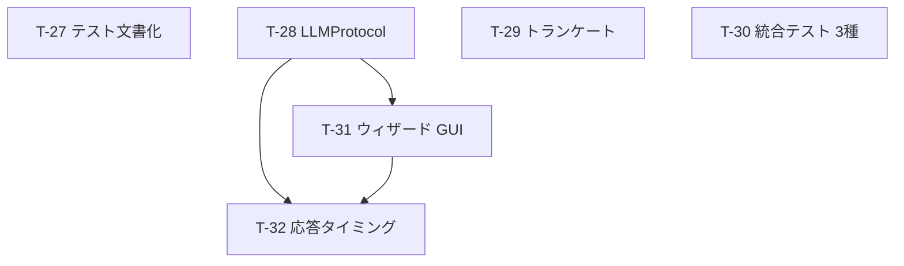

# Phase 2a 基盤強化 タスク一覧

**フェーズ**: PLANNING -- tasks サブフェーズ
**根拠**: requirements.md（承認済み Rev.1）+ design-d17〜d20（承認済み）
**作成日**: 2026-03-06

---

## タスク概要

| # | タスク名 | 対応 FR | 依存 | 推定規模 | 優先度 |
|---|---------|---------|------|---------|--------|
| T-27 | テスト文書化（スモークテスト手順書 + GUI 手動チェックリスト） | FR-8.1, FR-8.2 | なし | S | Must |
| T-28 | LLMProtocol 抽出 + 型注釈変更 | FR-8.6 | なし | S | Should |
| T-29 | トランケートアルゴリズム実装 | FR-8.7 | なし | L | Must |
| T-30 | 統合テスト 3 種（マルチスレッド + 永続状態 + シャットダウン） | FR-8.3, FR-8.4, FR-8.5 | なし | M | Must |
| T-31 | ウィザード GUI 統合 | FR-8.8, FR-8.9, FR-8.10 | T-28 | L | Must |
| T-32 | 応答タイミング統合テスト | FR-8.11 | T-28, T-31 | S | Should |

**タスク総数**: 6

---

## 依存関係グラフ

---

## 実行順序（推奨）

| Wave | タスク | 並列実行可能 | 概要 |
|------|--------|-------------|------|
| 1 | T-27, T-28, T-29, T-30 | Yes | 独立した4タスクを並列実行 |
| 2 | T-31 | - | ウィザード GUI（T-28 の LLMProtocol に依存） |
| 3 | T-32 | - | 応答タイミングテスト（T-28 + T-31 に依存） |

---

## AoT によるタスク分解

### Atom テーブル

| Atom | 内容 | 依存 | 並列可否 |
|------|------|------|---------|
| T-27 | テスト文書化 | なし | 可（T-28, T-29, T-30 と並列） |
| T-28 | LLMProtocol | なし | 可（T-27, T-29, T-30 と並列） |
| T-29 | トランケート | なし | 可（T-27, T-28, T-30 と並列） |
| T-30 | 統合テスト 3 種 | なし | 可（T-27, T-28, T-29 と並列） |
| T-31 | ウィザード GUI | T-28 | Wave 2 |
| T-32 | 応答タイミング | T-28, T-31 | Wave 3 |

### インターフェース契約

各タスクの Input/Output/Contract は個別タスク詳細にて定義。

---

## タスク詳細

### T-27: テスト文書化（スモークテスト手順書 + GUI 手動チェックリスト）

**対応 FR**: FR-8.1, FR-8.2
**対応設計**: D-20 Section 5
**依存**: なし
**推定規模**: S (Small: ドキュメントのみ)
**概要**: Phase 完了前の実動作テスト手順書と GUI 手動テストチェックリストを作成する。

**スコープ**:
- [ ] `docs/testing/smoke-test.md`: スモークテスト手順書
  - (1) 起動手順（config.toml 準備 → API キー設定 → `python -m kage_shiki` 実行）
  - (2) 対話確認手順（送信 → 5 秒以内応答 → クリックイベント確認）
  - (3) シャットダウン確認手順（トレイ「終了」→ ウィンドウ消失 → ログ確認）
  - (4) 2回目起動確認手順（同じ data_dir で再起動 → エラーなし → 記憶の引き継ぎ確認）
- [ ] `docs/testing/gui-manual-test.md`: GUI 手動テストチェックリスト
  - (1) 長文応答のスクロール表示
  - (2) ウィンドウドラッグ移動
  - (3) トレイ最小化・復帰
  - (4) ウィザード画面遷移（全フロー）

**テスト方針**:
- ドキュメントのみのため自動テストなし
- 文書の存在と必須セクションの有無をレビューで確認

**成果物**:
- `docs/testing/smoke-test.md`
- `docs/testing/gui-manual-test.md`

**インターフェース契約**:
| 種別 | 定義 |
|------|------|
| Input | なし |
| Output | 2 つのテスト文書 |
| Contract | FR-8.1 の 4 セクション + FR-8.2 の 4 項目以上を含む |

---

### T-28: LLMProtocol 抽出 + 型注釈変更

**対応 FR**: FR-8.6
**対応設計**: D-17（LLMProtocol 設計）
**依存**: なし
**推定規模**: S (Small: ~80-120行)
**概要**: `llm_client.py` に `LLMProtocol`（`typing.Protocol`）を追加し、`LLMClient` に `chat()` メソッドを追加する。上位モジュールの型注釈を `LLMProtocol` に変更する。

**スコープ**:
- [ ] `agent/llm_client.py`: `LLMProtocol` クラス定義（`@runtime_checkable`, `chat()` メソッド）
- [ ] `agent/llm_client.py`: `LLMClient.chat()` メソッド追加（`send_message()` に委譲）
- [ ] `agent/agent_core.py`: `AgentCore.__init__` の `llm_client` 型注釈を `LLMProtocol` に変更
- [ ] `memory/memory_worker.py`: `MemoryWorker.__init__` の `llm_client` 型注釈を `LLMProtocol` に変更
- [ ] `persona/wizard.py`: `WizardController.__init__` の `llm` 型注釈を `LLMProtocol` に変更

**テスト方針**:
- [ ] `isinstance(LLMClient(config), LLMProtocol)` が `True` を返すこと
- [ ] `LLMProtocol` を実装したモッククラスが `isinstance` で `True` を返すこと
- [ ] `LLMClient.chat()` が `send_message()` に正しく委譲すること
- [ ] Phase 1 の全テストが PASSED のまま（回帰なし）
- [ ] NFR-11: `isinstance(LLMClient(config), LLMProtocol)` による実行時チェック。静的型チェッカー（mypy/pyright）は `LLMProtocol` と `LLMClient` の `chat()` 互換性を検証する。ただし `send_message_for_purpose()` 呼び出し箇所の型エラーは Phase 3 まで許容する

**成果物**:
- `src/kage_shiki/agent/llm_client.py`（変更）
- `src/kage_shiki/agent/agent_core.py`（型注釈変更のみ）
- `src/kage_shiki/memory/memory_worker.py`（型注釈変更のみ）
- `src/kage_shiki/persona/wizard.py`（型注釈変更のみ）
- `tests/test_agent/test_llm_client.py`（Protocol 互換性テスト追加）

**インターフェース契約**:
| 種別 | 定義 |
|------|------|
| Input | なし |
| Output | `LLMProtocol` クラス + `LLMClient.chat()` メソッド |
| Contract | `LLMClient` が `LLMProtocol` を構造的に満足する。既存テスト全 PASSED |

---

### T-29: トランケートアルゴリズム実装

**対応 FR**: FR-8.7
**対応設計**: D-18（トランケートアルゴリズム設計）
**依存**: なし
**推定規模**: L (Large: ~300-400行)
**概要**: コンテキストウィンドウ超過時にメモリ層を優先順位に従って削減するトランケートロジックを実装する。

**スコープ**:
- [ ] `agent/truncation.py`（新規ファイル）: 定数・ヘルパー関数
  - `_CONTEXT_WINDOWS` dict（モデル別コンテキストウィンドウ）
  - `_CONTEXT_WINDOW_SAFETY_RATIO = 0.80`
  - `_CHARS_TO_TOKENS_RATIO = 2.0`
  - `get_effective_token_limit(model, max_tokens_for_output) -> int`
  - `estimate_tokens(text) -> int`
- [ ] `agent/agent_core.py`: `PromptBuilder.build_with_truncation()` メソッド追加
  - Phase 0: トークン上限計算
  - Phase 1: Hot Memory + 最新入力の基準コスト
  - Phase 2: Cold Memory 削減（最古から）
  - Phase 3: Warm Memory 削減（最古から）
  - Phase 4: Session Context 削減（最古ターンペアから）
  - Phase 5: Hot Memory 削減（`personality_trends` → `human_block` → `style_samples` の順、`persona_core` は絶対削除禁止）
  - Phase 6: 最終プロンプト構築（削減後の値で `build_system_prompt()` + `build_messages()` を再呼び出し）
  - テスト用 `_override_token_limit` パラメータ
- [ ] `agent/agent_core.py`: `AgentCore.process_turn()` で `build_with_truncation()` を使用するよう変更
- [ ] `PromptBuilder` インスタンスの状態は不変に保つ（コピーに対して削減）

**テスト方針**:
- [ ] 上限設定なし（デフォルト）の場合、Phase 1 と同一の出力になること（回帰テスト）
- [ ] 上限を低く設定した場合、Cold Memory から順に削減されること
- [ ] `persona_core` は上限超過時でも最終プロンプトに含まれること
- [ ] `cold_memories=None`, `day_summaries=[]`, `turns=[]` 等の境界値テスト
- [ ] 削減が `PromptBuilder` インスタンスの状態を変更しないこと

**成果物**:
- `src/kage_shiki/agent/truncation.py`（新規）
- `src/kage_shiki/agent/agent_core.py`（変更）
- `tests/test_agent/test_truncation.py`（新規）
- `tests/test_agent/test_agent_core.py`（`process_turn` の回帰テスト追加）

**インターフェース契約**:
| 種別 | 定義 |
|------|------|
| Input | `PromptBuilder` の全フィールド + `model` + `max_tokens_for_output` |
| Output | `(system_prompt: str, messages: list[dict])` タプル |
| Contract | 削除順序: Cold → Warm → Session → Hot。`persona_core` は絶対削除禁止。上限なしなら Phase 1 と同一出力 |

---

### T-30: 統合テスト 3 種（マルチスレッド + 永続状態 + シャットダウン）

**対応 FR**: FR-8.3, FR-8.4, FR-8.5
**対応設計**: D-20 Section 4.1〜4.3
**依存**: なし
**推定規模**: M (Medium: ~200-300行)
**概要**: Phase 1 ホットフィックス教訓 L-1/L-2/L-3 に対応する統合テスト 3 種を `tests/test_integration/` に追加する。

**スコープ**:
- [ ] `tests/test_integration/test_multithread.py`（FR-8.3）
  - `test_background_thread_with_queue()`: 実スレッドで input_queue → AgentCore → response_queue の往復を検証
  - `test_thread_same_connection_raises()`: `check_same_thread=True` でのエラー再現（教訓 L-1 回帰防止）
  - `test_thread_different_connection_ok()`: `check_same_thread=False` での正常動作確認
- [ ] `tests/test_integration/test_persistent_state.py`（FR-8.4）
  - `test_second_startup_no_unique_constraint_error()`: 1回目起動→サマリー生成→2回目起動→サマリー再生成で UNIQUE 制約エラーなし（教訓 L-2）
- [ ] `tests/test_integration/test_shutdown.py`（FR-8.5）
  - `test_atexit_path()`: atexit 経由で shutdown_callback が 1 回実行
  - `test_direct_shutdown_path()`: 直接呼び出しで 1 回実行
  - `test_double_call_prevented()`: 連続呼び出しで 2 重実行防止
  - 各テスト前後で `reset_shutdown_state()` を呼び出す `autouse` フィクスチャ
- [ ] スレッド同期は `threading.Event.wait(timeout=N)` を使用（`time.sleep()` 禁止）

**テスト方針**:
- 統合テスト自体がテスト成果物
- Phase 1 の既存テストに影響しないことを `pytest` 全件実行で確認

**成果物**:
- `tests/test_integration/test_multithread.py`（新規）
- `tests/test_integration/test_persistent_state.py`（新規）
- `tests/test_integration/test_shutdown.py`（新規）
- `tests/test_integration/conftest.py`（共通フィクスチャ追加）

**インターフェース契約**:
| 種別 | 定義 |
|------|------|
| Input | Phase 1 の実装コード（変更なし） |
| Output | 統合テスト 3 ファイル |
| Contract | 実スレッド・実ファイルシステムを使用。`time.sleep()` 不使用。全テスト PASSED |

---

### T-31: ウィザード GUI 統合

**対応 FR**: FR-8.8, FR-8.9, FR-8.10
**対応設計**: D-19（ウィザード GUI 設計）
**依存**: T-28（LLMProtocol — `WizardController` の型注釈が `LLMProtocol` に変更済みであること）
**推定規模**: L (Large: ~400-500行)
**概要**: 人格生成ウィザードの 3 画面（方式選択・プレビュー会話・凍結確認）を tkinter GUI として実装し、`main.py` の `_run_wizard()` を置き換える。

**スコープ**:
- [ ] `gui/wizard_gui.py`（新規ファイル）
  - `WizardStep` Enum（`METHOD_SELECT`, `INPUT_A`, `INPUT_B`, `INPUT_C`, `GENERATING`, `PREVIEW`, `FREEZE_CONFIRM`, `DONE`）
  - `WizardGUI` クラス
    - `__init__(root, wizard_ctrl, persona_system, data_dir, config)`
    - `show()`, `current_step` プロパティ
    - `_show_method_select()`: 3 方式ボタン（480x360）
    - `_show_input_a/b/c()`: 各方式入力画面
    - `_show_generating()`: 生成中ドットアニメーション
    - `_show_preview()`: プレビュー会話画面（480x400、Text+Scrollbar、送信・やり直し・確定ボタン）
    - `_show_freeze_confirm()`: 凍結確認（overrideredirect 対策付き）
    - `_on_done()`: `root.quit()` で終了
  - `_set_persona_frozen(config_path)`: config.toml の `persona_frozen` を正規表現で `true` に書き換え
- [ ] `main.py`: `_run_wizard()` を `WizardGUI` を使うように置き換え
- [ ] バックグラウンドスレッド + `root.after(0, callback)` で LLM 処理の非同期化
- [ ] ウィザード完了後はプロセス終了（次回起動で通常モード）

**テスト方針**:
- [ ] `WizardGUI` 生成後に `current_step == WizardStep.METHOD_SELECT` であること（FR-8.8 受入条件 3）
- [ ] 各ボタンの `invoke()` で `current_step` が正しく遷移すること
- [ ] モック `WizardController` を使用したプレビュー会話テスト（FR-8.9）
- [ ] 凍結確認後に `persona_core.md` + `style_samples.md` が生成されること（FR-8.10）
- [ ] `config.toml` の `persona_frozen` が `true` に更新されること
- [ ] `root.update_idletasks()` を使用（ウィンドウ表示を伴わない）

**成果物**:
- `src/kage_shiki/gui/wizard_gui.py`（新規）
- `src/kage_shiki/main.py`（変更）
- `tests/test_gui/test_wizard_gui.py`（新規）

**インターフェース契約**:
| 種別 | 定義 |
|------|------|
| Input | `WizardController`（Phase 1 実装、変更なし）、`root`（tk.Tk） |
| Output | `WizardGUI` クラス + `WizardStep` Enum |
| Contract | `WizardController` のビジネスロジックは変更しない（C-4）。`current_step` でテスト可能 |

---

### T-32: 応答タイミング統合テスト

**対応 FR**: FR-8.11
**対応設計**: D-20 Section 4.4
**依存**: T-28（LLMProtocol モック）, T-31（GUI 統合後の完全な経路が必要）
**推定規模**: S (Small: ~80-120行)
**概要**: GUI 統合後の応答時間（5 秒以内）をテストで検証する。LLM はモックを使用しネットワーク不要。

**スコープ**:
- [ ] `tests/test_integration/test_response_timing.py`（新規ファイル）
  - `MockLLMClientForTiming`: `chat()` + `send_message_for_purpose()` の両方を実装（D-17 の Protocol 外メソッド張力を認識した上での設計）
  - `test_response_within_5_seconds()`:
    - `root.mainloop()` は呼ばない（`root.update()` ポーリングで代替）
    - `input_queue.put()` から `display_text()` 呼び出しまでの経過時間を計測
    - `assert elapsed < 5.0`
    - タイムアウトしても他のテストをブロックしない

**テスト方針**:
- テスト自体が成果物
- `time.sleep()` はモックの遅延シミュレーションのみ許可（同期待ちには `Event.wait()` を使用）

**成果物**:
- `tests/test_integration/test_response_timing.py`（新規）

**インターフェース契約**:
| 種別 | 定義 |
|------|------|
| Input | `TkinterMascotView` + `AgentCore` + `MockLLMClientForTiming` |
| Output | 応答タイミングテスト |
| Contract | モック LLM で 5 秒以内応答。ネットワーク不要。タイムアウトでも他テスト非ブロック |

---

## Phase 2a 完了判定

Phase 2a の全タスク完了後、以下を確認する:

- [ ] `pytest` 全件 PASSED（Phase 1 + Phase 2a）
- [ ] `ruff check` All checks passed
- [ ] 全体行カバレッジ 90% 以上（NFR-10）
- [ ] `docs/testing/smoke-test.md` の手順に従い実動作テスト実施（Phase ルール L-4）
- [ ] `docs/testing/gui-manual-test.md` のチェックリスト実施
- [ ] NFR-12: Phase 1 の PASSED 件数以上

---

## Phase 2 据え置きリンク

Phase 2b 以降のスコープは以下を参照:
- `docs/memos/phase2-backlog.md`（B-1〜B-11 のうち Phase 2a 対象外の項目）
- `docs/specs/phase2a-foundation/requirements.md` Section 2.2（Phase 2a に含まないもの）
