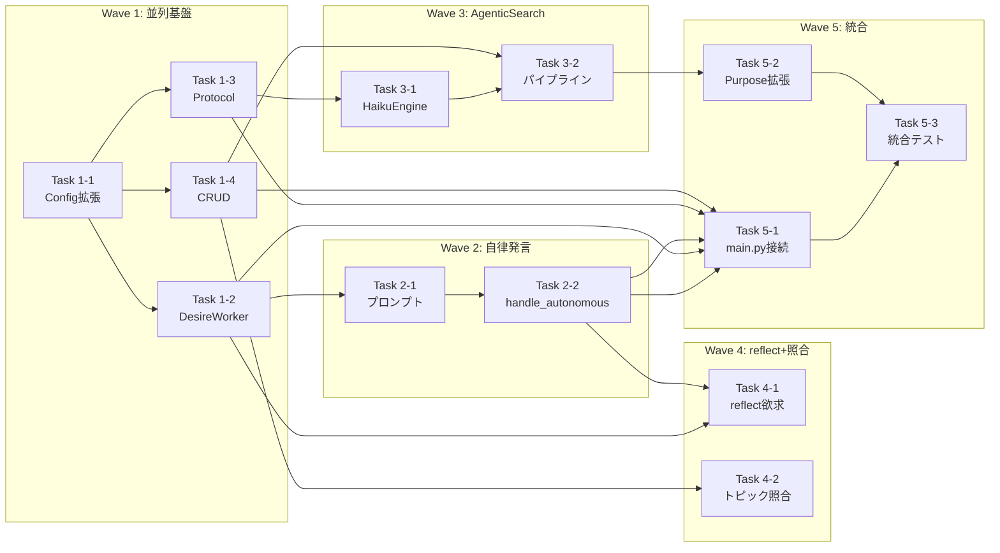

# Phase 2b 自律性コア タスク定義

**文書種別**: Task Decomposition
**根拠**: `docs/specs/phase2b-autonomy/requirements.md` (Rev.1 承認済み) + `docs/specs/phase2b-autonomy/design.md` (初版)
**作成日**: 2026-03-31

---

## Executive Summary

Phase 2b 自律性コアは、設計書付録の **AoT 分解** に基づいて 6 つの Atom に分割される。
- **Wave 1** (並列可能): A1 (DesireWorker基盤) + A3 (AgenticSearchEngine Protocol) + A4 (curiosity_targets CRUD) + config拡張
- **Wave 2**: A2 (自律発言統合、A1依存)
- **Wave 3**: A5 (AgenticSearch統合、A1+A3+A4依存)
- **Wave 4**: A6 (reflect欲求 + トピック照合、A1+A2+A4依存)
- **Wave 5**: 統合テスト + main.py 組み込み

各 Wave は完全に 1 PR で完結し、チェックリスト型 TDD を適用する。

---

## インターフェース契約（先行確定項目）

すべての Wave は以下 4 項目のシグネチャを確定した後、並列実装可能。

### 1. DesireConfig / AgenticSearchConfig dataclass

```python
# src/kage_shiki/core/config.py に追加

@dataclass
class DesireConfig:
    update_interval_sec: float = 7.5
    talk_threshold: float = 0.7
    curiosity_threshold: float = 0.6
    reflect_threshold: float = 0.8
    rest_threshold: float = 0.9
    idle_minutes_for_talk: float = 30.0
    idle_minutes_for_curiosity: float = 15.0
    reflect_episode_threshold: int = 20
    rest_hours_threshold: float = 4.0
    rest_suppress_minutes: float = 60.0

@dataclass
class AgenticSearchConfig:
    engine: str = "haiku"
    search_api: str = "duckduckgo"
    max_subqueries: int = 3
    max_concurrent_searches: int = 3

@dataclass
class AppConfig:
    # ... 既存フィールド ...
    desire: DesireConfig = field(default_factory=DesireConfig)
    agentic_search: AgenticSearchConfig = field(default_factory=AgenticSearchConfig)
```

### 2. AgenticSearchEngine Protocol

```python
# src/kage_shiki/agent/agentic_search.py に追加

@dataclass
class SearchResult:
    title: str
    url: str
    snippet: str

class AgenticSearchEngine(typing.Protocol):
    def decompose_query(self, topic: str) -> list[str]: ...
    def search(self, query: str) -> list[SearchResult]: ...
    def summarize(self, topic: str, results: list[SearchResult]) -> str: ...
    def extract_noise_topics(self, results: list[SearchResult]) -> list[str]: ...
```

### 3. curiosity_targets CRUD シグネチャ

```python
# src/kage_shiki/memory/db.py に追加

def create_curiosity_target(
    conn: sqlite3.Connection,
    topic: str,
    priority: int = 5,
    parent_id: int | None = None,
) -> int: ...

def get_pending_targets(
    conn: sqlite3.Connection,
    limit: int = 1,
) -> list[dict]: ...

def update_target_status(
    conn: sqlite3.Connection,
    target_id: int,
    status: str,
    result_summary: str | None = None,
) -> None: ...

def update_target_priority(
    conn: sqlite3.Connection,
    target_id: int,
    delta: int,
) -> None: ...
```

### 4. AgentCore.handle_autonomous_turn() シグネチャ

```python
# src/kage_shiki/agent/agent_core.py に追加

def handle_autonomous_turn(self, desire_type: str) -> str | None:
    """欲求閾値超過時に自律発言テキストを生成する.

    Args:
        desire_type: "talk" | "curiosity" | "reflect" | "rest"

    Returns:
        生成した自律発言テキスト。生成スキップ時は None。
    """
```

---

## Wave 構成

### Wave 1: 並列基盤構築（3タスク+設定）

**並列可否**: 可（3タスク同時実行可能）
**前提**: インターフェース契約 1〜4 確定後
**目標**: A1, A3, A4 の基盤実装完了 + config拡張

---

#### Task 1-1: DesireConfig / AgenticSearchConfig データクラス定義と AppConfig 拡張

**対応Atom**: A1, A3 (契約定義)
**対応FR**: なし（基盤・インターフェース確定タスク）
**新規/変更ファイル**:
- `src/kage_shiki/core/config.py` (変更)
- `config.toml` (変更・拡張)

**TDD Red（テスト観点）**:
- DesireConfig が正しくデフォルト値を持つ
- AgenticSearchConfig が正しくデフォルト値を持つ
- AppConfig に desire, agentic_search フィールドが存在する
- config.toml の [desire], [agentic_search] セクションが読み込まれる
- toml 型パースエラーハンドリング（無効な値）

**完了条件**:
- [x] DesireConfig, AgenticSearchConfig を dataclass として定義
- [x] AppConfig に field(default_factory=...) で組み込み
- [x] config.toml に新セクションを追加
- [x] テスト: config.toml 読込、デフォルト値確認、型検証
- [x] 既存テストが失敗していないこと

**見積もり**: S (1〜2時間)

---

#### Task 1-2: DesireWorker 基盤実装（DesireState/DesireLevel + update_desires + reset_all）

**対応Atom**: A1
**対応FR**: FR-9.1, FR-9.2
**新規/変更ファイル**:
- `src/kage_shiki/agent/desire_worker.py` (新規)

**TDD Red（テスト観点）**:
- DesireLevel データクラスが level, threshold, last_updated, active を持つ
- DesireState が desires: dict[str, DesireLevel] を持つ
- DesireWorker 起動時に全欲求が level=0.0, active=False で初期化される
- talk 欲求: idle時間に応じて線形増加（30分で1.0）
- curiosity 欲求: pending_count と idle時間の乗積で計算
- reflect 欲求: observations 蓄積件数に応じて増加
- rest 欲求: uptime に応じて増加
- 閾値超過時に on_threshold_exceeded コールバックが呼ばれる
- 同一欲求の連続通知が active=True の間は抑制される
- reset_all() で全欲求の active が False にリセットされる
- notify_user_input() で idle タイマーがリセットされる
- get_state() が現在の DesireState を返す
- threading.Lock による排他制御が機能している

**完了条件**:
- [x] DesireLevel, DesireState を dataclass として定義
- [x] DesireWorker クラスを実装 (init, start, stop, update_desires, reset_all, notify_user_input, get_state, on_threshold_exceeded)
- [x] 欲求計算式が設計書 Section 3.2 に準拠
- [x] テスト: ユニットテスト網羅（各欲求の計算、閾値判定、コールバック、reset機能）
- [x] スレッド安全性テスト (Lock 機能確認)
- [x] カバレッジ 95% 以上

**見積もり**: M (2〜4時間)

---

#### Task 1-3: AgenticSearchEngine Protocol + SearchResult

**対応Atom**: A3
**対応FR**: FR-9.10
**新規/変更ファイル**:
- `src/kage_shiki/agent/agentic_search.py` (新規、Protocol+SearchResult のみ、HaikuEngine は A3 に委譲)

**TDD Red（テスト観点）**:
- SearchResult が title, url, snippet を持つ dataclass
- AgenticSearchEngine が typing.Protocol として定義される
- decompose_query, search, summarize, extract_noise_topics の 4 メソッドが定義される
- Protocol メソッドのシグネチャが設計書に準拠

**完了条件**:
- [x] SearchResult dataclass 定義
- [x] AgenticSearchEngine Protocol 定義
- [x] Protocol の 4 メソッドシグネチャが正確に定義されている
- [x] Protocol の docstring が各メソッドの役割を説明している
- [x] mypy/pyright で Protocol として認識されることを確認

**見積もり**: S (1〜2時間)

---

#### Task 1-4: curiosity_targets CRUD 操作（db.py 拡張）

**対応Atom**: A4
**対応FR**: FR-9.11
**新規/変更ファイル**:
- `src/kage_shiki/memory/db.py` (変更)

**TDD Red（テスト観点）**:
- create_curiosity_target で pending レコードが作成される
- 作成時の status=pending, priority=5 がデフォルト
- parent_id が指定された場合、値が保存される
- get_pending_targets が priority 昇順の pending レコードを返す
- limit パラメータが有効に機能する
- update_target_status で status が更新される
- status=done 時に result_summary が保存される
- 無効な status 値は ValueError を送出する（R-2: dict ディスパッチ）
- update_target_priority で priority が増減される
- priority の最小値が 1 に保たれる
- 存在しない target_id へのアクセスで例外が送出される

**完了条件**:
- [x] 4 つの CRUD 関数を実装
- [x] status 値を frozenset で管理（無効値は KeyError）
- [x] テスト: 全 CRUD パターンをカバー（:memory: DB使用）
- [x] priority 昇順ソートが機能していることを検証
- [x] カバレッジ 95% 以上

**見積もり**: M (2〜4時間)

---

### Wave 2: 自律発言統合（A1 完了後）

**並列可否**: 不可（A1 依存）
**前提**: Task 1-1, 1-2, config.toml 完了

---

#### Task 2-1: 自律発言プロンプトテンプレート + prompt_builder 拡張

**対応Atom**: A2
**対応FR**: FR-9.3, FR-9.4
**新規/変更ファイル**:
- `src/kage_shiki/agent/autonomous_prompt.py` (新規)
- `src/kage_shiki/agent/prompt_builder.py` (変更)

**TDD Red（テスト観点）**:
- AUTONOMOUS_PROMPTS が "talk", "curiosity", "reflect", "rest" を含む
- 各プロンプトが 50文字以内推奨の指示を含む
- reflect プロンプトに {day_summary} プレースホルダーが存在する
- build_system_prompt に autonomous_prompt: str | None = None パラメータが追加される
- autonomous_prompt != None 時、元のシステムプロンプトに追記される
- autonomous_turn=True フラグが正しく処理される
- persona_core + style_samples が autonomous=True でも注入される

**完了条件**:
- [x] autonomous_prompt.py に AUTONOMOUS_PROMPTS 定数を定義
- [x] 各プロンプトが設計書 Section 4.2 に準拠
- [x] prompt_builder.py に autonomous_prompt パラメータを追加
- [x] テスト: プロンプト内容の構成確認、プレースホルダー置換テスト
- [x] 既存の build_system_prompt テストが継続して成功すること

**見積もり**: S (1〜2時間)

---

#### Task 2-2: AgentCore.handle_autonomous_turn() 実装

**対応Atom**: A2
**対応FR**: FR-9.3, FR-9.4, FR-9.5（排他制御）
**新規/変更ファイル**:
- `src/kage_shiki/agent/agent_core.py` (変更)

**TDD Red（テスト観点）**:
- handle_autonomous_turn("talk") が ReAct ループを起動する
- 生成されたテキストが response_queue に投入される（モックで検証）
- handle_autonomous_turn("reflect") で day_summary を DB から取得する
- reflect のシステムプロンプトに day_summary が含まれる
- desire_type="curiosity" 時は AgenticSearch パイプラインへ委譲する（スタブ化）
- autonomous_turn=True フラグが正しく prompt_builder に渡される
- active フラグが False の場合、None が返される（破棄ロジック、FR-9.5）
- LLM 実行中に reset_all() が呼ばれた場合、結果が破棄される

**完了条件**:
- [x] handle_autonomous_turn メソッドを実装
- [x] desire_type 別の処理分岐を実装
- [x] 既存の ReAct ループを再利用（C-4）
- [x] persona_core + style_samples がコンテキストに含まれることを確認
- [x] テスト: 各 desire_type の処理、active フラグ制御、破棄ロジック
- [x] 統合テスト: response_queue への投入確認

**見積もり**: M (2〜4時間)

---

### Wave 3: AgenticSearch 統合（A1+A3+A4 完了後）

**並列可否**: 不可（A1, A3, A4 依存）
**前提**: Task 1-1, 1-2, 1-3, 1-4 完了

---

#### Task 3-1: HaikuEngine 実装（decompose_query, search, summarize, extract_noise_topics）

**対応Atom**: A3
**対応FR**: FR-9.10, FR-9.7
**新規/変更ファイル**:
- `src/kage_shiki/agent/agentic_search.py` (変更・HaikuEngine実装)

**TDD Red（テスト観点）**:
- HaikuEngine が AgenticSearchEngine Protocol を実装する（静的型チェック）
- decompose_query が 2〜max_subqueries 個のサブクエリを返す
- search が duckduckgo-search (DDGS) を呼び出して SearchResult リストを返す
- search_parallel が複数クエリを asyncio.run() で並列実行する
- search_parallel のタイムアウト（30秒）が機能する
- summarize が LLMClient を呼び出して要約を返す
- extract_noise_topics が 0〜3 個の派生テーマを返す
- 各メソッドがタイムアウト設定に準拠する（設計書 Table 5.2 Section 5）
- LLM呼び出し失敗時に例外が送出される（Status=failed に遷移は A5 で実装）

**完了条件**:
- [x] HaikuEngine クラスを実装
- [x] 4 つのメソッドが Protocol に準拠
- [x] decompose_query のプロンプトが設計書に準拠
- [x] search_parallel が asyncio で並列化される
- [x] テスト: 全メソッドをモック (DDGS, LLMClient) で検証
- [x] スレッドセーフティ: asyncio.run() の呼び出しがスレッド内で安全に実行できることを確認
- [x] カバレッジ 90% 以上

**見積もり**: M (2〜4時間)

---

#### Task 3-2: AgenticSearch パイプライン統合（handle_autonomous_turn("curiosity") 実装）

**対応Atom**: A5
**対応FR**: FR-9.6, FR-9.7, FR-9.8
**新規/変更ファイル**:
- `src/kage_shiki/agent/agent_core.py` (変更)
- `src/kage_shiki/memory/db.py` (既存 curiosity_targets CRUD を使用)

**TDD Red（テスト観点）**:
- handle_autonomous_turn("curiosity") が呼ばれると AgenticSearch が起動する
- pending トピックが存在しない場合、何もしない（FR-9.6 (2)）
- pending トピックが存在する場合、priority 最高の 1 件を取得する
- パイプラインの実行順序: decompose → search_parallel → summarize → extract_noise_topics → db更新
- status が pending → searching → done/failed に遷移する
- 調査完了時に result_summary が curiosity_targets に保存される
- extract_noise_topics で派生テーマが返された場合、各テーマが parent_id付きで登録される
- 検索失敗時に status=failed に遷移する
- 検索失敗時に curiosity レベルがリセットされる
- つぶやきが response_queue に投入される（「調べ始める」「調査完了」）

**完了条件**:
- [x] handle_autonomous_turn("curiosity") の処理を実装
- [x] AgenticSearch パイプラインの順序実装
- [x] db.update_target_status, db.create_curiosity_target を使用
- [x] テスト: パイプイン全体の実行フロー、success/failure パス、派生テーマ登録
- [x] 統合テスト: response_queue への投入、DB 状態遷移

**見積もり**: M (2〜4時間)

---

### Wave 4: reflect 欲求 + トピック照合（A1+A2+A4 完了後）

**並列可否**: 不可（A1, A2, A4 依存）
**前提**: Task 1-1, 1-2, 1-4, Task 2-1, 2-2 完了

---

#### Task 4-1: reflect 欲求の実装と day_summary 参照

**対応Atom**: A6
**対応FR**: FR-9.9
**新規/変更ファイル**:
- `src/kage_shiki/agent/agent_core.py` (変更)

**TDD Red（テスト観点）**:
- handle_autonomous_turn("reflect") が呼ばれると day_summary を DB から取得する
- day_summary が存在しない場合の処理（スキップまたは空文字列）
- reflect のシステムプロンプトに day_summary が正しく注入される
- 生成された内省テキストが response_queue に投入される

**完了条件**:
- [x] handle_autonomous_turn("reflect") の処理を実装
- [x] day_summary 取得ロジックを実装
- [x] autonomousプロンプトに {day_summary} を置換
- [x] テスト: day_summary 有無の両パターン、プロンプト内容確認
- [x] 統合テスト: response_queue への投入確認

**見積もり**: S (1〜2時間)

---

#### Task 4-2: ユーザー入力時の curiosity_targets トピック照合（priority更新）

**対応Atom**: A6
**対応FR**: FR-9.12
**新規/変更ファイル**:
- `src/kage_shiki/agent/agent_core.py` (変更)

**TDD Red（テスト観点）**:
- process_turn 実行時に pending トピックのキーワード照合が行われる
- ユーザー入力のキーワードが curious_targets.topic と一致した場合、priority が 1 下がる
- 複数トピックが一致する場合、全て priority が下がる
- 大文字・小文字を無視して照合される
- priority の最小値が 1 に保たれる

**完了条件**:
- [x] _update_curiosity_priority_on_user_input メソッドを実装
- [x] process_turn で呼び出される
- [x] キーワード照合ロジック（部分文字列一致、大文字小文字無視）
- [x] テスト: 単一マッチ、複数マッチ、マッチなし、priority 下限確認
- [x] 既存の process_turn テストが継続して成功すること

**見積もり**: S (1〜2時間)

---

### Wave 5: 統合テスト + main.py 組み込み

**並列可否**: 不可（全 Atom 完了後）
**前提**: Task 1-1〜4-2 完了

---

#### Task 5-1: DesireWorker と AgentCore の接続（main.py + _run_background_loop 拡張）

**対応Atom**: A1, A2, A3, A4, A5, A6
**対応FR**: FR-9.1, FR-9.2, FR-9.3, FR-9.5（排他制御）
**新規/変更ファイル**:
- `src/kage_shiki/main.py` (変更)

**TDD Red（テスト観点）**:
- DesireWorker がアプリケーション起動時に初期化される
- DesireWorker.start() が呼ばれて定期更新ループが開始される
- on_threshold_exceeded コールバックが desire_type を受け取って autonomous_queue に投入する
- autonomous_queue が maxsize=1 で古いイベントを破棄する
- _run_background_loop が input_queue と autonomous_queue の両方をポーリングする
- input_queue を先にチェックする優先度制御が機能する
- ユーザー入力時に desire_worker.reset_all() が呼ばれる
- ユーザー入力時に desire_worker.notify_user_input() が呼ばれる
- autonomous_queue に投入された desire_type が handle_autonomous_turn に渡される
- DesireWorker.stop() がシャットダウン時に呼ばれる（スレッド終了）
- 進行中の自律行動がユーザー入力で中断される（active フラグ破棄ロジック）

**完了条件**:
- [x] main.py に DesireWorker 初期化コードを追加
- [x] on_threshold_exceeded コールバック関数を実装
- [x] autonomous_queue (maxsize=1) を生成
- [x] _run_background_loop を拡張（input_queue / autonomous_queue 両方をハンドル）
- [x] 優先度制御（input_queue先チェック）を実装
- [x] reset_all() + notify_user_input() の呼び出し
- [x] シャットダウン時の DesireWorker.stop() 呼び出し
- [x] テスト: 統合テスト（ユーザー入力、自律発言、優先度制御）
- [x] テスト: スレッド間通信の動作確認

**見積もり**: M (2〜4時間)

---

#### Task 5-2: Purpose 管理拡張と LLMClient 統合

**対応Atom**: A2, A3, A5, A6
**対応FR**: FR-9.3, FR-9.4, FR-9.7, FR-9.10
**新規/変更ファイル**:
- `src/kage_shiki/core/config.py` (変更)

**TDD Red（テスト観点）**:
- VALID_PURPOSES に autonomous_talk, agentic_decompose, agentic_summarize, agentic_noise が追加される
- _PURPOSE_MODEL_SLOTS に新しい 4 purpose の entry が追加される
- _MAX_TOKENS_MAP に新しい 4 purpose の token数が定義される
- _PURPOSE_TEMPERATURES に新しい 4 purpose の temperature が定義される
- 各 purpose が LLMClient の create() で使用可能である

**完了条件**:
- [x] VALID_PURPOSES を拡張（4 purpose 追加）
- [x] _PURPOSE_MODEL_SLOTS に entry を追加（R-3: 定数使用の即時接続）
- [x] _MAX_TOKENS_MAP, _PURPOSE_TEMPERATURES に値を追加
- [x] テスト: 新しい purpose が有効に認識されること
- [x] テスト: 既存の purpose が動作に影響を受けないこと

**見積もり**: S (1〜2時間)

---

#### Task 5-3: 統合テスト + カバレッジ確認 + スモークテスト

**対応Atom**: A1〜A6
**対応FR**: 全 FR-9.x
**新規/変更ファイル**:
- `tests/test_agent/` (新規・統合テスト)
- `tests/test_memory/` (curiosity_targets テスト拡張)

**TDD Red（テスト観点）**:
- Phase 2b 全体の End-to-End テスト（ユーザー入力 → 自律発言 → curiosity調査）
- 各 Desire タイプ（talk, curiosity, reflect, rest）の発現テスト
- curiosity_targets CRUD の全パターン
- AgenticSearch パイプラインの成功・失敗パス
- 排他制御テスト（ユーザー入力による自律行動の中断）
- スレッド間通信の安全性テスト
- Phase 2a との回帰テスト（既存テストの全パス）
- カバレッジが Phase 2a 完了時点（92%）を下回らないこと
- Phase 2b 追加モジュールのカバレッジが 90% 以上

**実動作テスト（スモークテスト）**:
- 実際に `python -m kage_shiki` を実行して起動・終了確認
- 自律発言のプロンプト送信・受信確認
- curiosity_targets への登録・更新の確認（GUIで表示または DB直接確認）

**完了条件**:
- [x] 統合テストスイートを作成（tests/test_agent/test_desire_worker_integration.py 等）
- [x] curiosity_targets テストを拡張（tests/test_memory/test_curiosity_targets.py）
- [x] pytest --cov で全体カバレッジを計測
- [x] Phase 2b 追加モジュール: 90% 以上
- [x] 全体: 92% 以上を維持
- [x] 実動作テスト: 起動・停止、自律発言生成、DB更新確認
- [x] 既存テストスイート（Phase 2a）が全て PASS

**見積もり**: L (4〜8時間)

---

## FR → タスク トレーサビリティ

| FR | タスク | Wave |
|:--|:-------|:-----|
| FR-9.1 | Task 1-2 (DesireWorker.update_desires) | Wave 1 |
| FR-9.2 | Task 1-2 (on_threshold_exceeded callback) + Task 5-1 (main.py接続) | Wave 1/5 |
| FR-9.3 | Task 2-2 (AgentCore.handle_autonomous_turn) + Task 5-2 (Purpose拡張) | Wave 2/5 |
| FR-9.4 | Task 2-1 (autonomous_prompt.py) + Task 2-2 (prompt_builder拡張) | Wave 2 |
| FR-9.5 | Task 2-2 (active flag制御) + Task 5-1 (reset_all呼び出し) | Wave 2/5 |
| FR-9.6 | Task 3-2 (AgenticSearch起動) | Wave 3 |
| FR-9.7 | Task 3-1 (HaikuEngine実装) + Task 3-2 (パイプライン統合) | Wave 3 |
| FR-9.8 | Task 3-2 (派生テーマ登録) | Wave 3 |
| FR-9.9 | Task 4-1 (reflect欲求実装) | Wave 4 |
| FR-9.10 | Task 1-3 (Protocol定義) + Task 3-1 (HaikuEngine実装) | Wave 1/3 |
| FR-9.11 | Task 1-4 (curiosity_targets CRUD) | Wave 1 |
| FR-9.12 | Task 4-2 (トピック照合) | Wave 4 |

---

## タスク → FR トレーサビリティ（孤児チェック）

| タスク | 対応 FR | 孤児判定 |
|:-------|:-------|:--------|
| Task 1-1 | インターフェース契約 (基盤) | ✓ 孤児でない（A1/A3の起点） |
| Task 1-2 | FR-9.1, FR-9.2 | ✓ 孤児でない |
| Task 1-3 | FR-9.10 | ✓ 孤児でない |
| Task 1-4 | FR-9.11 | ✓ 孤児でない |
| Task 2-1 | FR-9.3, FR-9.4 | ✓ 孤児でない |
| Task 2-2 | FR-9.3, FR-9.4, FR-9.5 | ✓ 孤児でない |
| Task 3-1 | FR-9.10, FR-9.7 | ✓ 孤児でない |
| Task 3-2 | FR-9.6, FR-9.7, FR-9.8 | ✓ 孤児でない |
| Task 4-1 | FR-9.9 | ✓ 孤児でない |
| Task 4-2 | FR-9.12 | ✓ 孤児でない |
| Task 5-1 | FR-9.1, FR-9.2, FR-9.5 (統合) | ✓ 孤児でない |
| Task 5-2 | FR-9.3, FR-9.7 (Purpose拡張) | ✓ 孤児でない |
| Task 5-3 | 全 FR-9.x (統合テスト) | ✓ 孤児でない |

**孤児タスク**: なし
**未対応 FR**: なし

---

## WBS 100% Rule 検証

### 全 FR/NFR に対応するタスク存在の確認

| 要件 | 対応タスク | 確認 |
|:-----|:----------|:-----|
| FR-9.1 | Task 1-2, Task 5-1 | ✓ |
| FR-9.2 | Task 1-2, Task 5-1 | ✓ |
| FR-9.3 | Task 2-1, Task 2-2, Task 5-2 | ✓ |
| FR-9.4 | Task 2-1, Task 2-2 | ✓ |
| FR-9.5 | Task 2-2, Task 5-1 | ✓ |
| FR-9.6 | Task 3-2 | ✓ |
| FR-9.7 | Task 3-1, Task 3-2, Task 5-2 | ✓ |
| FR-9.8 | Task 3-2 | ✓ |
| FR-9.9 | Task 4-1 | ✓ |
| FR-9.10 | Task 1-3, Task 3-1 | ✓ |
| FR-9.11 | Task 1-4 | ✓ |
| FR-9.12 | Task 4-2 | ✓ |
| NFR-13 (duckduckgo-search) | Task 3-1, Task 5-3 | ✓ |
| NFR-14 (CPU負荷) | Task 1-2, Task 5-3 | ✓ |
| NFR-15 (カバレッジ) | Task 5-3 | ✓ |

### 孤児タスク（対応 FR/NFR なし）

なし

### スコープ外 NFR（確認）

| 項目 | Phase 2c以降 | 理由 |
|:-----|:----------|:-----|
| セマンティック検索 | Phase 2c | 要件書 S-4 |
| 忘却曲線 | Phase 2c | 要件書 S-3 |
| ボディ表現 | Phase 2c | 要件書 S-5 |
| 可変層L2-L6 | Phase 2c | 要件書 S-2 |
| parent_id グラフ化 | Phase 3 | 要件書 S-2 |
| LocalLLM移行 | Phase 3 | 要件書 S-1 |

---

## 依存関係グラフ



---

## Phase 2b スモークテスト計画

以下は Task 5-3（統合テスト）に含まれるスモークテスト項目:

1. **アプリケーション起動**
   - `python -m kage_shiki` で正常に起動する
   - GUI ウィンドウが表示される

2. **DesireWorker 動作確認**
   - 指定間隔（7.5秒）で欲求レベルが更新される（ログ確認）
   - 30分無入力で talk 欲求が閾値に達する（手動時刻操作またはユニットテストで確認）

3. **自律発言生成**
   - 「調べようかな」等のテキストが GUI に表示される（最大30分待機）

4. **curiosity_targets 操作**
   - 「SQLについて」等のトピックをテストとして登録する
   - DB から正しく検索・取得される

5. **ユーザー入力優先度**
   - ユーザーがテキスト入力すると、自律行動が即座に中断される

6. **アプリケーション停止**
   - Ctrl+C または GUI 終了ボタンで正常にシャットダウンする
   - デーモンスレッドが残存しない（プロセスが完全に終了）

---

## Definition of Ready 最終チェック

### 全タスク共通

- [x] 対応する仕様書が存在
  - `docs/specs/phase2b-autonomy/requirements.md` (要件定義)
  - `docs/specs/phase2b-autonomy/design.md` (設計書)

- [x] 受け入れ条件がテスト可能
  - 全タスク: TDD Red で観察可能な条件として記述

- [x] 1 PR で完結するサイズ
  - Task 1-1〜1-4, 2-1, 2-2, 4-1, 4-2, 5-2: S/Sサイズ
  - Task 3-1, 3-2, 5-1: Mサイズ
  - Task 5-3: Lサイズ（統合テスト・スモークテスト）

### タスク個別チェック

| タスク | 仕様リンク | テスト可能 | PR範囲 | 見積 |
|:------|:----------|:---------|:-------|:--:|
| 1-1 | FR-9.1〜12 | ✓ | S | S |
| 1-2 | FR-9.1, 9.2 | ✓ | M | M |
| 1-3 | FR-9.10 | ✓ | S | S |
| 1-4 | FR-9.11 | ✓ | M | M |
| 2-1 | FR-9.3, 9.4 | ✓ | S | S |
| 2-2 | FR-9.3, 9.4, 9.5 | ✓ | M | M |
| 3-1 | FR-9.10, 9.7 | ✓ | M | M |
| 3-2 | FR-9.6, 9.7, 9.8 | ✓ | M | M |
| 4-1 | FR-9.9 | ✓ | S | S |
| 4-2 | FR-9.12 | ✓ | S | S |
| 5-1 | FR-9.1〜5 | ✓ | M | M |
| 5-2 | FR-9.3, 9.7 | ✓ | S | S |
| 5-3 | 全 FR-9.x | ✓ | L | L |

---

## 実装開始チェックリスト

実装開始前に以下を確認してください:

- [ ] インターフェース契約 4 項目が確定している
- [ ] config.toml のテンプレートが `config/config.template.toml` に追加されている
- [ ] pytest-freezegun がテスト依存に含まれている
- [ ] duckduckgo-search が pyproject.toml に追加されている（NFR-13）
- [ ] 既存テストスイート（Phase 2a）が全て PASS している
- [ ] カバレッジが 92% を確認している（Task 5-3 実施前の baseline）

---

## 注記

### R-3 準拠（定数定義 → 使用の即時接続）

Task 5-2 で `VALID_PURPOSES` に新しい 4 purpose を追加する際、
同一タスク内で以下を即座に実装する:

- `_PURPOSE_MODEL_SLOTS` に entry を追加
- `_MAX_TOKENS_MAP` に値を追加
- `_PURPOSE_TEMPERATURES` に値を追加
- LLMClient.create() で使用可能なことを確認するテストを追加

未参照の定数を残さない（R-3 = building-checklist.md R-3）。

### S-2 準拠（Protocol外メソッドの明示）

DesireWorker の `notify_user_input()` メソッドは要件書 Section 5.1 の Protocol 定義外。
Task 1-2 で以下のいずれかを実施:

- 要件書 Section 5.1 に「Protocol外メソッドとして提供」と明記済みのため不要
- または design.md Section 3.3 で「設計判断」として文書化済み

### S-1 補足（NFR突合）

Task 5-3 で以下の NFR を確認する:

- NFR-13: duckduckgo-search がただ 1 つの依存パッケージ追加か
- NFR-14: DesireWorker.update_desires() < 1ms の CPU 負荷か
- NFR-15: Phase 2b 追加モジュール 90%+、全体 92% 以上か

